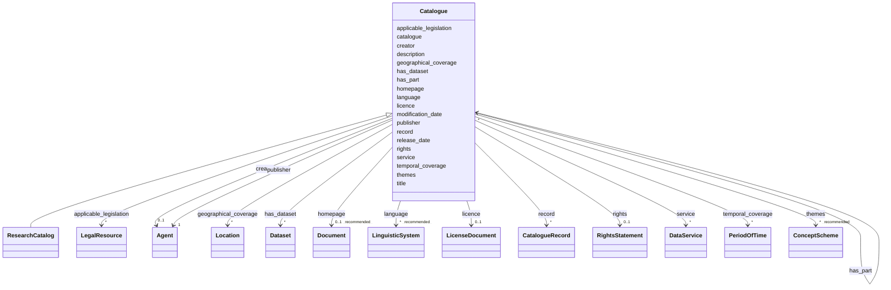

# Class: Catalogue


_See [DCAT-AP specs:Catalogue](https://semiceu.github.io/DCAT-AP/releases/3.0.0/#Catalogue)_


URI: [dcat:Catalog](http://www.w3.org/ns/dcat#Catalog)





## Inheritance
* **Catalogue**
    * [ResearchCatalog](ResearchCatalog.md)


## Slots

| Name | Cardinality and Range | Description | Inheritance |
| ---  | --- | --- | --- |
| [applicable_legislation](applicable_legislation.md) | * <br/> [LegalResource](LegalResource.md) | The legislation that mandates the creation or management of the Catalog | direct |
| [catalogue](catalogue.md) | * <br/> [Catalogue](Catalogue.md) | A catalogue whose contents are of interest in the context of this catalogue | direct |
| [creator](creator.md) | 0..1 <br/> [Agent](Agent.md) | An entity responsible for the creation of the catalogue | direct |
| [description](description.md) | 1..* <br/> [String](String.md) | A free-text account of the Catalogue | direct |
| [geographical_coverage](geographical_coverage.md) | * <br/> [Location](Location.md) | A geographical area covered by the Catalogue | direct |
| [has_dataset](has_dataset.md) | * <br/> [Dataset](Dataset.md) | A Dataset that is part of the Catalogue | direct |
| [has_part](has_part.md) | * <br/> [Catalogue](Catalogue.md) | A related Catalogue that is part of the described Catalogue | direct |
| [homepage](homepage.md) | 0..1 _recommended_ <br/> [Document](Document.md) | A web page that acts as the main page for the Catalogue | direct |
| [language](language.md) | * _recommended_ <br/> [LinguisticSystem](LinguisticSystem.md) | A language used in the textual metadata describing titles, descriptions, etc | direct |
| [licence](licence.md) | 0..1 <br/> [LicenseDocument](LicenseDocument.md) | A licence under which the Catalogue can be used or reused | direct |
| [modification_date](modification_date.md) | 0..1 _recommended_ <br/> [String](String.md) | The most recent date on which the Catalogue was modified | direct |
| [publisher](publisher.md) | 1 <br/> [Agent](Agent.md) | An entity (organisation) responsible for making the Catalogue available | direct |
| [record](record.md) | * <br/> [CatalogueRecord](CatalogueRecord.md) | A Catalogue Record that is part of the Catalogue | direct |
| [release_date](release_date.md) | 0..1 _recommended_ <br/> [String](String.md) | The date of formal issuance (e | direct |
| [rights](rights.md) | 0..1 <br/> [RightsStatement](RightsStatement.md) | A statement that specifies rights associated with the Catalogue | direct |
| [service](service.md) | * <br/> [DataService](DataService.md) | A site or end-point (Data Service) that is listed in the Catalogue | direct |
| [temporal_coverage](temporal_coverage.md) | * <br/> [PeriodOfTime](PeriodOfTime.md) | A temporal period that the Catalogue covers | direct |
| [themes](themes.md) | * _recommended_ <br/> [ConceptScheme](ConceptScheme.md) | A knowledge organization system used to classify the Resources that are in th... | direct |
| [title](title.md) | 1..* <br/> [String](String.md) | A name given to the Catalogue | direct |


## Usages

| used by | used in | type | used |
| ---  | --- | --- | --- |
| [Catalogue](Catalogue.md) | [catalogue](catalogue.md) | range | [Catalogue](Catalogue.md) |
| [Catalogue](Catalogue.md) | [has_part](has_part.md) | range | [Catalogue](Catalogue.md) |
| [ResearchCatalog](ResearchCatalog.md) | [catalogue](catalogue.md) | range | [Catalogue](Catalogue.md) |
| [ResearchCatalog](ResearchCatalog.md) | [has_part](has_part.md) | range | [Catalogue](Catalogue.md) |


## Identifier and Mapping Information


### Schema Source


* from schema: https://stroemphi.github.io/dcat-4C-ap/dcat_4c_ap


## Mappings

| Mapping Type | Mapped Value |
| ---  | ---  |
| self | dcat:Catalog |
| native | nfdi4c:Catalogue |


## LinkML Source

<!-- TODO: investigate https://stackoverflow.com/questions/37606292/how-to-create-tabbed-code-blocks-in-mkdocs-or-sphinx -->

### Direct

<details>
```yaml
name: Catalogue
description: See [DCAT-AP specs:Catalogue](https://semiceu.github.io/DCAT-AP/releases/3.0.0/#Catalogue)
from_schema: https://stroemphi.github.io/dcat-4C-ap/dcat_4c_ap
abstract: false
slots:
- applicable_legislation
- catalogue
- creator
- description
- geographical_coverage
- has_dataset
- has_part
- homepage
- language
- licence
- modification_date
- publisher
- record
- release_date
- rights
- service
- temporal_coverage
- themes
- title
slot_usage:
  applicable_legislation:
    name: applicable_legislation
    description: The legislation that mandates the creation or management of the Catalog.
    slot_uri: dcatap:applicableLegislation
    range: LegalResource
    required: false
    multivalued: true
    inlined_as_list: true
  catalogue:
    name: catalogue
    description: A catalogue whose contents are of interest in the context of this
      catalogue.
    slot_uri: dcat:catalog
    range: Catalogue
    required: false
    multivalued: true
    inlined_as_list: true
  creator:
    name: creator
    description: An entity responsible for the creation of the catalogue.
    slot_uri: dcterms:creator
    range: Agent
    required: false
    multivalued: false
    inlined_as_list: true
  description:
    name: description
    description: A free-text account of the Catalogue.
    slot_uri: dcterms:description
    range: string
    required: true
    multivalued: true
    inlined_as_list: true
  geographical_coverage:
    name: geographical_coverage
    description: A geographical area covered by the Catalogue.
    slot_uri: dcterms:spatial
    range: Location
    required: false
    multivalued: true
    inlined_as_list: true
  has_dataset:
    name: has_dataset
    description: A Dataset that is part of the Catalogue.
    slot_uri: dcat:dataset
    range: Dataset
    required: false
    multivalued: true
    inlined_as_list: true
  has_part:
    name: has_part
    description: A related Catalogue that is part of the described Catalogue.
    slot_uri: dcterms:hasPart
    range: Catalogue
    required: false
    multivalued: true
    inlined_as_list: true
  homepage:
    name: homepage
    description: A web page that acts as the main page for the Catalogue.
    slot_uri: foaf:homepage
    range: Document
    required: false
    recommended: true
    multivalued: false
    inlined_as_list: true
  language:
    name: language
    description: A language used in the textual metadata describing titles, descriptions,
      etc. of the Datasets in the Catalogue.
    slot_uri: dcterms:language
    range: LinguisticSystem
    required: false
    recommended: true
    multivalued: true
    inlined_as_list: true
  licence:
    name: licence
    description: A licence under which the Catalogue can be used or reused.
    slot_uri: dcterms:license
    range: LicenseDocument
    required: false
    multivalued: false
    inlined_as_list: true
  modification_date:
    name: modification_date
    description: The most recent date on which the Catalogue was modified.
    slot_uri: dcterms:modified
    range: string
    required: false
    recommended: true
    multivalued: false
    inlined_as_list: false
  publisher:
    name: publisher
    description: An entity (organisation) responsible for making the Catalogue available.
    slot_uri: dcterms:publisher
    range: Agent
    required: true
    multivalued: false
    inlined_as_list: true
  record:
    name: record
    description: A Catalogue Record that is part of the Catalogue.
    slot_uri: dcat:record
    range: CatalogueRecord
    required: false
    multivalued: true
    inlined_as_list: true
  release_date:
    name: release_date
    description: The date of formal issuance (e.g., publication) of the Catalogue.
    slot_uri: dcterms:issued
    range: string
    required: false
    recommended: true
    multivalued: false
    inlined_as_list: false
  rights:
    name: rights
    description: A statement that specifies rights associated with the Catalogue.
    slot_uri: dcterms:rights
    range: RightsStatement
    required: false
    multivalued: false
    inlined_as_list: true
  service:
    name: service
    description: A site or end-point (Data Service) that is listed in the Catalogue.
    slot_uri: dcat:service
    range: DataService
    required: false
    multivalued: true
    inlined_as_list: true
  temporal_coverage:
    name: temporal_coverage
    description: A temporal period that the Catalogue covers.
    slot_uri: dcterms:temporal
    range: PeriodOfTime
    required: false
    multivalued: true
    inlined_as_list: true
  themes:
    name: themes
    description: A knowledge organization system used to classify the Resources that
      are in the Catalogue.
    slot_uri: dcat:themeTaxonomy
    range: ConceptScheme
    required: false
    recommended: true
    multivalued: true
    inlined_as_list: true
  title:
    name: title
    description: A name given to the Catalogue.
    slot_uri: dcterms:title
    range: string
    required: true
    multivalued: true
    inlined_as_list: true
class_uri: dcat:Catalog

```
</details>

### Induced

<details>
```yaml
name: Catalogue
description: See [DCAT-AP specs:Catalogue](https://semiceu.github.io/DCAT-AP/releases/3.0.0/#Catalogue)
from_schema: https://stroemphi.github.io/dcat-4C-ap/dcat_4c_ap
abstract: false
slot_usage:
  applicable_legislation:
    name: applicable_legislation
    description: The legislation that mandates the creation or management of the Catalog.
    slot_uri: dcatap:applicableLegislation
    range: LegalResource
    required: false
    multivalued: true
    inlined_as_list: true
  catalogue:
    name: catalogue
    description: A catalogue whose contents are of interest in the context of this
      catalogue.
    slot_uri: dcat:catalog
    range: Catalogue
    required: false
    multivalued: true
    inlined_as_list: true
  creator:
    name: creator
    description: An entity responsible for the creation of the catalogue.
    slot_uri: dcterms:creator
    range: Agent
    required: false
    multivalued: false
    inlined_as_list: true
  description:
    name: description
    description: A free-text account of the Catalogue.
    slot_uri: dcterms:description
    range: string
    required: true
    multivalued: true
    inlined_as_list: true
  geographical_coverage:
    name: geographical_coverage
    description: A geographical area covered by the Catalogue.
    slot_uri: dcterms:spatial
    range: Location
    required: false
    multivalued: true
    inlined_as_list: true
  has_dataset:
    name: has_dataset
    description: A Dataset that is part of the Catalogue.
    slot_uri: dcat:dataset
    range: Dataset
    required: false
    multivalued: true
    inlined_as_list: true
  has_part:
    name: has_part
    description: A related Catalogue that is part of the described Catalogue.
    slot_uri: dcterms:hasPart
    range: Catalogue
    required: false
    multivalued: true
    inlined_as_list: true
  homepage:
    name: homepage
    description: A web page that acts as the main page for the Catalogue.
    slot_uri: foaf:homepage
    range: Document
    required: false
    recommended: true
    multivalued: false
    inlined_as_list: true
  language:
    name: language
    description: A language used in the textual metadata describing titles, descriptions,
      etc. of the Datasets in the Catalogue.
    slot_uri: dcterms:language
    range: LinguisticSystem
    required: false
    recommended: true
    multivalued: true
    inlined_as_list: true
  licence:
    name: licence
    description: A licence under which the Catalogue can be used or reused.
    slot_uri: dcterms:license
    range: LicenseDocument
    required: false
    multivalued: false
    inlined_as_list: true
  modification_date:
    name: modification_date
    description: The most recent date on which the Catalogue was modified.
    slot_uri: dcterms:modified
    range: string
    required: false
    recommended: true
    multivalued: false
    inlined_as_list: false
  publisher:
    name: publisher
    description: An entity (organisation) responsible for making the Catalogue available.
    slot_uri: dcterms:publisher
    range: Agent
    required: true
    multivalued: false
    inlined_as_list: true
  record:
    name: record
    description: A Catalogue Record that is part of the Catalogue.
    slot_uri: dcat:record
    range: CatalogueRecord
    required: false
    multivalued: true
    inlined_as_list: true
  release_date:
    name: release_date
    description: The date of formal issuance (e.g., publication) of the Catalogue.
    slot_uri: dcterms:issued
    range: string
    required: false
    recommended: true
    multivalued: false
    inlined_as_list: false
  rights:
    name: rights
    description: A statement that specifies rights associated with the Catalogue.
    slot_uri: dcterms:rights
    range: RightsStatement
    required: false
    multivalued: false
    inlined_as_list: true
  service:
    name: service
    description: A site or end-point (Data Service) that is listed in the Catalogue.
    slot_uri: dcat:service
    range: DataService
    required: false
    multivalued: true
    inlined_as_list: true
  temporal_coverage:
    name: temporal_coverage
    description: A temporal period that the Catalogue covers.
    slot_uri: dcterms:temporal
    range: PeriodOfTime
    required: false
    multivalued: true
    inlined_as_list: true
  themes:
    name: themes
    description: A knowledge organization system used to classify the Resources that
      are in the Catalogue.
    slot_uri: dcat:themeTaxonomy
    range: ConceptScheme
    required: false
    recommended: true
    multivalued: true
    inlined_as_list: true
  title:
    name: title
    description: A name given to the Catalogue.
    slot_uri: dcterms:title
    range: string
    required: true
    multivalued: true
    inlined_as_list: true
attributes:
  applicable_legislation:
    name: applicable_legislation
    description: The legislation that mandates the creation or management of the Catalog.
    from_schema: https://stroemphi.github.io/dcat-4C-ap/dcat_4c_ap
    rank: 1000
    slot_uri: dcatap:applicableLegislation
    alias: applicable_legislation
    owner: Catalogue
    domain_of:
    - Catalogue
    - DataService
    - Dataset
    - DatasetSeries
    - Distribution
    range: LegalResource
    required: false
    multivalued: true
    inlined_as_list: true
  catalogue:
    name: catalogue
    description: A catalogue whose contents are of interest in the context of this
      catalogue.
    from_schema: https://stroemphi.github.io/dcat-4C-ap/dcat_4c_ap
    rank: 1000
    slot_uri: dcat:catalog
    alias: catalogue
    owner: Catalogue
    domain_of:
    - Catalogue
    range: Catalogue
    required: false
    multivalued: true
    inlined_as_list: true
  creator:
    name: creator
    description: An entity responsible for the creation of the catalogue.
    from_schema: https://stroemphi.github.io/dcat-4C-ap/dcat_4c_ap
    rank: 1000
    slot_uri: dcterms:creator
    alias: creator
    owner: Catalogue
    domain_of:
    - Catalogue
    - Dataset
    range: Agent
    required: false
    multivalued: false
    inlined_as_list: true
  description:
    name: description
    description: A free-text account of the Catalogue.
    from_schema: https://stroemphi.github.io/dcat-4C-ap/dcat_4c_ap
    rank: 1000
    slot_uri: dcterms:description
    alias: description
    owner: Catalogue
    domain_of:
    - Catalogue
    - CatalogueRecord
    - DataService
    - Dataset
    - DatasetSeries
    - Distribution
    - DataCreatingActivity
    - EvaluatedEntity
    - EvaluatedActivity
    - Tool
    - Environment
    - Plan
    - QualitativeAttribute
    - QuantitativeAttribute
    range: string
    required: true
    multivalued: true
    inlined_as_list: true
  geographical_coverage:
    name: geographical_coverage
    description: A geographical area covered by the Catalogue.
    from_schema: https://stroemphi.github.io/dcat-4C-ap/dcat_4c_ap
    rank: 1000
    slot_uri: dcterms:spatial
    alias: geographical_coverage
    owner: Catalogue
    domain_of:
    - Catalogue
    - Dataset
    - DatasetSeries
    range: Location
    required: false
    multivalued: true
    inlined_as_list: true
  has_dataset:
    name: has_dataset
    description: A Dataset that is part of the Catalogue.
    from_schema: https://stroemphi.github.io/dcat-4C-ap/dcat_4c_ap
    rank: 1000
    slot_uri: dcat:dataset
    alias: has_dataset
    owner: Catalogue
    domain_of:
    - Catalogue
    range: Dataset
    required: false
    multivalued: true
    inlined_as_list: true
  has_part:
    name: has_part
    description: A related Catalogue that is part of the described Catalogue.
    from_schema: https://stroemphi.github.io/dcat-4C-ap/dcat_4c_ap
    rank: 1000
    slot_uri: dcterms:hasPart
    alias: has_part
    owner: Catalogue
    domain_of:
    - Catalogue
    - DataCreatingActivity
    - EvaluatedEntity
    - EvaluatedActivity
    - Tool
    range: Catalogue
    required: false
    multivalued: true
    inlined_as_list: true
  homepage:
    name: homepage
    description: A web page that acts as the main page for the Catalogue.
    from_schema: https://stroemphi.github.io/dcat-4C-ap/dcat_4c_ap
    rank: 1000
    slot_uri: foaf:homepage
    alias: homepage
    owner: Catalogue
    domain_of:
    - Catalogue
    range: Document
    required: false
    recommended: true
    multivalued: false
    inlined_as_list: true
  language:
    name: language
    description: A language used in the textual metadata describing titles, descriptions,
      etc. of the Datasets in the Catalogue.
    from_schema: https://stroemphi.github.io/dcat-4C-ap/dcat_4c_ap
    rank: 1000
    slot_uri: dcterms:language
    alias: language
    owner: Catalogue
    domain_of:
    - Catalogue
    - CatalogueRecord
    - Dataset
    - Distribution
    range: LinguisticSystem
    required: false
    recommended: true
    multivalued: true
    inlined_as_list: true
  licence:
    name: licence
    description: A licence under which the Catalogue can be used or reused.
    from_schema: https://stroemphi.github.io/dcat-4C-ap/dcat_4c_ap
    rank: 1000
    slot_uri: dcterms:license
    alias: licence
    owner: Catalogue
    domain_of:
    - Catalogue
    - DataService
    - Distribution
    range: LicenseDocument
    required: false
    multivalued: false
    inlined_as_list: true
  modification_date:
    name: modification_date
    description: The most recent date on which the Catalogue was modified.
    from_schema: https://stroemphi.github.io/dcat-4C-ap/dcat_4c_ap
    rank: 1000
    slot_uri: dcterms:modified
    alias: modification_date
    owner: Catalogue
    domain_of:
    - Catalogue
    - CatalogueRecord
    - Dataset
    - DatasetSeries
    - Distribution
    range: string
    required: false
    recommended: true
    multivalued: false
    inlined_as_list: false
  publisher:
    name: publisher
    description: An entity (organisation) responsible for making the Catalogue available.
    from_schema: https://stroemphi.github.io/dcat-4C-ap/dcat_4c_ap
    rank: 1000
    slot_uri: dcterms:publisher
    alias: publisher
    owner: Catalogue
    domain_of:
    - Catalogue
    - DataService
    - Dataset
    - DatasetSeries
    range: Agent
    required: true
    multivalued: false
    inlined_as_list: true
  record:
    name: record
    description: A Catalogue Record that is part of the Catalogue.
    from_schema: https://stroemphi.github.io/dcat-4C-ap/dcat_4c_ap
    rank: 1000
    slot_uri: dcat:record
    alias: record
    owner: Catalogue
    domain_of:
    - Catalogue
    range: CatalogueRecord
    required: false
    multivalued: true
    inlined_as_list: true
  release_date:
    name: release_date
    description: The date of formal issuance (e.g., publication) of the Catalogue.
    from_schema: https://stroemphi.github.io/dcat-4C-ap/dcat_4c_ap
    rank: 1000
    slot_uri: dcterms:issued
    alias: release_date
    owner: Catalogue
    domain_of:
    - Catalogue
    - Dataset
    - DatasetSeries
    - Distribution
    range: string
    required: false
    recommended: true
    multivalued: false
    inlined_as_list: false
  rights:
    name: rights
    description: A statement that specifies rights associated with the Catalogue.
    from_schema: https://stroemphi.github.io/dcat-4C-ap/dcat_4c_ap
    rank: 1000
    slot_uri: dcterms:rights
    alias: rights
    owner: Catalogue
    domain_of:
    - Catalogue
    - Distribution
    range: RightsStatement
    required: false
    multivalued: false
    inlined_as_list: true
  service:
    name: service
    description: A site or end-point (Data Service) that is listed in the Catalogue.
    from_schema: https://stroemphi.github.io/dcat-4C-ap/dcat_4c_ap
    rank: 1000
    slot_uri: dcat:service
    alias: service
    owner: Catalogue
    domain_of:
    - Catalogue
    range: DataService
    required: false
    multivalued: true
    inlined_as_list: true
  temporal_coverage:
    name: temporal_coverage
    description: A temporal period that the Catalogue covers.
    from_schema: https://stroemphi.github.io/dcat-4C-ap/dcat_4c_ap
    rank: 1000
    slot_uri: dcterms:temporal
    alias: temporal_coverage
    owner: Catalogue
    domain_of:
    - Catalogue
    - Dataset
    - DatasetSeries
    range: PeriodOfTime
    required: false
    multivalued: true
    inlined_as_list: true
  themes:
    name: themes
    description: A knowledge organization system used to classify the Resources that
      are in the Catalogue.
    from_schema: https://stroemphi.github.io/dcat-4C-ap/dcat_4c_ap
    rank: 1000
    slot_uri: dcat:themeTaxonomy
    alias: themes
    owner: Catalogue
    domain_of:
    - Catalogue
    range: ConceptScheme
    required: false
    recommended: true
    multivalued: true
    inlined_as_list: true
  title:
    name: title
    description: A name given to the Catalogue.
    from_schema: https://stroemphi.github.io/dcat-4C-ap/dcat_4c_ap
    rank: 1000
    slot_uri: dcterms:title
    alias: title
    owner: Catalogue
    domain_of:
    - Catalogue
    - CatalogueRecord
    - ConceptScheme
    - DataService
    - Dataset
    - DatasetSeries
    - Distribution
    - DefinedTerm
    - DataCreatingActivity
    - EvaluatedEntity
    - EvaluatedActivity
    - Tool
    - Environment
    - Plan
    - QualitativeAttribute
    - QuantitativeAttribute
    range: string
    required: true
    multivalued: true
    inlined_as_list: true
class_uri: dcat:Catalog

```
</details>