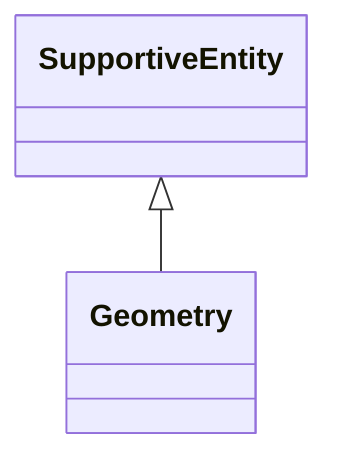

# Class: Geometry


_See [DCAT-AP specs:Geometry](https://semiceu.github.io/DCAT-AP/releases/3.0.0/#Geometry)_


URI: [locn:Geometry](http://www.w3.org/ns/locn#Geometry)





## Inheritance
* [SupportiveEntity](SupportiveEntity.md)
    * **Geometry**


## Slots

| Name | Cardinality and Range | Description | Inheritance |
| ---  | --- | --- | --- |


## Usages

| used by | used in | type | used |
| ---  | --- | --- | --- |
| [Location](Location.md) | [geometry](geometry.md) | range | [Geometry](Geometry.md) |


## Identifier and Mapping Information


### Schema Source


* from schema: https://stroemphi.github.io/dcat-4C-ap/dcat_4c_ap


## Mappings

| Mapping Type | Mapped Value |
| ---  | ---  |
| self | locn:Geometry |
| native | nfdi4c:Geometry |


## LinkML Source

<!-- TODO: investigate https://stackoverflow.com/questions/37606292/how-to-create-tabbed-code-blocks-in-mkdocs-or-sphinx -->

### Direct

<details>
```yaml
name: Geometry
description: See [DCAT-AP specs:Geometry](https://semiceu.github.io/DCAT-AP/releases/3.0.0/#Geometry)
from_schema: https://stroemphi.github.io/dcat-4C-ap/dcat_4c_ap
is_a: SupportiveEntity
abstract: false
class_uri: locn:Geometry

```
</details>

### Induced

<details>
```yaml
name: Geometry
description: See [DCAT-AP specs:Geometry](https://semiceu.github.io/DCAT-AP/releases/3.0.0/#Geometry)
from_schema: https://stroemphi.github.io/dcat-4C-ap/dcat_4c_ap
is_a: SupportiveEntity
abstract: false
class_uri: locn:Geometry

```
</details>