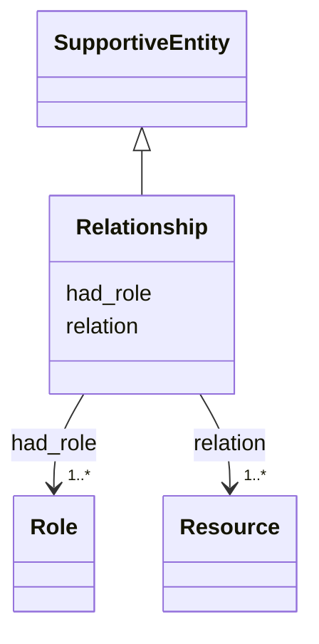

# Class: Relationship


_See [DCAT-AP specs:Relationship](https://semiceu.github.io/DCAT-AP/releases/3.0.0/#Relationship)_


URI: [dcat:Relationship](http://www.w3.org/ns/dcat#Relationship)





## Inheritance
* [SupportiveEntity](SupportiveEntity.md)
    * **Relationship**


## Slots

| Name | Cardinality and Range | Description | Inheritance |
| ---  | --- | --- | --- |
| [had_role](had_role.md) | 1..* <br/> [Role](Role.md) | A function of an entity or agent with respect to another entity or resource | direct |
| [relation](relation.md) | 1..* <br/> [Resource](Resource.md) | A resource related to the source resource | direct |


## Usages

| used by | used in | type | used |
| ---  | --- | --- | --- |
| [NMRAnalysisDataset](NMRAnalysisDataset.md) | [qualified_relation](qualified_relation.md) | range | [Relationship](Relationship.md) |
| [Dataset](Dataset.md) | [qualified_relation](qualified_relation.md) | range | [Relationship](Relationship.md) |
| [ResearchDataset](ResearchDataset.md) | [qualified_relation](qualified_relation.md) | range | [Relationship](Relationship.md) |
| [AnalysisDataset](AnalysisDataset.md) | [qualified_relation](qualified_relation.md) | range | [Relationship](Relationship.md) |


## Identifier and Mapping Information


### Schema Source


* from schema: https://stroemphi.github.io/dcat-4C-ap/dcat_4c_ap


## Mappings

| Mapping Type | Mapped Value |
| ---  | ---  |
| self | dcat:Relationship |
| native | nfdi4c:Relationship |


## LinkML Source

<!-- TODO: investigate https://stackoverflow.com/questions/37606292/how-to-create-tabbed-code-blocks-in-mkdocs-or-sphinx -->

### Direct

<details>
```yaml
name: Relationship
description: See [DCAT-AP specs:Relationship](https://semiceu.github.io/DCAT-AP/releases/3.0.0/#Relationship)
from_schema: https://stroemphi.github.io/dcat-4C-ap/dcat_4c_ap
is_a: SupportiveEntity
abstract: false
slots:
- had_role
- relation
slot_usage:
  had_role:
    name: had_role
    description: A function of an entity or agent with respect to another entity or
      resource.
    slot_uri: dcat:hadRole
    range: Role
    required: true
    multivalued: true
    inlined_as_list: true
  relation:
    name: relation
    description: A resource related to the source resource.
    slot_uri: dcterms:relation
    range: Resource
    required: true
    multivalued: true
    inlined_as_list: true
class_uri: dcat:Relationship

```
</details>

### Induced

<details>
```yaml
name: Relationship
description: See [DCAT-AP specs:Relationship](https://semiceu.github.io/DCAT-AP/releases/3.0.0/#Relationship)
from_schema: https://stroemphi.github.io/dcat-4C-ap/dcat_4c_ap
is_a: SupportiveEntity
abstract: false
slot_usage:
  had_role:
    name: had_role
    description: A function of an entity or agent with respect to another entity or
      resource.
    slot_uri: dcat:hadRole
    range: Role
    required: true
    multivalued: true
    inlined_as_list: true
  relation:
    name: relation
    description: A resource related to the source resource.
    slot_uri: dcterms:relation
    range: Resource
    required: true
    multivalued: true
    inlined_as_list: true
attributes:
  had_role:
    name: had_role
    description: A function of an entity or agent with respect to another entity or
      resource.
    from_schema: https://stroemphi.github.io/dcat-4C-ap/dcat_4c_ap
    rank: 1000
    slot_uri: dcat:hadRole
    alias: had_role
    owner: Relationship
    domain_of:
    - Relationship
    range: Role
    required: true
    multivalued: true
    inlined_as_list: true
  relation:
    name: relation
    description: A resource related to the source resource.
    from_schema: https://stroemphi.github.io/dcat-4C-ap/dcat_4c_ap
    rank: 1000
    slot_uri: dcterms:relation
    alias: relation
    owner: Relationship
    domain_of:
    - Relationship
    range: Resource
    required: true
    multivalued: true
    inlined_as_list: true
class_uri: dcat:Relationship

```
</details>