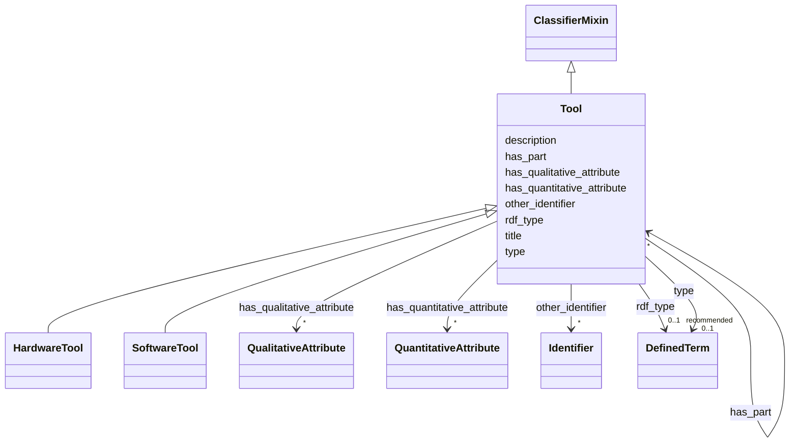

# Class: Tool


_A entity with a certain function used within a DataCreatingActivity._


URI: [prov:Entity](http://www.w3.org/ns/prov#Entity)





## Inheritance
* **Tool** [ [ClassifierMixin](ClassifierMixin.md)]
    * [HardwareTool](HardwareTool.md)
    * [SoftwareTool](SoftwareTool.md)


## Slots

| Name | Cardinality and Range | Description | Inheritance |
| ---  | --- | --- | --- |
| [title](title.md) | 0..1 <br/> [String](String.md) | This slot is described in more detail within the class in which it is used | direct |
| [description](description.md) | 0..1 <br/> [String](String.md) | This slot is described in more detail within the class in which it is used | direct |
| [other_identifier](other_identifier.md) | * <br/> [Identifier](Identifier.md) | A secondary identifier of the EvaluatedActivity | direct |
| [has_qualitative_attribute](has_qualitative_attribute.md) | * <br/> [QualitativeAttribute](QualitativeAttribute.md) | The slot to relate a qualitative attribute to an entity of interest, tool or ... | direct |
| [has_quantitative_attribute](has_quantitative_attribute.md) | * <br/> [QuantitativeAttribute](QuantitativeAttribute.md) | The slot to relate a quantitative  attribute to an entity of interest, tool o... | direct |
| [has_part](has_part.md) | * <br/> [Tool](Tool.md) | The slot to specify parts of a tool | direct |
| [type](type.md) | 0..1 <br/> [DefinedTerm](DefinedTerm.md) | This slot is described in more detail within the class in which it is used | [ClassifierMixin](ClassifierMixin.md) |
| [rdf_type](rdf_type.md) | 0..1 _recommended_ <br/> [DefinedTerm](DefinedTerm.md) | The slot to specify the ontology class that is instantiated by an entity | [ClassifierMixin](ClassifierMixin.md) |


## Usages

| used by | used in | type | used |
| ---  | --- | --- | --- |
| [NMRSpectralAnalysis](NMRSpectralAnalysis.md) | [used_tool](used_tool.md) | range | [Tool](Tool.md) |
| [NMRSpectroscopy](NMRSpectroscopy.md) | [used_tool](used_tool.md) | range | [Tool](Tool.md) |
| [DataCreatingActivity](DataCreatingActivity.md) | [used_tool](used_tool.md) | range | [Tool](Tool.md) |
| [DataAnalysis](DataAnalysis.md) | [used_tool](used_tool.md) | range | [Tool](Tool.md) |
| [Tool](Tool.md) | [has_part](has_part.md) | range | [Tool](Tool.md) |
| [HardwareTool](HardwareTool.md) | [has_part](has_part.md) | range | [Tool](Tool.md) |
| [SoftwareTool](SoftwareTool.md) | [has_part](has_part.md) | range | [Tool](Tool.md) |


## Identifier and Mapping Information


### Schema Source


* from schema: https://stroemphi.github.io/dcat-4C-ap/dcat_4c_ap


## Mappings

| Mapping Type | Mapped Value |
| ---  | ---  |
| self | prov:Entity |
| native | nfdi4c:Tool |
| broad | prov:Entity |


## LinkML Source

<!-- TODO: investigate https://stackoverflow.com/questions/37606292/how-to-create-tabbed-code-blocks-in-mkdocs-or-sphinx -->

### Direct

<details>
```yaml
name: Tool
description: A entity with a certain function used within a DataCreatingActivity.
from_schema: https://stroemphi.github.io/dcat-4C-ap/dcat_4c_ap
broad_mappings:
- prov:Entity
mixins:
- ClassifierMixin
slots:
- title
- description
- other_identifier
- has_qualitative_attribute
- has_quantitative_attribute
- has_part
slot_usage:
  has_part:
    name: has_part
    description: The slot to specify parts of a tool.
    range: Tool
    multivalued: true
    inlined: true
    inlined_as_list: true
  other_identifier:
    name: other_identifier
    description: A secondary identifier of the EvaluatedActivity
    slot_uri: adms:identifier
    range: Identifier
    required: false
    multivalued: true
    inlined_as_list: true
class_uri: prov:Entity

```
</details>

### Induced

<details>
```yaml
name: Tool
description: A entity with a certain function used within a DataCreatingActivity.
from_schema: https://stroemphi.github.io/dcat-4C-ap/dcat_4c_ap
broad_mappings:
- prov:Entity
mixins:
- ClassifierMixin
slot_usage:
  has_part:
    name: has_part
    description: The slot to specify parts of a tool.
    range: Tool
    multivalued: true
    inlined: true
    inlined_as_list: true
  other_identifier:
    name: other_identifier
    description: A secondary identifier of the EvaluatedActivity
    slot_uri: adms:identifier
    range: Identifier
    required: false
    multivalued: true
    inlined_as_list: true
attributes:
  title:
    name: title
    description: This slot is described in more detail within the class in which it
      is used.
    from_schema: https://stroemphi.github.io/dcat-4C-ap/dcat_4c_ap
    rank: 1000
    slot_uri: dcterms:title
    alias: title
    owner: Tool
    domain_of:
    - Catalogue
    - CatalogueRecord
    - ConceptScheme
    - DataService
    - Dataset
    - DatasetSeries
    - Distribution
    - DefinedTerm
    - DataCreatingActivity
    - EvaluatedEntity
    - EvaluatedActivity
    - Tool
    - Environment
    - Plan
    - QualitativeAttribute
    - QuantitativeAttribute
    range: string
  description:
    name: description
    description: This slot is described in more detail within the class in which it
      is used.
    from_schema: https://stroemphi.github.io/dcat-4C-ap/dcat_4c_ap
    rank: 1000
    slot_uri: dcterms:description
    alias: description
    owner: Tool
    domain_of:
    - Catalogue
    - CatalogueRecord
    - DataService
    - Dataset
    - DatasetSeries
    - Distribution
    - DataCreatingActivity
    - EvaluatedEntity
    - EvaluatedActivity
    - Tool
    - Environment
    - Plan
    - QualitativeAttribute
    - QuantitativeAttribute
    range: string
  other_identifier:
    name: other_identifier
    description: A secondary identifier of the EvaluatedActivity
    from_schema: https://stroemphi.github.io/dcat-4C-ap/dcat_4c_ap
    rank: 1000
    slot_uri: adms:identifier
    alias: other_identifier
    owner: Tool
    domain_of:
    - Dataset
    - DataCreatingActivity
    - EvaluatedEntity
    - EvaluatedActivity
    - Tool
    - Environment
    range: Identifier
    required: false
    multivalued: true
    inlined_as_list: true
  has_qualitative_attribute:
    name: has_qualitative_attribute
    description: The slot to relate a qualitative attribute to an entity of interest,
      tool or environment.
    from_schema: https://stroemphi.github.io/dcat-4C-ap/dcat_4c_ap
    rank: 1000
    slot_uri: dcterms:relation
    alias: has_qualitative_attribute
    owner: Tool
    domain_of:
    - EvaluatedEntity
    - EvaluatedActivity
    - Tool
    range: QualitativeAttribute
    multivalued: true
    inlined: true
    inlined_as_list: true
  has_quantitative_attribute:
    name: has_quantitative_attribute
    description: The slot to relate a quantitative  attribute to an entity of interest,
      tool or environment.
    from_schema: https://stroemphi.github.io/dcat-4C-ap/dcat_4c_ap
    rank: 1000
    slot_uri: dcterms:relation
    alias: has_quantitative_attribute
    owner: Tool
    domain_of:
    - EvaluatedEntity
    - EvaluatedActivity
    - Tool
    range: QuantitativeAttribute
    multivalued: true
    inlined: true
    inlined_as_list: true
  has_part:
    name: has_part
    description: The slot to specify parts of a tool.
    from_schema: https://stroemphi.github.io/dcat-4C-ap/dcat_4c_ap
    rank: 1000
    slot_uri: dcterms:hasPart
    alias: has_part
    owner: Tool
    domain_of:
    - Catalogue
    - DataCreatingActivity
    - EvaluatedEntity
    - EvaluatedActivity
    - Tool
    range: Tool
    multivalued: true
    inlined: true
    inlined_as_list: true
  type:
    name: type
    description: This slot is described in more detail within the class in which it
      is used.
    from_schema: https://stroemphi.github.io/dcat-4C-ap/dcat_4c_ap
    rank: 1000
    slot_uri: dcterms:type
    alias: type
    owner: Tool
    domain_of:
    - Agent
    - Dataset
    - LicenseDocument
    - ClassifierMixin
    range: DefinedTerm
    inlined: true
  rdf_type:
    name: rdf_type
    description: The slot to specify the ontology class that is instantiated by an
      entity.
    from_schema: https://stroemphi.github.io/dcat-4C-ap/dcat_4c_ap
    rank: 1000
    slot_uri: rdf:type
    alias: rdf_type
    owner: Tool
    domain_of:
    - ClassifierMixin
    range: DefinedTerm
    recommended: true
    inlined: true
class_uri: prov:Entity

```
</details>