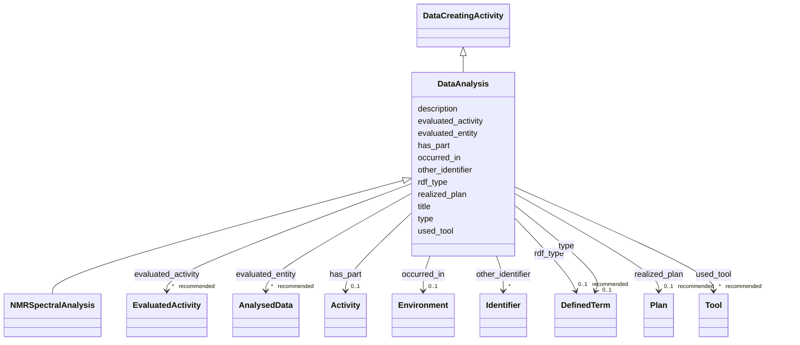

# Class: DataAnalysis


_A DataCreatingActivity that evaluates the data produced by another DataCreatingActivity._


URI: [prov:Activity](http://www.w3.org/ns/prov#Activity)





## Inheritance
* [Activity](Activity.md)
    * [DataCreatingActivity](DataCreatingActivity.md) [ [ClassifierMixin](ClassifierMixin.md)]
        * **DataAnalysis**
            * [NMRSpectralAnalysis](NMRSpectralAnalysis.md)


## Slots

| Name | Cardinality and Range | Description | Inheritance |
| ---  | --- | --- | --- |
| [title](title.md) | 0..1 <br/> [String](String.md) | This slot is described in more detail within the class in which it is used | [DataCreatingActivity](DataCreatingActivity.md) |
| [description](description.md) | 0..1 <br/> [String](String.md) | This slot is described in more detail within the class in which it is used | [DataCreatingActivity](DataCreatingActivity.md) |
| [other_identifier](other_identifier.md) | * <br/> [Identifier](Identifier.md) | A secondary identifier of the DataCreatingActivity | [DataCreatingActivity](DataCreatingActivity.md) |
| [evaluated_entity](evaluated_entity.md) | * _recommended_ <br/> [AnalysedData](AnalysedData.md) | The slot to specify the entity of interest that was evaluated | [DataCreatingActivity](DataCreatingActivity.md) |
| [evaluated_activity](evaluated_activity.md) | * _recommended_ <br/> [EvaluatedActivity](EvaluatedActivity.md) | The slot to specify the activity of interest that was evaluated | [DataCreatingActivity](DataCreatingActivity.md) |
| [used_tool](used_tool.md) | * _recommended_ <br/> [Tool](Tool.md) | The slot to specify the tool that was used | [DataCreatingActivity](DataCreatingActivity.md) |
| [realized_plan](realized_plan.md) | 0..1 _recommended_ <br/> [Plan](Plan.md) | The slot to specify the Method (aka Procedure) that was realized by a DataCre... | [DataCreatingActivity](DataCreatingActivity.md) |
| [has_part](has_part.md) | 0..1 <br/> [Activity](Activity.md) | The slot to specify one or more parts of the DataCreatingActivity that are th... | [DataCreatingActivity](DataCreatingActivity.md) |
| [occurred_in](occurred_in.md) | 0..1 <br/> [Environment](Environment.md) | The slot to specify the Method (aka Procedure) that was used in the DataCreat... | [DataCreatingActivity](DataCreatingActivity.md) |
| [type](type.md) | 0..1 <br/> [DefinedTerm](DefinedTerm.md) | This slot is described in more detail within the class in which it is used | [ClassifierMixin](ClassifierMixin.md) |
| [rdf_type](rdf_type.md) | 0..1 _recommended_ <br/> [DefinedTerm](DefinedTerm.md) | The slot to specify the ontology class that is instantiated by an entity | [ClassifierMixin](ClassifierMixin.md) |


## Usages

| used by | used in | type | used |
| ---  | --- | --- | --- |
| [AnalysisDataset](AnalysisDataset.md) | [was_generated_by](was_generated_by.md) | range | [DataAnalysis](DataAnalysis.md) |


## Identifier and Mapping Information


### Schema Source


* from schema: https://stroemphi.github.io/dcat-4C-ap/dcat_4c_ap


## Mappings

| Mapping Type | Mapped Value |
| ---  | ---  |
| self | prov:Activity |
| native | nfdi4c:DataAnalysis |
| exact | OBI:0200000 |
| close | http://purl.obolibrary.org/obo/NCIT_C25391 |


## LinkML Source

<!-- TODO: investigate https://stackoverflow.com/questions/37606292/how-to-create-tabbed-code-blocks-in-mkdocs-or-sphinx -->

### Direct

<details>
```yaml
name: DataAnalysis
description: A DataCreatingActivity that evaluates the data produced by another DataCreatingActivity.
from_schema: https://stroemphi.github.io/dcat-4C-ap/dcat_4c_ap
exact_mappings:
- OBI:0200000
close_mappings:
- http://purl.obolibrary.org/obo/NCIT_C25391
is_a: DataCreatingActivity
slot_usage:
  evaluated_entity:
    name: evaluated_entity
    range: AnalysedData
class_uri: prov:Activity

```
</details>

### Induced

<details>
```yaml
name: DataAnalysis
description: A DataCreatingActivity that evaluates the data produced by another DataCreatingActivity.
from_schema: https://stroemphi.github.io/dcat-4C-ap/dcat_4c_ap
exact_mappings:
- OBI:0200000
close_mappings:
- http://purl.obolibrary.org/obo/NCIT_C25391
is_a: DataCreatingActivity
slot_usage:
  evaluated_entity:
    name: evaluated_entity
    range: AnalysedData
attributes:
  title:
    name: title
    description: This slot is described in more detail within the class in which it
      is used.
    from_schema: https://stroemphi.github.io/dcat-4C-ap/dcat_4c_ap
    rank: 1000
    slot_uri: dcterms:title
    alias: title
    owner: DataAnalysis
    domain_of:
    - Catalogue
    - CatalogueRecord
    - ConceptScheme
    - DataService
    - Dataset
    - DatasetSeries
    - Distribution
    - DefinedTerm
    - DataCreatingActivity
    - EvaluatedEntity
    - EvaluatedActivity
    - Tool
    - Environment
    - Plan
    - QualitativeAttribute
    - QuantitativeAttribute
    range: string
  description:
    name: description
    description: This slot is described in more detail within the class in which it
      is used.
    from_schema: https://stroemphi.github.io/dcat-4C-ap/dcat_4c_ap
    rank: 1000
    slot_uri: dcterms:description
    alias: description
    owner: DataAnalysis
    domain_of:
    - Catalogue
    - CatalogueRecord
    - DataService
    - Dataset
    - DatasetSeries
    - Distribution
    - DataCreatingActivity
    - EvaluatedEntity
    - EvaluatedActivity
    - Tool
    - Environment
    - Plan
    - QualitativeAttribute
    - QuantitativeAttribute
    range: string
  other_identifier:
    name: other_identifier
    description: A secondary identifier of the DataCreatingActivity
    from_schema: https://stroemphi.github.io/dcat-4C-ap/dcat_4c_ap
    rank: 1000
    slot_uri: adms:identifier
    alias: other_identifier
    owner: DataAnalysis
    domain_of:
    - Dataset
    - DataCreatingActivity
    - EvaluatedEntity
    - EvaluatedActivity
    - Tool
    - Environment
    range: Identifier
    required: false
    multivalued: true
    inlined_as_list: true
  evaluated_entity:
    name: evaluated_entity
    description: The slot to specify the entity of interest that was evaluated.
    from_schema: https://stroemphi.github.io/dcat-4C-ap/dcat_4c_ap
    rank: 1000
    slot_uri: prov:used
    alias: evaluated_entity
    owner: DataAnalysis
    domain_of:
    - DataCreatingActivity
    range: AnalysedData
    recommended: true
    multivalued: true
    inlined: true
    inlined_as_list: true
  evaluated_activity:
    name: evaluated_activity
    description: The slot to specify the activity of interest that was evaluated.
    from_schema: https://stroemphi.github.io/dcat-4C-ap/dcat_4c_ap
    rank: 1000
    slot_uri: prov:wasInformedBy
    alias: evaluated_activity
    owner: DataAnalysis
    domain_of:
    - DataCreatingActivity
    range: EvaluatedActivity
    recommended: true
    multivalued: true
    inlined: true
    inlined_as_list: true
  used_tool:
    name: used_tool
    description: The slot to specify the tool that was used.
    from_schema: https://stroemphi.github.io/dcat-4C-ap/dcat_4c_ap
    rank: 1000
    slot_uri: prov:used
    alias: used_tool
    owner: DataAnalysis
    domain_of:
    - DataCreatingActivity
    range: Tool
    recommended: true
    multivalued: true
    inlined: true
    inlined_as_list: true
  realized_plan:
    name: realized_plan
    description: The slot to specify the Method (aka Procedure) that was realized
      by a DataCreatingActivity.
    from_schema: https://stroemphi.github.io/dcat-4C-ap/dcat_4c_ap
    rank: 1000
    slot_uri: prov:used
    alias: realized_plan
    owner: DataAnalysis
    domain_of:
    - DataCreatingActivity
    range: Plan
    recommended: true
  has_part:
    name: has_part
    description: The slot to specify one or more parts of the DataCreatingActivity
      that are themselves also data generating activities.
    from_schema: https://stroemphi.github.io/dcat-4C-ap/dcat_4c_ap
    rank: 1000
    slot_uri: dcterms:hasPart
    alias: has_part
    owner: DataAnalysis
    domain_of:
    - Catalogue
    - DataCreatingActivity
    - EvaluatedEntity
    - EvaluatedActivity
    - Tool
    range: Activity
    inlined: true
  occurred_in:
    name: occurred_in
    description: The slot to specify the Method (aka Procedure) that was used in the
      DataCreatingActivity.
    from_schema: https://stroemphi.github.io/dcat-4C-ap/dcat_4c_ap
    rank: 1000
    slot_uri: BFO:0000066
    alias: occurred_in
    owner: DataAnalysis
    domain_of:
    - DataCreatingActivity
    range: Environment
  type:
    name: type
    description: This slot is described in more detail within the class in which it
      is used.
    from_schema: https://stroemphi.github.io/dcat-4C-ap/dcat_4c_ap
    rank: 1000
    slot_uri: dcterms:type
    alias: type
    owner: DataAnalysis
    domain_of:
    - Agent
    - Dataset
    - LicenseDocument
    - ClassifierMixin
    range: DefinedTerm
    inlined: true
  rdf_type:
    name: rdf_type
    description: The slot to specify the ontology class that is instantiated by an
      entity.
    from_schema: https://stroemphi.github.io/dcat-4C-ap/dcat_4c_ap
    rank: 1000
    slot_uri: rdf:type
    alias: rdf_type
    owner: DataAnalysis
    domain_of:
    - ClassifierMixin
    range: DefinedTerm
    recommended: true
    inlined: true
class_uri: prov:Activity

```
</details>