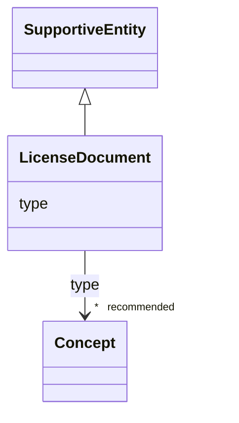

# Class: LicenseDocument


_See [DCAT-AP specs:LicenseDocument](https://semiceu.github.io/DCAT-AP/releases/3.0.0/#LicenseDocument)_


URI: [dcterms:LicenseDocument](http://purl.org/dc/terms/LicenseDocument)





## Inheritance
* [SupportiveEntity](SupportiveEntity.md)
    * **LicenseDocument**


## Slots

| Name | Cardinality and Range | Description | Inheritance |
| ---  | --- | --- | --- |
| [type](type.md) | * _recommended_ <br/> [Concept](Concept.md) | A type of licence, e | direct |


## Usages

| used by | used in | type | used |
| ---  | --- | --- | --- |
| [Catalogue](Catalogue.md) | [licence](licence.md) | range | [LicenseDocument](LicenseDocument.md) |
| [DataService](DataService.md) | [licence](licence.md) | range | [LicenseDocument](LicenseDocument.md) |
| [Distribution](Distribution.md) | [licence](licence.md) | range | [LicenseDocument](LicenseDocument.md) |
| [ResearchCatalog](ResearchCatalog.md) | [licence](licence.md) | range | [LicenseDocument](LicenseDocument.md) |


## Identifier and Mapping Information


### Schema Source


* from schema: https://stroemphi.github.io/dcat-4C-ap/dcat_4c_ap


## Mappings

| Mapping Type | Mapped Value |
| ---  | ---  |
| self | dcterms:LicenseDocument |
| native | nfdi4c:LicenseDocument |


## LinkML Source

<!-- TODO: investigate https://stackoverflow.com/questions/37606292/how-to-create-tabbed-code-blocks-in-mkdocs-or-sphinx -->

### Direct

<details>
```yaml
name: LicenseDocument
description: See [DCAT-AP specs:LicenseDocument](https://semiceu.github.io/DCAT-AP/releases/3.0.0/#LicenseDocument)
from_schema: https://stroemphi.github.io/dcat-4C-ap/dcat_4c_ap
is_a: SupportiveEntity
abstract: false
slots:
- type
slot_usage:
  type:
    name: type
    description: A type of licence, e.g. indicating 'public domain' or 'royalties
      required'.
    slot_uri: dcterms:type
    range: Concept
    required: false
    recommended: true
    multivalued: true
    inlined_as_list: true
class_uri: dcterms:LicenseDocument

```
</details>

### Induced

<details>
```yaml
name: LicenseDocument
description: See [DCAT-AP specs:LicenseDocument](https://semiceu.github.io/DCAT-AP/releases/3.0.0/#LicenseDocument)
from_schema: https://stroemphi.github.io/dcat-4C-ap/dcat_4c_ap
is_a: SupportiveEntity
abstract: false
slot_usage:
  type:
    name: type
    description: A type of licence, e.g. indicating 'public domain' or 'royalties
      required'.
    slot_uri: dcterms:type
    range: Concept
    required: false
    recommended: true
    multivalued: true
    inlined_as_list: true
attributes:
  type:
    name: type
    description: A type of licence, e.g. indicating 'public domain' or 'royalties
      required'.
    from_schema: https://stroemphi.github.io/dcat-4C-ap/dcat_4c_ap
    rank: 1000
    slot_uri: dcterms:type
    alias: type
    owner: LicenseDocument
    domain_of:
    - Agent
    - Dataset
    - LicenseDocument
    - ClassifierMixin
    range: Concept
    required: false
    recommended: true
    multivalued: true
    inlined_as_list: true
class_uri: dcterms:LicenseDocument

```
</details>