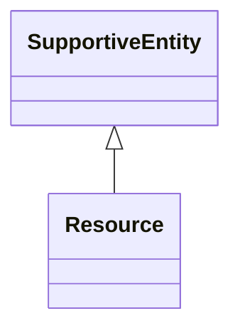

# Class: Resource


_See [DCAT-AP specs:Resource](https://semiceu.github.io/DCAT-AP/releases/3.0.0/#Resource)_


URI: [rdfs:Resource](http://www.w3.org/2000/01/rdf-schema#Resource)





## Inheritance
* [SupportiveEntity](SupportiveEntity.md)
    * **Resource**


## Slots

| Name | Cardinality and Range | Description | Inheritance |
| ---  | --- | --- | --- |


## Usages

| used by | used in | type | used |
| ---  | --- | --- | --- |
| [NMRAnalysisDataset](NMRAnalysisDataset.md) | [is_referenced_by](is_referenced_by.md) | range | [Resource](Resource.md) |
| [NMRAnalysisDataset](NMRAnalysisDataset.md) | [related_resource](related_resource.md) | range | [Resource](Resource.md) |
| [DataService](DataService.md) | [endpoint_URL](endpoint_URL.md) | range | [Resource](Resource.md) |
| [DataService](DataService.md) | [endpoint_description](endpoint_description.md) | range | [Resource](Resource.md) |
| [Dataset](Dataset.md) | [is_referenced_by](is_referenced_by.md) | range | [Resource](Resource.md) |
| [Dataset](Dataset.md) | [related_resource](related_resource.md) | range | [Resource](Resource.md) |
| [Distribution](Distribution.md) | [access_URL](access_URL.md) | range | [Resource](Resource.md) |
| [Distribution](Distribution.md) | [download_URL](download_URL.md) | range | [Resource](Resource.md) |
| [Relationship](Relationship.md) | [relation](relation.md) | range | [Resource](Resource.md) |
| [ResearchDataset](ResearchDataset.md) | [is_referenced_by](is_referenced_by.md) | range | [Resource](Resource.md) |
| [ResearchDataset](ResearchDataset.md) | [related_resource](related_resource.md) | range | [Resource](Resource.md) |
| [AnalysisDataset](AnalysisDataset.md) | [is_referenced_by](is_referenced_by.md) | range | [Resource](Resource.md) |
| [AnalysisDataset](AnalysisDataset.md) | [related_resource](related_resource.md) | range | [Resource](Resource.md) |


## Identifier and Mapping Information


### Schema Source


* from schema: https://stroemphi.github.io/dcat-4C-ap/dcat_4c_ap


## Mappings

| Mapping Type | Mapped Value |
| ---  | ---  |
| self | rdfs:Resource |
| native | nfdi4c:Resource |


## LinkML Source

<!-- TODO: investigate https://stackoverflow.com/questions/37606292/how-to-create-tabbed-code-blocks-in-mkdocs-or-sphinx -->

### Direct

<details>
```yaml
name: Resource
description: See [DCAT-AP specs:Resource](https://semiceu.github.io/DCAT-AP/releases/3.0.0/#Resource)
from_schema: https://stroemphi.github.io/dcat-4C-ap/dcat_4c_ap
is_a: SupportiveEntity
abstract: false
class_uri: rdfs:Resource

```
</details>

### Induced

<details>
```yaml
name: Resource
description: See [DCAT-AP specs:Resource](https://semiceu.github.io/DCAT-AP/releases/3.0.0/#Resource)
from_schema: https://stroemphi.github.io/dcat-4C-ap/dcat_4c_ap
is_a: SupportiveEntity
abstract: false
class_uri: rdfs:Resource

```
</details>