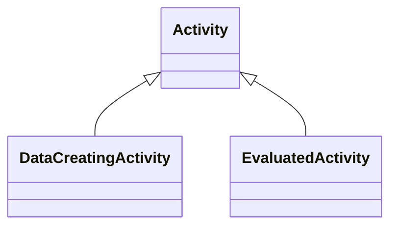

# Class: Activity


_See [DCAT-AP specs:Activity](https://semiceu.github.io/DCAT-AP/releases/3.0.0/#Activity)_


URI: [prov:Activity](http://www.w3.org/ns/prov#Activity)





## Inheritance
* **Activity**
    * [DataCreatingActivity](DataCreatingActivity.md) [ [ClassifierMixin](ClassifierMixin.md)]
    * [EvaluatedActivity](EvaluatedActivity.md) [ [ClassifierMixin](ClassifierMixin.md)]


## Slots

| Name | Cardinality and Range | Description | Inheritance |
| ---  | --- | --- | --- |


## Usages

| used by | used in | type | used |
| ---  | --- | --- | --- |
| [NMRSpectralAnalysis](NMRSpectralAnalysis.md) | [has_part](has_part.md) | range | [Activity](Activity.md) |
| [NMRSpectroscopy](NMRSpectroscopy.md) | [has_part](has_part.md) | range | [Activity](Activity.md) |
| [ChemicalSubstance](ChemicalSubstance.md) | [was_generated_by](was_generated_by.md) | range | [Activity](Activity.md) |
| [ChemicalSample](ChemicalSample.md) | [was_generated_by](was_generated_by.md) | range | [Activity](Activity.md) |
| [Dataset](Dataset.md) | [was_generated_by](was_generated_by.md) | range | [Activity](Activity.md) |
| [DataCreatingActivity](DataCreatingActivity.md) | [has_part](has_part.md) | range | [Activity](Activity.md) |
| [DataAnalysis](DataAnalysis.md) | [has_part](has_part.md) | range | [Activity](Activity.md) |
| [EvaluatedEntity](EvaluatedEntity.md) | [was_generated_by](was_generated_by.md) | range | [Activity](Activity.md) |


## Identifier and Mapping Information


### Schema Source


* from schema: https://stroemphi.github.io/dcat-4C-ap/dcat_4c_ap


## Mappings

| Mapping Type | Mapped Value |
| ---  | ---  |
| self | prov:Activity |
| native | nfdi4c:Activity |


## LinkML Source

<!-- TODO: investigate https://stackoverflow.com/questions/37606292/how-to-create-tabbed-code-blocks-in-mkdocs-or-sphinx -->

### Direct

<details>
```yaml
name: Activity
description: See [DCAT-AP specs:Activity](https://semiceu.github.io/DCAT-AP/releases/3.0.0/#Activity)
from_schema: https://stroemphi.github.io/dcat-4C-ap/dcat_4c_ap
abstract: false
class_uri: prov:Activity

```
</details>

### Induced

<details>
```yaml
name: Activity
description: See [DCAT-AP specs:Activity](https://semiceu.github.io/DCAT-AP/releases/3.0.0/#Activity)
from_schema: https://stroemphi.github.io/dcat-4C-ap/dcat_4c_ap
abstract: false
class_uri: prov:Activity

```
</details>