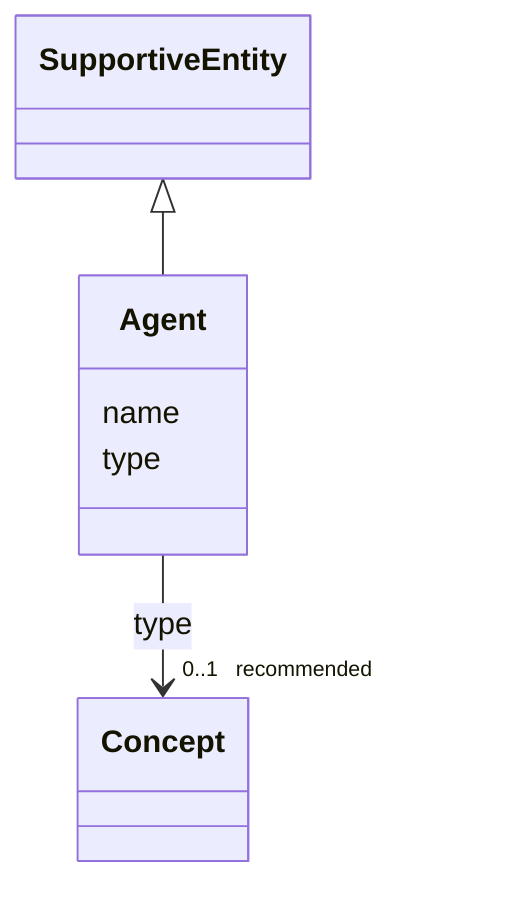

# Class: Agent


_See [DCAT-AP specs:Agent](https://semiceu.github.io/DCAT-AP/releases/3.0.0/#Agent)_


URI: [foaf:Agent](http://xmlns.com/foaf/0.1/Agent)





## Inheritance
* [SupportiveEntity](SupportiveEntity.md)
    * **Agent**


## Slots

| Name | Cardinality and Range | Description | Inheritance |
| ---  | --- | --- | --- |
| [name](name.md) | 1..* <br/> [String](String.md) | A name of the agent | direct |
| [type](type.md) | 0..1 _recommended_ <br/> [Concept](Concept.md) | The nature of the agent | direct |


## Usages

| used by | used in | type | used |
| ---  | --- | --- | --- |
| [NMRAnalysisDataset](NMRAnalysisDataset.md) | [creator](creator.md) | range | [Agent](Agent.md) |
| [NMRAnalysisDataset](NMRAnalysisDataset.md) | [publisher](publisher.md) | range | [Agent](Agent.md) |
| [Catalogue](Catalogue.md) | [creator](creator.md) | range | [Agent](Agent.md) |
| [Catalogue](Catalogue.md) | [publisher](publisher.md) | range | [Agent](Agent.md) |
| [DataService](DataService.md) | [publisher](publisher.md) | range | [Agent](Agent.md) |
| [Dataset](Dataset.md) | [creator](creator.md) | range | [Agent](Agent.md) |
| [Dataset](Dataset.md) | [publisher](publisher.md) | range | [Agent](Agent.md) |
| [DatasetSeries](DatasetSeries.md) | [publisher](publisher.md) | range | [Agent](Agent.md) |
| [ResearchDataset](ResearchDataset.md) | [creator](creator.md) | range | [Agent](Agent.md) |
| [ResearchDataset](ResearchDataset.md) | [publisher](publisher.md) | range | [Agent](Agent.md) |
| [AnalysisDataset](AnalysisDataset.md) | [creator](creator.md) | range | [Agent](Agent.md) |
| [AnalysisDataset](AnalysisDataset.md) | [publisher](publisher.md) | range | [Agent](Agent.md) |
| [ResearchCatalog](ResearchCatalog.md) | [creator](creator.md) | range | [Agent](Agent.md) |
| [ResearchCatalog](ResearchCatalog.md) | [publisher](publisher.md) | range | [Agent](Agent.md) |


## Identifier and Mapping Information


### Schema Source


* from schema: https://stroemphi.github.io/dcat-4C-ap/dcat_4c_ap


## Mappings

| Mapping Type | Mapped Value |
| ---  | ---  |
| self | foaf:Agent |
| native | nfdi4c:Agent |


## LinkML Source

<!-- TODO: investigate https://stackoverflow.com/questions/37606292/how-to-create-tabbed-code-blocks-in-mkdocs-or-sphinx -->

### Direct

<details>
```yaml
name: Agent
description: See [DCAT-AP specs:Agent](https://semiceu.github.io/DCAT-AP/releases/3.0.0/#Agent)
from_schema: https://stroemphi.github.io/dcat-4C-ap/dcat_4c_ap
is_a: SupportiveEntity
abstract: false
slots:
- name
- type
slot_usage:
  name:
    name: name
    description: A name of the agent.
    slot_uri: foaf:name
    range: string
    required: true
    multivalued: true
    inlined_as_list: true
  type:
    name: type
    description: The nature of the agent.
    slot_uri: dcterms:type
    range: Concept
    required: false
    recommended: true
    multivalued: false
    inlined_as_list: true
class_uri: foaf:Agent

```
</details>

### Induced

<details>
```yaml
name: Agent
description: See [DCAT-AP specs:Agent](https://semiceu.github.io/DCAT-AP/releases/3.0.0/#Agent)
from_schema: https://stroemphi.github.io/dcat-4C-ap/dcat_4c_ap
is_a: SupportiveEntity
abstract: false
slot_usage:
  name:
    name: name
    description: A name of the agent.
    slot_uri: foaf:name
    range: string
    required: true
    multivalued: true
    inlined_as_list: true
  type:
    name: type
    description: The nature of the agent.
    slot_uri: dcterms:type
    range: Concept
    required: false
    recommended: true
    multivalued: false
    inlined_as_list: true
attributes:
  name:
    name: name
    description: A name of the agent.
    from_schema: https://stroemphi.github.io/dcat-4C-ap/dcat_4c_ap
    rank: 1000
    slot_uri: foaf:name
    alias: name
    owner: Agent
    domain_of:
    - Agent
    range: string
    required: true
    multivalued: true
    inlined_as_list: true
  type:
    name: type
    description: The nature of the agent.
    from_schema: https://stroemphi.github.io/dcat-4C-ap/dcat_4c_ap
    rank: 1000
    slot_uri: dcterms:type
    alias: type
    owner: Agent
    domain_of:
    - Agent
    - Dataset
    - LicenseDocument
    - ClassifierMixin
    range: Concept
    required: false
    recommended: true
    multivalued: false
    inlined_as_list: true
class_uri: foaf:Agent

```
</details>