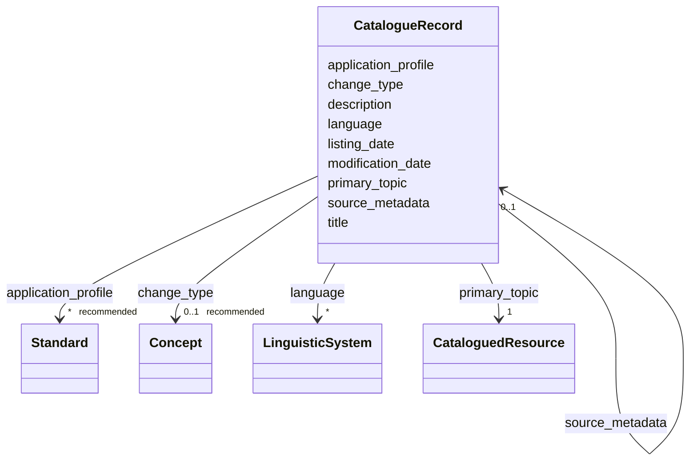

# Class: CatalogueRecord


_See [DCAT-AP specs:CatalogueRecord](https://semiceu.github.io/DCAT-AP/releases/3.0.0/#CatalogueRecord)_


URI: [dcat:CatalogRecord](http://www.w3.org/ns/dcat#CatalogRecord)





<!-- no inheritance hierarchy -->


## Slots

| Name | Cardinality and Range | Description | Inheritance |
| ---  | --- | --- | --- |
| [application_profile](application_profile.md) | * _recommended_ <br/> [Standard](Standard.md) | An Application Profile that the Catalogued Resource&#39;s metadata conforms t... | direct |
| [change_type](change_type.md) | 0..1 _recommended_ <br/> [Concept](Concept.md) | The status of the catalogue record in the context of editorial flow of the da... | direct |
| [description](description.md) | * <br/> [String](String.md) | A free-text account of the record | direct |
| [language](language.md) | * <br/> [LinguisticSystem](LinguisticSystem.md) | A language used in the textual metadata describing titles, descriptions, etc | direct |
| [listing_date](listing_date.md) | 0..1 _recommended_ <br/> [String](String.md) | The date on which the description of the Resource was included in the Catalog... | direct |
| [modification_date](modification_date.md) | 1 <br/> [String](String.md) | The most recent date on which the Catalogue entry was changed or modified | direct |
| [primary_topic](primary_topic.md) | 1 <br/> [CataloguedResource](CataloguedResource.md) | A link to the Dataset, Data service or Catalog described in the record | direct |
| [source_metadata](source_metadata.md) | 0..1 <br/> [CatalogueRecord](CatalogueRecord.md) | The original metadata that was used in creating metadata for the Dataset, Dat... | direct |
| [title](title.md) | * <br/> [String](String.md) | A name given to the Catalogue Record | direct |


## Usages

| used by | used in | type | used |
| ---  | --- | --- | --- |
| [Catalogue](Catalogue.md) | [record](record.md) | range | [CatalogueRecord](CatalogueRecord.md) |
| [CatalogueRecord](CatalogueRecord.md) | [source_metadata](source_metadata.md) | range | [CatalogueRecord](CatalogueRecord.md) |
| [ResearchCatalog](ResearchCatalog.md) | [record](record.md) | range | [CatalogueRecord](CatalogueRecord.md) |


## Identifier and Mapping Information


### Schema Source


* from schema: https://stroemphi.github.io/dcat-4C-ap/dcat_4c_ap


## Mappings

| Mapping Type | Mapped Value |
| ---  | ---  |
| self | dcat:CatalogRecord |
| native | nfdi4c:CatalogueRecord |


## LinkML Source

<!-- TODO: investigate https://stackoverflow.com/questions/37606292/how-to-create-tabbed-code-blocks-in-mkdocs-or-sphinx -->

### Direct

<details>
```yaml
name: CatalogueRecord
description: See [DCAT-AP specs:CatalogueRecord](https://semiceu.github.io/DCAT-AP/releases/3.0.0/#CatalogueRecord)
from_schema: https://stroemphi.github.io/dcat-4C-ap/dcat_4c_ap
abstract: false
slots:
- application_profile
- change_type
- description
- language
- listing_date
- modification_date
- primary_topic
- source_metadata
- title
slot_usage:
  application_profile:
    name: application_profile
    description: An Application Profile that the Catalogued Resource&#39;s metadata
      conforms to.
    slot_uri: dcterms:conformsTo
    range: Standard
    required: false
    recommended: true
    multivalued: true
    inlined_as_list: true
  change_type:
    name: change_type
    description: The status of the catalogue record in the context of editorial flow
      of the dataset and data service descriptions.
    slot_uri: adms:status
    range: Concept
    required: false
    recommended: true
    multivalued: false
    inlined_as_list: true
  description:
    name: description
    description: A free-text account of the record. This property can be repeated
      for parallel language versions of the description.
    slot_uri: dcterms:description
    range: string
    required: false
    multivalued: true
    inlined_as_list: true
  language:
    name: language
    description: A language used in the textual metadata describing titles, descriptions,
      etc. of the Catalogued Resource.
    slot_uri: dcterms:language
    range: LinguisticSystem
    required: false
    multivalued: true
    inlined_as_list: true
  listing_date:
    name: listing_date
    description: The date on which the description of the Resource was included in
      the Catalogue.
    slot_uri: dcterms:issued
    range: string
    required: false
    recommended: true
    multivalued: false
    inlined_as_list: true
  modification_date:
    name: modification_date
    description: The most recent date on which the Catalogue entry was changed or
      modified.
    slot_uri: dcterms:modified
    range: string
    required: true
    multivalued: false
    inlined_as_list: false
  primary_topic:
    name: primary_topic
    description: A link to the Dataset, Data service or Catalog described in the record.
    slot_uri: foaf:primaryTopic
    range: CataloguedResource
    required: true
    multivalued: false
    inlined_as_list: false
  source_metadata:
    name: source_metadata
    description: The original metadata that was used in creating metadata for the
      Dataset, Data Service or Dataset Series.
    slot_uri: dcterms:source
    range: CatalogueRecord
    required: false
    multivalued: false
    inlined_as_list: true
  title:
    name: title
    description: A name given to the Catalogue Record.
    slot_uri: dcterms:title
    range: string
    required: false
    multivalued: true
    inlined_as_list: true
class_uri: dcat:CatalogRecord

```
</details>

### Induced

<details>
```yaml
name: CatalogueRecord
description: See [DCAT-AP specs:CatalogueRecord](https://semiceu.github.io/DCAT-AP/releases/3.0.0/#CatalogueRecord)
from_schema: https://stroemphi.github.io/dcat-4C-ap/dcat_4c_ap
abstract: false
slot_usage:
  application_profile:
    name: application_profile
    description: An Application Profile that the Catalogued Resource&#39;s metadata
      conforms to.
    slot_uri: dcterms:conformsTo
    range: Standard
    required: false
    recommended: true
    multivalued: true
    inlined_as_list: true
  change_type:
    name: change_type
    description: The status of the catalogue record in the context of editorial flow
      of the dataset and data service descriptions.
    slot_uri: adms:status
    range: Concept
    required: false
    recommended: true
    multivalued: false
    inlined_as_list: true
  description:
    name: description
    description: A free-text account of the record. This property can be repeated
      for parallel language versions of the description.
    slot_uri: dcterms:description
    range: string
    required: false
    multivalued: true
    inlined_as_list: true
  language:
    name: language
    description: A language used in the textual metadata describing titles, descriptions,
      etc. of the Catalogued Resource.
    slot_uri: dcterms:language
    range: LinguisticSystem
    required: false
    multivalued: true
    inlined_as_list: true
  listing_date:
    name: listing_date
    description: The date on which the description of the Resource was included in
      the Catalogue.
    slot_uri: dcterms:issued
    range: string
    required: false
    recommended: true
    multivalued: false
    inlined_as_list: true
  modification_date:
    name: modification_date
    description: The most recent date on which the Catalogue entry was changed or
      modified.
    slot_uri: dcterms:modified
    range: string
    required: true
    multivalued: false
    inlined_as_list: false
  primary_topic:
    name: primary_topic
    description: A link to the Dataset, Data service or Catalog described in the record.
    slot_uri: foaf:primaryTopic
    range: CataloguedResource
    required: true
    multivalued: false
    inlined_as_list: false
  source_metadata:
    name: source_metadata
    description: The original metadata that was used in creating metadata for the
      Dataset, Data Service or Dataset Series.
    slot_uri: dcterms:source
    range: CatalogueRecord
    required: false
    multivalued: false
    inlined_as_list: true
  title:
    name: title
    description: A name given to the Catalogue Record.
    slot_uri: dcterms:title
    range: string
    required: false
    multivalued: true
    inlined_as_list: true
attributes:
  application_profile:
    name: application_profile
    description: An Application Profile that the Catalogued Resource&#39;s metadata
      conforms to.
    from_schema: https://stroemphi.github.io/dcat-4C-ap/dcat_4c_ap
    rank: 1000
    slot_uri: dcterms:conformsTo
    alias: application_profile
    owner: CatalogueRecord
    domain_of:
    - CatalogueRecord
    range: Standard
    required: false
    recommended: true
    multivalued: true
    inlined_as_list: true
  change_type:
    name: change_type
    description: The status of the catalogue record in the context of editorial flow
      of the dataset and data service descriptions.
    from_schema: https://stroemphi.github.io/dcat-4C-ap/dcat_4c_ap
    rank: 1000
    slot_uri: adms:status
    alias: change_type
    owner: CatalogueRecord
    domain_of:
    - CatalogueRecord
    range: Concept
    required: false
    recommended: true
    multivalued: false
    inlined_as_list: true
  description:
    name: description
    description: A free-text account of the record. This property can be repeated
      for parallel language versions of the description.
    from_schema: https://stroemphi.github.io/dcat-4C-ap/dcat_4c_ap
    rank: 1000
    slot_uri: dcterms:description
    alias: description
    owner: CatalogueRecord
    domain_of:
    - Catalogue
    - CatalogueRecord
    - DataService
    - Dataset
    - DatasetSeries
    - Distribution
    - DataCreatingActivity
    - EvaluatedEntity
    - EvaluatedActivity
    - Tool
    - Environment
    - Plan
    - QualitativeAttribute
    - QuantitativeAttribute
    range: string
    required: false
    multivalued: true
    inlined_as_list: true
  language:
    name: language
    description: A language used in the textual metadata describing titles, descriptions,
      etc. of the Catalogued Resource.
    from_schema: https://stroemphi.github.io/dcat-4C-ap/dcat_4c_ap
    rank: 1000
    slot_uri: dcterms:language
    alias: language
    owner: CatalogueRecord
    domain_of:
    - Catalogue
    - CatalogueRecord
    - Dataset
    - Distribution
    range: LinguisticSystem
    required: false
    multivalued: true
    inlined_as_list: true
  listing_date:
    name: listing_date
    description: The date on which the description of the Resource was included in
      the Catalogue.
    from_schema: https://stroemphi.github.io/dcat-4C-ap/dcat_4c_ap
    rank: 1000
    slot_uri: dcterms:issued
    alias: listing_date
    owner: CatalogueRecord
    domain_of:
    - CatalogueRecord
    range: string
    required: false
    recommended: true
    multivalued: false
    inlined_as_list: true
  modification_date:
    name: modification_date
    description: The most recent date on which the Catalogue entry was changed or
      modified.
    from_schema: https://stroemphi.github.io/dcat-4C-ap/dcat_4c_ap
    rank: 1000
    slot_uri: dcterms:modified
    alias: modification_date
    owner: CatalogueRecord
    domain_of:
    - Catalogue
    - CatalogueRecord
    - Dataset
    - DatasetSeries
    - Distribution
    range: string
    required: true
    multivalued: false
    inlined_as_list: false
  primary_topic:
    name: primary_topic
    description: A link to the Dataset, Data service or Catalog described in the record.
    from_schema: https://stroemphi.github.io/dcat-4C-ap/dcat_4c_ap
    rank: 1000
    slot_uri: foaf:primaryTopic
    alias: primary_topic
    owner: CatalogueRecord
    domain_of:
    - CatalogueRecord
    range: CataloguedResource
    required: true
    multivalued: false
    inlined_as_list: false
  source_metadata:
    name: source_metadata
    description: The original metadata that was used in creating metadata for the
      Dataset, Data Service or Dataset Series.
    from_schema: https://stroemphi.github.io/dcat-4C-ap/dcat_4c_ap
    rank: 1000
    slot_uri: dcterms:source
    alias: source_metadata
    owner: CatalogueRecord
    domain_of:
    - CatalogueRecord
    range: CatalogueRecord
    required: false
    multivalued: false
    inlined_as_list: true
  title:
    name: title
    description: A name given to the Catalogue Record.
    from_schema: https://stroemphi.github.io/dcat-4C-ap/dcat_4c_ap
    rank: 1000
    slot_uri: dcterms:title
    alias: title
    owner: CatalogueRecord
    domain_of:
    - Catalogue
    - CatalogueRecord
    - ConceptScheme
    - DataService
    - Dataset
    - DatasetSeries
    - Distribution
    - DefinedTerm
    - DataCreatingActivity
    - EvaluatedEntity
    - EvaluatedActivity
    - Tool
    - Environment
    - Plan
    - QualitativeAttribute
    - QuantitativeAttribute
    range: string
    required: false
    multivalued: true
    inlined_as_list: true
class_uri: dcat:CatalogRecord

```
</details>