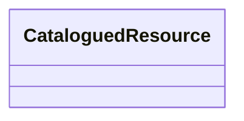

# Class: CataloguedResource


_See [DCAT-AP specs:CataloguedResource](https://semiceu.github.io/DCAT-AP/releases/3.0.0/#CataloguedResource)_


* __NOTE__: this is an abstract class and should not be instantiated directly


URI: [dcat:Resource](http://www.w3.org/ns/dcat#Resource)





<!-- no inheritance hierarchy -->


## Slots

| Name | Cardinality and Range | Description | Inheritance |
| ---  | --- | --- | --- |


## Usages

| used by | used in | type | used |
| ---  | --- | --- | --- |
| [CatalogueRecord](CatalogueRecord.md) | [primary_topic](primary_topic.md) | range | [CataloguedResource](CataloguedResource.md) |


## Identifier and Mapping Information


### Schema Source


* from schema: https://stroemphi.github.io/dcat-4C-ap/dcat_4c_ap


## Mappings

| Mapping Type | Mapped Value |
| ---  | ---  |
| self | dcat:Resource |
| native | nfdi4c:CataloguedResource |


## LinkML Source

<!-- TODO: investigate https://stackoverflow.com/questions/37606292/how-to-create-tabbed-code-blocks-in-mkdocs-or-sphinx -->

### Direct

<details>
```yaml
name: CataloguedResource
description: See [DCAT-AP specs:CataloguedResource](https://semiceu.github.io/DCAT-AP/releases/3.0.0/#CataloguedResource)
from_schema: https://stroemphi.github.io/dcat-4C-ap/dcat_4c_ap
abstract: true
class_uri: dcat:Resource

```
</details>

### Induced

<details>
```yaml
name: CataloguedResource
description: See [DCAT-AP specs:CataloguedResource](https://semiceu.github.io/DCAT-AP/releases/3.0.0/#CataloguedResource)
from_schema: https://stroemphi.github.io/dcat-4C-ap/dcat_4c_ap
abstract: true
class_uri: dcat:Resource

```
</details>