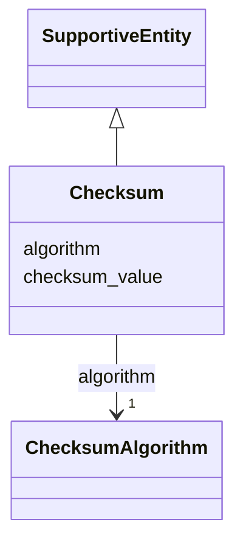

# Class: Checksum


_See [DCAT-AP specs:Checksum](https://semiceu.github.io/DCAT-AP/releases/3.0.0/#Checksum)_


URI: [spdx:Checksum](http://spdx.org/rdf/terms#Checksum)





## Inheritance
* [SupportiveEntity](SupportiveEntity.md)
    * **Checksum**


## Slots

| Name | Cardinality and Range | Description | Inheritance |
| ---  | --- | --- | --- |
| [algorithm](algorithm.md) | 1 <br/> [ChecksumAlgorithm](ChecksumAlgorithm.md) | The algorithm used to produce the subject Checksum | direct |
| [checksum_value](checksum_value.md) | 1 <br/> [HexBinary](HexBinary.md) | A lower case hexadecimal encoded digest value produced using a specific algor... | direct |


## Usages

| used by | used in | type | used |
| ---  | --- | --- | --- |
| [Distribution](Distribution.md) | [checksum](checksum.md) | range | [Checksum](Checksum.md) |


## Identifier and Mapping Information


### Schema Source


* from schema: https://stroemphi.github.io/dcat-4C-ap/dcat_4c_ap


## Mappings

| Mapping Type | Mapped Value |
| ---  | ---  |
| self | spdx:Checksum |
| native | nfdi4c:Checksum |


## LinkML Source

<!-- TODO: investigate https://stackoverflow.com/questions/37606292/how-to-create-tabbed-code-blocks-in-mkdocs-or-sphinx -->

### Direct

<details>
```yaml
name: Checksum
description: See [DCAT-AP specs:Checksum](https://semiceu.github.io/DCAT-AP/releases/3.0.0/#Checksum)
from_schema: https://stroemphi.github.io/dcat-4C-ap/dcat_4c_ap
is_a: SupportiveEntity
abstract: false
slots:
- algorithm
- checksum_value
slot_usage:
  algorithm:
    name: algorithm
    description: The algorithm used to produce the subject Checksum.
    slot_uri: spdx:algorithm
    range: ChecksumAlgorithm
    required: true
    multivalued: false
    inlined_as_list: true
  checksum_value:
    name: checksum_value
    description: A lower case hexadecimal encoded digest value produced using a specific
      algorithm.
    slot_uri: spdx:checksumValue
    range: hexBinary
    required: true
    multivalued: false
    inlined_as_list: true
class_uri: spdx:Checksum

```
</details>

### Induced

<details>
```yaml
name: Checksum
description: See [DCAT-AP specs:Checksum](https://semiceu.github.io/DCAT-AP/releases/3.0.0/#Checksum)
from_schema: https://stroemphi.github.io/dcat-4C-ap/dcat_4c_ap
is_a: SupportiveEntity
abstract: false
slot_usage:
  algorithm:
    name: algorithm
    description: The algorithm used to produce the subject Checksum.
    slot_uri: spdx:algorithm
    range: ChecksumAlgorithm
    required: true
    multivalued: false
    inlined_as_list: true
  checksum_value:
    name: checksum_value
    description: A lower case hexadecimal encoded digest value produced using a specific
      algorithm.
    slot_uri: spdx:checksumValue
    range: hexBinary
    required: true
    multivalued: false
    inlined_as_list: true
attributes:
  algorithm:
    name: algorithm
    description: The algorithm used to produce the subject Checksum.
    from_schema: https://stroemphi.github.io/dcat-4C-ap/dcat_4c_ap
    rank: 1000
    slot_uri: spdx:algorithm
    alias: algorithm
    owner: Checksum
    domain_of:
    - Checksum
    range: ChecksumAlgorithm
    required: true
    multivalued: false
    inlined_as_list: true
  checksum_value:
    name: checksum_value
    description: A lower case hexadecimal encoded digest value produced using a specific
      algorithm.
    from_schema: https://stroemphi.github.io/dcat-4C-ap/dcat_4c_ap
    rank: 1000
    slot_uri: spdx:checksumValue
    alias: checksum_value
    owner: Checksum
    domain_of:
    - Checksum
    range: hexBinary
    required: true
    multivalued: false
    inlined_as_list: true
class_uri: spdx:Checksum

```
</details>