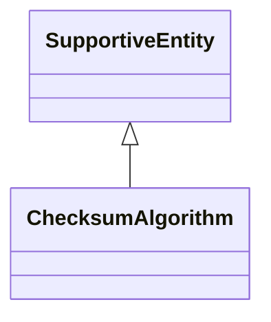

# Class: ChecksumAlgorithm


_See [DCAT-AP specs:ChecksumAlgorithm](https://semiceu.github.io/DCAT-AP/releases/3.0.0/#ChecksumAlgorithm)_


URI: [spdx:ChecksumAlgorithm](http://spdx.org/rdf/terms#ChecksumAlgorithm)





## Inheritance
* [SupportiveEntity](SupportiveEntity.md)
    * **ChecksumAlgorithm**


## Slots

| Name | Cardinality and Range | Description | Inheritance |
| ---  | --- | --- | --- |


## Usages

| used by | used in | type | used |
| ---  | --- | --- | --- |
| [Checksum](Checksum.md) | [algorithm](algorithm.md) | range | [ChecksumAlgorithm](ChecksumAlgorithm.md) |


## Identifier and Mapping Information


### Schema Source


* from schema: https://stroemphi.github.io/dcat-4C-ap/dcat_4c_ap


## Mappings

| Mapping Type | Mapped Value |
| ---  | ---  |
| self | spdx:ChecksumAlgorithm |
| native | nfdi4c:ChecksumAlgorithm |


## LinkML Source

<!-- TODO: investigate https://stackoverflow.com/questions/37606292/how-to-create-tabbed-code-blocks-in-mkdocs-or-sphinx -->

### Direct

<details>
```yaml
name: ChecksumAlgorithm
description: See [DCAT-AP specs:ChecksumAlgorithm](https://semiceu.github.io/DCAT-AP/releases/3.0.0/#ChecksumAlgorithm)
from_schema: https://stroemphi.github.io/dcat-4C-ap/dcat_4c_ap
is_a: SupportiveEntity
abstract: false
class_uri: spdx:ChecksumAlgorithm

```
</details>

### Induced

<details>
```yaml
name: ChecksumAlgorithm
description: See [DCAT-AP specs:ChecksumAlgorithm](https://semiceu.github.io/DCAT-AP/releases/3.0.0/#ChecksumAlgorithm)
from_schema: https://stroemphi.github.io/dcat-4C-ap/dcat_4c_ap
is_a: SupportiveEntity
abstract: false
class_uri: spdx:ChecksumAlgorithm

```
</details>