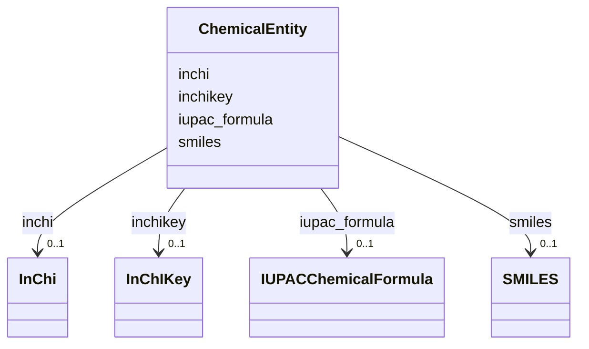

# Class: ChemicalEntity


_Any constitutionally or isotopically distinct atom, molecule, ion, ion pair, radical, radical ion, complex, conformer etc., identifiable as a separately distinguishable entity._


URI: [CHEBI:23367](http://purl.obolibrary.org/obo/CHEBI_23367)





<!-- no inheritance hierarchy -->


## Slots

| Name | Cardinality and Range | Description | Inheritance |
| ---  | --- | --- | --- |
| [inchi](inchi.md) | 0..1 <br/> [InChi](InChi.md) | The slot to provide the InChi descriptor of a chemical substance | direct |
| [inchikey](inchikey.md) | 0..1 <br/> [InChIKey](InChIKey.md) | The slot to provide the InChiKey of a chemical substance | direct |
| [smiles](smiles.md) | 0..1 <br/> [SMILES](SMILES.md) | The slot to provide the canonical SMILES descriptor of a chemical substance | direct |
| [iupac_formula](iupac_formula.md) | 0..1 <br/> [IUPACChemicalFormula](IUPACChemicalFormula.md) | The slot to provide the IUPAC name of a chemical substance | direct |


## Usages

| used by | used in | type | used |
| ---  | --- | --- | --- |
| [ChemicalSubstance](ChemicalSubstance.md) | [composed_of](composed_of.md) | range | [ChemicalEntity](ChemicalEntity.md) |
| [ChemicalSample](ChemicalSample.md) | [composed_of](composed_of.md) | range | [ChemicalEntity](ChemicalEntity.md) |


## Identifier and Mapping Information


### Schema Source


* from schema: https://stroemphi.github.io/dcat-4C-ap/dcat_4c_ap


## Mappings

| Mapping Type | Mapped Value |
| ---  | ---  |
| self | CHEBI:23367 |
| native | nfdi4c:ChemicalEntity |


## LinkML Source

<!-- TODO: investigate https://stackoverflow.com/questions/37606292/how-to-create-tabbed-code-blocks-in-mkdocs-or-sphinx -->

### Direct

<details>
```yaml
name: ChemicalEntity
description: Any constitutionally or isotopically distinct atom, molecule, ion, ion
  pair, radical, radical ion, complex, conformer etc., identifiable as a separately
  distinguishable entity.
from_schema: https://stroemphi.github.io/dcat-4C-ap/dcat_4c_ap
attributes:
  inchi:
    name: inchi
    description: The slot to provide the InChi descriptor of a chemical substance.
    from_schema: https://stroemphi.github.io/dcat-4C-ap/dcat_4c_ap
    rank: 1000
    domain_of:
    - ChemicalEntity
    range: InChi
    inlined: true
  inchikey:
    name: inchikey
    description: The slot to provide the InChiKey of a chemical substance.
    from_schema: https://stroemphi.github.io/dcat-4C-ap/dcat_4c_ap
    rank: 1000
    domain_of:
    - ChemicalEntity
    range: InChIKey
    inlined: true
  smiles:
    name: smiles
    description: The slot to provide the canonical SMILES descriptor of a chemical
      substance.
    from_schema: https://stroemphi.github.io/dcat-4C-ap/dcat_4c_ap
    rank: 1000
    domain_of:
    - ChemicalEntity
    range: SMILES
    inlined: true
  iupac_formula:
    name: iupac_formula
    description: The slot to provide the IUPAC name of a chemical substance.
    from_schema: https://stroemphi.github.io/dcat-4C-ap/dcat_4c_ap
    rank: 1000
    domain_of:
    - ChemicalEntity
    range: IUPACChemicalFormula
    inlined: true
class_uri: CHEBI:23367

```
</details>

### Induced

<details>
```yaml
name: ChemicalEntity
description: Any constitutionally or isotopically distinct atom, molecule, ion, ion
  pair, radical, radical ion, complex, conformer etc., identifiable as a separately
  distinguishable entity.
from_schema: https://stroemphi.github.io/dcat-4C-ap/dcat_4c_ap
attributes:
  inchi:
    name: inchi
    description: The slot to provide the InChi descriptor of a chemical substance.
    from_schema: https://stroemphi.github.io/dcat-4C-ap/dcat_4c_ap
    rank: 1000
    alias: inchi
    owner: ChemicalEntity
    domain_of:
    - ChemicalEntity
    range: InChi
    inlined: true
  inchikey:
    name: inchikey
    description: The slot to provide the InChiKey of a chemical substance.
    from_schema: https://stroemphi.github.io/dcat-4C-ap/dcat_4c_ap
    rank: 1000
    alias: inchikey
    owner: ChemicalEntity
    domain_of:
    - ChemicalEntity
    range: InChIKey
    inlined: true
  smiles:
    name: smiles
    description: The slot to provide the canonical SMILES descriptor of a chemical
      substance.
    from_schema: https://stroemphi.github.io/dcat-4C-ap/dcat_4c_ap
    rank: 1000
    alias: smiles
    owner: ChemicalEntity
    domain_of:
    - ChemicalEntity
    range: SMILES
    inlined: true
  iupac_formula:
    name: iupac_formula
    description: The slot to provide the IUPAC name of a chemical substance.
    from_schema: https://stroemphi.github.io/dcat-4C-ap/dcat_4c_ap
    rank: 1000
    alias: iupac_formula
    owner: ChemicalEntity
    domain_of:
    - ChemicalEntity
    range: IUPACChemicalFormula
    inlined: true
class_uri: CHEBI:23367

```
</details>