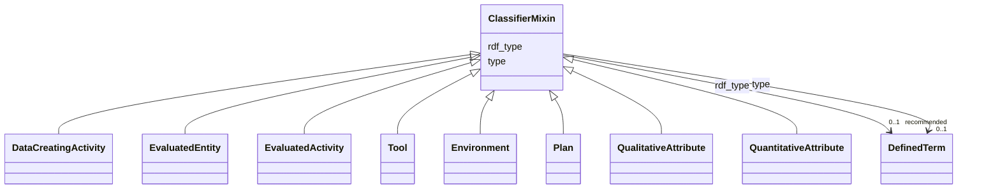

# Class: ClassifierMixin


_A mixin with which an entity of this schema can be classified via an additional rdf:type assertion._


* __NOTE__: this is an abstract class and should not be instantiated directly


URI: [nfdi4c:ClassifierMixin](https://stroemphi.github.io/dcat-4C-ap/dcat_4c_ap/ClassifierMixin)





<!-- no inheritance hierarchy -->


## Slots

| Name | Cardinality and Range | Description | Inheritance |
| ---  | --- | --- | --- |
| [type](type.md) | 0..1 <br/> [DefinedTerm](DefinedTerm.md) | This slot is described in more detail within the class in which it is used | direct |
| [rdf_type](rdf_type.md) | 0..1 _recommended_ <br/> [DefinedTerm](DefinedTerm.md) | The slot to specify the ontology class that is instantiated by an entity | direct |


## Mixin Usage

| mixed into | description |
| --- | --- |
| [DataCreatingActivity](DataCreatingActivity.md) | An activity (process) that has the objective to produce information about an ... |
| [EvaluatedEntity](EvaluatedEntity.md) | Something (not an activity or process) that is being evaluated in a DataCreat... |
| [EvaluatedActivity](EvaluatedActivity.md) | An activity or process that is being evaluated in a DataCreatingActivity |
| [Tool](Tool.md) | A entity with a certain function used within a DataCreatingActivity |
| [Environment](Environment.md) | The surrounding in which the dataset creating activity took place (e |
| [Plan](Plan.md) | A piece of information that specifies: a) how an activity has to be carried o... |
| [QualitativeAttribute](QualitativeAttribute.md) | A piece of information that is attributed to an entity of interest, tool or e... |
| [QuantitativeAttribute](QuantitativeAttribute.md) | A quantifiable piece of information that is attributed to an entity of intere... |


## Identifier and Mapping Information


### Schema Source


* from schema: https://stroemphi.github.io/dcat-4C-ap/dcat_4c_ap


## Mappings

| Mapping Type | Mapped Value |
| ---  | ---  |
| self | nfdi4c:ClassifierMixin |
| native | nfdi4c:ClassifierMixin |


## LinkML Source

<!-- TODO: investigate https://stackoverflow.com/questions/37606292/how-to-create-tabbed-code-blocks-in-mkdocs-or-sphinx -->

### Direct

<details>
```yaml
name: ClassifierMixin
description: A mixin with which an entity of this schema can be classified via an
  additional rdf:type assertion.
from_schema: https://stroemphi.github.io/dcat-4C-ap/dcat_4c_ap
abstract: true
mixin: true
slots:
- type
- rdf_type
slot_usage:
  type:
    name: type
    range: DefinedTerm
    inlined: true

```
</details>

### Induced

<details>
```yaml
name: ClassifierMixin
description: A mixin with which an entity of this schema can be classified via an
  additional rdf:type assertion.
from_schema: https://stroemphi.github.io/dcat-4C-ap/dcat_4c_ap
abstract: true
mixin: true
slot_usage:
  type:
    name: type
    range: DefinedTerm
    inlined: true
attributes:
  type:
    name: type
    description: This slot is described in more detail within the class in which it
      is used.
    from_schema: https://stroemphi.github.io/dcat-4C-ap/dcat_4c_ap
    rank: 1000
    slot_uri: dcterms:type
    alias: type
    owner: ClassifierMixin
    domain_of:
    - Agent
    - Dataset
    - LicenseDocument
    - ClassifierMixin
    range: DefinedTerm
    inlined: true
  rdf_type:
    name: rdf_type
    description: The slot to specify the ontology class that is instantiated by an
      entity.
    from_schema: https://stroemphi.github.io/dcat-4C-ap/dcat_4c_ap
    rank: 1000
    slot_uri: rdf:type
    alias: rdf_type
    owner: ClassifierMixin
    domain_of:
    - ClassifierMixin
    range: DefinedTerm
    recommended: true
    inlined: true

```
</details>