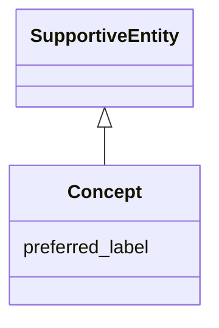

# Class: Concept


_See [DCAT-AP specs:Concept](https://semiceu.github.io/DCAT-AP/releases/3.0.0/#Concept)_


URI: [skos:Concept](http://www.w3.org/2004/02/skos/core#Concept)





## Inheritance
* [SupportiveEntity](SupportiveEntity.md)
    * **Concept**


## Slots

| Name | Cardinality and Range | Description | Inheritance |
| ---  | --- | --- | --- |
| [preferred_label](preferred_label.md) | 1..* <br/> [String](String.md) | A preferred label of the concept | direct |


## Usages

| used by | used in | type | used |
| ---  | --- | --- | --- |
| [NMRAnalysisDataset](NMRAnalysisDataset.md) | [theme](theme.md) | range | [Concept](Concept.md) |
| [NMRAnalysisDataset](NMRAnalysisDataset.md) | [type](type.md) | range | [Concept](Concept.md) |
| [Agent](Agent.md) | [type](type.md) | range | [Concept](Concept.md) |
| [CatalogueRecord](CatalogueRecord.md) | [change_type](change_type.md) | range | [Concept](Concept.md) |
| [DataService](DataService.md) | [theme](theme.md) | range | [Concept](Concept.md) |
| [Dataset](Dataset.md) | [theme](theme.md) | range | [Concept](Concept.md) |
| [Dataset](Dataset.md) | [type](type.md) | range | [Concept](Concept.md) |
| [Distribution](Distribution.md) | [availability](availability.md) | range | [Concept](Concept.md) |
| [Distribution](Distribution.md) | [status](status.md) | range | [Concept](Concept.md) |
| [LicenseDocument](LicenseDocument.md) | [type](type.md) | range | [Concept](Concept.md) |
| [ResearchDataset](ResearchDataset.md) | [theme](theme.md) | range | [Concept](Concept.md) |
| [ResearchDataset](ResearchDataset.md) | [type](type.md) | range | [Concept](Concept.md) |
| [AnalysisDataset](AnalysisDataset.md) | [theme](theme.md) | range | [Concept](Concept.md) |
| [AnalysisDataset](AnalysisDataset.md) | [type](type.md) | range | [Concept](Concept.md) |


## Identifier and Mapping Information


### Schema Source


* from schema: https://stroemphi.github.io/dcat-4C-ap/dcat_4c_ap


## Mappings

| Mapping Type | Mapped Value |
| ---  | ---  |
| self | skos:Concept |
| native | nfdi4c:Concept |


## LinkML Source

<!-- TODO: investigate https://stackoverflow.com/questions/37606292/how-to-create-tabbed-code-blocks-in-mkdocs-or-sphinx -->

### Direct

<details>
```yaml
name: Concept
description: See [DCAT-AP specs:Concept](https://semiceu.github.io/DCAT-AP/releases/3.0.0/#Concept)
from_schema: https://stroemphi.github.io/dcat-4C-ap/dcat_4c_ap
is_a: SupportiveEntity
abstract: false
slots:
- preferred_label
slot_usage:
  preferred_label:
    name: preferred_label
    description: A preferred label of the concept.
    slot_uri: skos:prefLabel
    range: string
    required: true
    multivalued: true
    inlined_as_list: true
class_uri: skos:Concept

```
</details>

### Induced

<details>
```yaml
name: Concept
description: See [DCAT-AP specs:Concept](https://semiceu.github.io/DCAT-AP/releases/3.0.0/#Concept)
from_schema: https://stroemphi.github.io/dcat-4C-ap/dcat_4c_ap
is_a: SupportiveEntity
abstract: false
slot_usage:
  preferred_label:
    name: preferred_label
    description: A preferred label of the concept.
    slot_uri: skos:prefLabel
    range: string
    required: true
    multivalued: true
    inlined_as_list: true
attributes:
  preferred_label:
    name: preferred_label
    description: A preferred label of the concept.
    from_schema: https://stroemphi.github.io/dcat-4C-ap/dcat_4c_ap
    rank: 1000
    slot_uri: skos:prefLabel
    alias: preferred_label
    owner: Concept
    domain_of:
    - Concept
    range: string
    required: true
    multivalued: true
    inlined_as_list: true
class_uri: skos:Concept

```
</details>