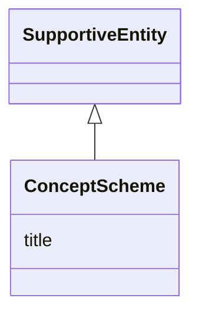

# Class: ConceptScheme


_See [DCAT-AP specs:ConceptScheme](https://semiceu.github.io/DCAT-AP/releases/3.0.0/#ConceptScheme)_


URI: [skos:ConceptScheme](http://www.w3.org/2004/02/skos/core#ConceptScheme)





## Inheritance
* [SupportiveEntity](SupportiveEntity.md)
    * **ConceptScheme**


## Slots

| Name | Cardinality and Range | Description | Inheritance |
| ---  | --- | --- | --- |
| [title](title.md) | 1..* <br/> [String](String.md) | A name of the concept scheme | direct |


## Usages

| used by | used in | type | used |
| ---  | --- | --- | --- |
| [Catalogue](Catalogue.md) | [themes](themes.md) | range | [ConceptScheme](ConceptScheme.md) |
| [ResearchCatalog](ResearchCatalog.md) | [themes](themes.md) | range | [ConceptScheme](ConceptScheme.md) |


## Identifier and Mapping Information


### Schema Source


* from schema: https://stroemphi.github.io/dcat-4C-ap/dcat_4c_ap


## Mappings

| Mapping Type | Mapped Value |
| ---  | ---  |
| self | skos:ConceptScheme |
| native | nfdi4c:ConceptScheme |


## LinkML Source

<!-- TODO: investigate https://stackoverflow.com/questions/37606292/how-to-create-tabbed-code-blocks-in-mkdocs-or-sphinx -->

### Direct

<details>
```yaml
name: ConceptScheme
description: See [DCAT-AP specs:ConceptScheme](https://semiceu.github.io/DCAT-AP/releases/3.0.0/#ConceptScheme)
from_schema: https://stroemphi.github.io/dcat-4C-ap/dcat_4c_ap
is_a: SupportiveEntity
abstract: false
slots:
- title
slot_usage:
  title:
    name: title
    description: A name of the concept scheme.
    slot_uri: dcterms:title
    range: string
    required: true
    multivalued: true
    inlined_as_list: true
class_uri: skos:ConceptScheme

```
</details>

### Induced

<details>
```yaml
name: ConceptScheme
description: See [DCAT-AP specs:ConceptScheme](https://semiceu.github.io/DCAT-AP/releases/3.0.0/#ConceptScheme)
from_schema: https://stroemphi.github.io/dcat-4C-ap/dcat_4c_ap
is_a: SupportiveEntity
abstract: false
slot_usage:
  title:
    name: title
    description: A name of the concept scheme.
    slot_uri: dcterms:title
    range: string
    required: true
    multivalued: true
    inlined_as_list: true
attributes:
  title:
    name: title
    description: A name of the concept scheme.
    from_schema: https://stroemphi.github.io/dcat-4C-ap/dcat_4c_ap
    rank: 1000
    slot_uri: dcterms:title
    alias: title
    owner: ConceptScheme
    domain_of:
    - Catalogue
    - CatalogueRecord
    - ConceptScheme
    - DataService
    - Dataset
    - DatasetSeries
    - Distribution
    - DefinedTerm
    - DataCreatingActivity
    - EvaluatedEntity
    - EvaluatedActivity
    - Tool
    - Environment
    - Plan
    - QualitativeAttribute
    - QuantitativeAttribute
    range: string
    required: true
    multivalued: true
    inlined_as_list: true
class_uri: skos:ConceptScheme

```
</details>