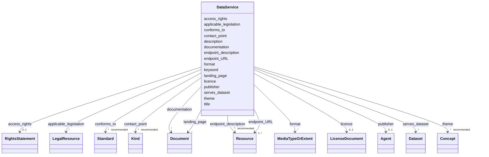

# Class: DataService


_See [DCAT-AP specs:DataService](https://semiceu.github.io/DCAT-AP/releases/3.0.0/#DataService)_


URI: [dcat:DataService](http://www.w3.org/ns/dcat#DataService)





<!-- no inheritance hierarchy -->


## Slots

| Name | Cardinality and Range | Description | Inheritance |
| ---  | --- | --- | --- |
| [access_rights](access_rights.md) | 0..1 <br/> [RightsStatement](RightsStatement.md) | Information regarding access or restrictions based on privacy, security, or o... | direct |
| [applicable_legislation](applicable_legislation.md) | * <br/> [LegalResource](LegalResource.md) | The legislation that mandates the creation or management of the Data Service | direct |
| [conforms_to](conforms_to.md) | * _recommended_ <br/> [Standard](Standard.md) | An established (technical) standard to which the Data Service conforms | direct |
| [contact_point](contact_point.md) | * _recommended_ <br/> [Kind](Kind.md) | Contact information that can be used for sending comments about the Data Serv... | direct |
| [description](description.md) | * <br/> [String](String.md) | A free-text account of the Data Service | direct |
| [documentation](documentation.md) | * <br/> [Document](Document.md) | A page or document about this Data Service | direct |
| [endpoint_URL](endpoint_URL.md) | 1..* <br/> [Resource](Resource.md) | The root location or primary endpoint of the service (an IRI) | direct |
| [endpoint_description](endpoint_description.md) | * _recommended_ <br/> [Resource](Resource.md) | A description of the services available via the end-points, including their o... | direct |
| [format](format.md) | * <br/> [MediaTypeOrExtent](MediaTypeOrExtent.md) | The structure that can be returned by querying the endpointURL | direct |
| [keyword](keyword.md) | * _recommended_ <br/> [String](String.md) | A keyword or tag describing the Data Service | direct |
| [landing_page](landing_page.md) | * <br/> [Document](Document.md) | A web page that provides access to the Data Service and/or additional informa... | direct |
| [licence](licence.md) | 0..1 <br/> [LicenseDocument](LicenseDocument.md) | A licence under which the Data service is made available | direct |
| [publisher](publisher.md) | 0..1 <br/> [Agent](Agent.md) | An entity (organisation) responsible for making the Data Service available | direct |
| [serves_dataset](serves_dataset.md) | * <br/> [Dataset](Dataset.md) | This property refers to a collection of data that this data service can distr... | direct |
| [theme](theme.md) | * _recommended_ <br/> [Concept](Concept.md) | A category of the Data Service | direct |
| [title](title.md) | 1..* <br/> [String](String.md) | A name given to the Data Service | direct |


## Usages

| used by | used in | type | used |
| ---  | --- | --- | --- |
| [Catalogue](Catalogue.md) | [service](service.md) | range | [DataService](DataService.md) |
| [Distribution](Distribution.md) | [access_service](access_service.md) | range | [DataService](DataService.md) |
| [ResearchCatalog](ResearchCatalog.md) | [service](service.md) | range | [DataService](DataService.md) |


## Identifier and Mapping Information


### Schema Source


* from schema: https://stroemphi.github.io/dcat-4C-ap/dcat_4c_ap


## Mappings

| Mapping Type | Mapped Value |
| ---  | ---  |
| self | dcat:DataService |
| native | nfdi4c:DataService |


## LinkML Source

<!-- TODO: investigate https://stackoverflow.com/questions/37606292/how-to-create-tabbed-code-blocks-in-mkdocs-or-sphinx -->

### Direct

<details>
```yaml
name: DataService
description: See [DCAT-AP specs:DataService](https://semiceu.github.io/DCAT-AP/releases/3.0.0/#DataService)
from_schema: https://stroemphi.github.io/dcat-4C-ap/dcat_4c_ap
abstract: false
slots:
- access_rights
- applicable_legislation
- conforms_to
- contact_point
- description
- documentation
- endpoint_URL
- endpoint_description
- format
- keyword
- landing_page
- licence
- publisher
- serves_dataset
- theme
- title
slot_usage:
  access_rights:
    name: access_rights
    description: Information regarding access or restrictions based on privacy, security,
      or other policies.
    slot_uri: dcterms:accessRights
    range: RightsStatement
    required: false
    multivalued: false
    inlined_as_list: true
  applicable_legislation:
    name: applicable_legislation
    description: The legislation that mandates the creation or management of the Data
      Service.
    slot_uri: dcatap:applicableLegislation
    range: LegalResource
    required: false
    multivalued: true
    inlined_as_list: true
  conforms_to:
    name: conforms_to
    description: An established (technical) standard to which the Data Service conforms.
    slot_uri: dcterms:conformsTo
    range: Standard
    required: false
    recommended: true
    multivalued: true
    inlined_as_list: true
  contact_point:
    name: contact_point
    description: Contact information that can be used for sending comments about the
      Data Service.
    slot_uri: dcat:contactPoint
    range: Kind
    required: false
    recommended: true
    multivalued: true
    inlined_as_list: true
  description:
    name: description
    description: A free-text account of the Data Service.
    slot_uri: dcterms:description
    range: string
    required: false
    multivalued: true
    inlined_as_list: true
  documentation:
    name: documentation
    description: A page or document about this Data Service
    slot_uri: foaf:page
    range: Document
    required: false
    multivalued: true
    inlined_as_list: true
  endpoint_URL:
    name: endpoint_URL
    description: The root location or primary endpoint of the service (an IRI).
    slot_uri: dcat:endpointURL
    range: Resource
    required: true
    multivalued: true
    inlined_as_list: true
  endpoint_description:
    name: endpoint_description
    description: A description of the services available via the end-points, including
      their operations, parameters etc.
    slot_uri: dcat:endpointDescription
    range: Resource
    required: false
    recommended: true
    multivalued: true
    inlined_as_list: true
  format:
    name: format
    description: The structure that can be returned by querying the endpointURL.
    slot_uri: dcterms:format
    range: MediaTypeOrExtent
    required: false
    multivalued: true
    inlined_as_list: true
  keyword:
    name: keyword
    description: A keyword or tag describing the Data Service.
    slot_uri: dcat:keyword
    range: string
    required: false
    recommended: true
    multivalued: true
    inlined_as_list: true
  landing_page:
    name: landing_page
    description: A web page that provides access to the Data Service and/or additional
      information.
    slot_uri: dcat:landingPage
    range: Document
    required: false
    multivalued: true
    inlined_as_list: true
  licence:
    name: licence
    description: A licence under which the Data service is made available.
    slot_uri: dcterms:license
    range: LicenseDocument
    required: false
    multivalued: false
    inlined_as_list: true
  publisher:
    name: publisher
    description: An entity (organisation) responsible for making the Data Service
      available.
    slot_uri: dcterms:publisher
    range: Agent
    required: false
    multivalued: false
    inlined_as_list: true
  serves_dataset:
    name: serves_dataset
    description: This property refers to a collection of data that this data service
      can distribute.
    slot_uri: dcat:servesDataset
    range: Dataset
    required: false
    multivalued: true
    inlined_as_list: true
  theme:
    name: theme
    description: A category of the Data Service.
    slot_uri: dcat:theme
    range: Concept
    required: false
    recommended: true
    multivalued: true
    inlined_as_list: true
  title:
    name: title
    description: A name given to the Data Service.
    slot_uri: dcterms:title
    range: string
    required: true
    multivalued: true
    inlined_as_list: true
class_uri: dcat:DataService

```
</details>

### Induced

<details>
```yaml
name: DataService
description: See [DCAT-AP specs:DataService](https://semiceu.github.io/DCAT-AP/releases/3.0.0/#DataService)
from_schema: https://stroemphi.github.io/dcat-4C-ap/dcat_4c_ap
abstract: false
slot_usage:
  access_rights:
    name: access_rights
    description: Information regarding access or restrictions based on privacy, security,
      or other policies.
    slot_uri: dcterms:accessRights
    range: RightsStatement
    required: false
    multivalued: false
    inlined_as_list: true
  applicable_legislation:
    name: applicable_legislation
    description: The legislation that mandates the creation or management of the Data
      Service.
    slot_uri: dcatap:applicableLegislation
    range: LegalResource
    required: false
    multivalued: true
    inlined_as_list: true
  conforms_to:
    name: conforms_to
    description: An established (technical) standard to which the Data Service conforms.
    slot_uri: dcterms:conformsTo
    range: Standard
    required: false
    recommended: true
    multivalued: true
    inlined_as_list: true
  contact_point:
    name: contact_point
    description: Contact information that can be used for sending comments about the
      Data Service.
    slot_uri: dcat:contactPoint
    range: Kind
    required: false
    recommended: true
    multivalued: true
    inlined_as_list: true
  description:
    name: description
    description: A free-text account of the Data Service.
    slot_uri: dcterms:description
    range: string
    required: false
    multivalued: true
    inlined_as_list: true
  documentation:
    name: documentation
    description: A page or document about this Data Service
    slot_uri: foaf:page
    range: Document
    required: false
    multivalued: true
    inlined_as_list: true
  endpoint_URL:
    name: endpoint_URL
    description: The root location or primary endpoint of the service (an IRI).
    slot_uri: dcat:endpointURL
    range: Resource
    required: true
    multivalued: true
    inlined_as_list: true
  endpoint_description:
    name: endpoint_description
    description: A description of the services available via the end-points, including
      their operations, parameters etc.
    slot_uri: dcat:endpointDescription
    range: Resource
    required: false
    recommended: true
    multivalued: true
    inlined_as_list: true
  format:
    name: format
    description: The structure that can be returned by querying the endpointURL.
    slot_uri: dcterms:format
    range: MediaTypeOrExtent
    required: false
    multivalued: true
    inlined_as_list: true
  keyword:
    name: keyword
    description: A keyword or tag describing the Data Service.
    slot_uri: dcat:keyword
    range: string
    required: false
    recommended: true
    multivalued: true
    inlined_as_list: true
  landing_page:
    name: landing_page
    description: A web page that provides access to the Data Service and/or additional
      information.
    slot_uri: dcat:landingPage
    range: Document
    required: false
    multivalued: true
    inlined_as_list: true
  licence:
    name: licence
    description: A licence under which the Data service is made available.
    slot_uri: dcterms:license
    range: LicenseDocument
    required: false
    multivalued: false
    inlined_as_list: true
  publisher:
    name: publisher
    description: An entity (organisation) responsible for making the Data Service
      available.
    slot_uri: dcterms:publisher
    range: Agent
    required: false
    multivalued: false
    inlined_as_list: true
  serves_dataset:
    name: serves_dataset
    description: This property refers to a collection of data that this data service
      can distribute.
    slot_uri: dcat:servesDataset
    range: Dataset
    required: false
    multivalued: true
    inlined_as_list: true
  theme:
    name: theme
    description: A category of the Data Service.
    slot_uri: dcat:theme
    range: Concept
    required: false
    recommended: true
    multivalued: true
    inlined_as_list: true
  title:
    name: title
    description: A name given to the Data Service.
    slot_uri: dcterms:title
    range: string
    required: true
    multivalued: true
    inlined_as_list: true
attributes:
  access_rights:
    name: access_rights
    description: Information regarding access or restrictions based on privacy, security,
      or other policies.
    from_schema: https://stroemphi.github.io/dcat-4C-ap/dcat_4c_ap
    rank: 1000
    slot_uri: dcterms:accessRights
    alias: access_rights
    owner: DataService
    domain_of:
    - DataService
    - Dataset
    range: RightsStatement
    required: false
    multivalued: false
    inlined_as_list: true
  applicable_legislation:
    name: applicable_legislation
    description: The legislation that mandates the creation or management of the Data
      Service.
    from_schema: https://stroemphi.github.io/dcat-4C-ap/dcat_4c_ap
    rank: 1000
    slot_uri: dcatap:applicableLegislation
    alias: applicable_legislation
    owner: DataService
    domain_of:
    - Catalogue
    - DataService
    - Dataset
    - DatasetSeries
    - Distribution
    range: LegalResource
    required: false
    multivalued: true
    inlined_as_list: true
  conforms_to:
    name: conforms_to
    description: An established (technical) standard to which the Data Service conforms.
    from_schema: https://stroemphi.github.io/dcat-4C-ap/dcat_4c_ap
    rank: 1000
    slot_uri: dcterms:conformsTo
    alias: conforms_to
    owner: DataService
    domain_of:
    - DataService
    - Dataset
    range: Standard
    required: false
    recommended: true
    multivalued: true
    inlined_as_list: true
  contact_point:
    name: contact_point
    description: Contact information that can be used for sending comments about the
      Data Service.
    from_schema: https://stroemphi.github.io/dcat-4C-ap/dcat_4c_ap
    rank: 1000
    slot_uri: dcat:contactPoint
    alias: contact_point
    owner: DataService
    domain_of:
    - DataService
    - Dataset
    - DatasetSeries
    range: Kind
    required: false
    recommended: true
    multivalued: true
    inlined_as_list: true
  description:
    name: description
    description: A free-text account of the Data Service.
    from_schema: https://stroemphi.github.io/dcat-4C-ap/dcat_4c_ap
    rank: 1000
    slot_uri: dcterms:description
    alias: description
    owner: DataService
    domain_of:
    - Catalogue
    - CatalogueRecord
    - DataService
    - Dataset
    - DatasetSeries
    - Distribution
    - DataCreatingActivity
    - EvaluatedEntity
    - EvaluatedActivity
    - Tool
    - Environment
    - Plan
    - QualitativeAttribute
    - QuantitativeAttribute
    range: string
    required: false
    multivalued: true
    inlined_as_list: true
  documentation:
    name: documentation
    description: A page or document about this Data Service
    from_schema: https://stroemphi.github.io/dcat-4C-ap/dcat_4c_ap
    rank: 1000
    slot_uri: foaf:page
    alias: documentation
    owner: DataService
    domain_of:
    - DataService
    - Dataset
    - Distribution
    range: Document
    required: false
    multivalued: true
    inlined_as_list: true
  endpoint_URL:
    name: endpoint_URL
    description: The root location or primary endpoint of the service (an IRI).
    from_schema: https://stroemphi.github.io/dcat-4C-ap/dcat_4c_ap
    rank: 1000
    slot_uri: dcat:endpointURL
    alias: endpoint_URL
    owner: DataService
    domain_of:
    - DataService
    range: Resource
    required: true
    multivalued: true
    inlined_as_list: true
  endpoint_description:
    name: endpoint_description
    description: A description of the services available via the end-points, including
      their operations, parameters etc.
    from_schema: https://stroemphi.github.io/dcat-4C-ap/dcat_4c_ap
    rank: 1000
    slot_uri: dcat:endpointDescription
    alias: endpoint_description
    owner: DataService
    domain_of:
    - DataService
    range: Resource
    required: false
    recommended: true
    multivalued: true
    inlined_as_list: true
  format:
    name: format
    description: The structure that can be returned by querying the endpointURL.
    from_schema: https://stroemphi.github.io/dcat-4C-ap/dcat_4c_ap
    rank: 1000
    slot_uri: dcterms:format
    alias: format
    owner: DataService
    domain_of:
    - DataService
    - Distribution
    range: MediaTypeOrExtent
    required: false
    multivalued: true
    inlined_as_list: true
  keyword:
    name: keyword
    description: A keyword or tag describing the Data Service.
    from_schema: https://stroemphi.github.io/dcat-4C-ap/dcat_4c_ap
    rank: 1000
    slot_uri: dcat:keyword
    alias: keyword
    owner: DataService
    domain_of:
    - DataService
    - Dataset
    range: string
    required: false
    recommended: true
    multivalued: true
    inlined_as_list: true
  landing_page:
    name: landing_page
    description: A web page that provides access to the Data Service and/or additional
      information.
    from_schema: https://stroemphi.github.io/dcat-4C-ap/dcat_4c_ap
    rank: 1000
    slot_uri: dcat:landingPage
    alias: landing_page
    owner: DataService
    domain_of:
    - DataService
    - Dataset
    range: Document
    required: false
    multivalued: true
    inlined_as_list: true
  licence:
    name: licence
    description: A licence under which the Data service is made available.
    from_schema: https://stroemphi.github.io/dcat-4C-ap/dcat_4c_ap
    rank: 1000
    slot_uri: dcterms:license
    alias: licence
    owner: DataService
    domain_of:
    - Catalogue
    - DataService
    - Distribution
    range: LicenseDocument
    required: false
    multivalued: false
    inlined_as_list: true
  publisher:
    name: publisher
    description: An entity (organisation) responsible for making the Data Service
      available.
    from_schema: https://stroemphi.github.io/dcat-4C-ap/dcat_4c_ap
    rank: 1000
    slot_uri: dcterms:publisher
    alias: publisher
    owner: DataService
    domain_of:
    - Catalogue
    - DataService
    - Dataset
    - DatasetSeries
    range: Agent
    required: false
    multivalued: false
    inlined_as_list: true
  serves_dataset:
    name: serves_dataset
    description: This property refers to a collection of data that this data service
      can distribute.
    from_schema: https://stroemphi.github.io/dcat-4C-ap/dcat_4c_ap
    rank: 1000
    slot_uri: dcat:servesDataset
    alias: serves_dataset
    owner: DataService
    domain_of:
    - DataService
    range: Dataset
    required: false
    multivalued: true
    inlined_as_list: true
  theme:
    name: theme
    description: A category of the Data Service.
    from_schema: https://stroemphi.github.io/dcat-4C-ap/dcat_4c_ap
    rank: 1000
    slot_uri: dcat:theme
    alias: theme
    owner: DataService
    domain_of:
    - DataService
    - Dataset
    range: Concept
    required: false
    recommended: true
    multivalued: true
    inlined_as_list: true
  title:
    name: title
    description: A name given to the Data Service.
    from_schema: https://stroemphi.github.io/dcat-4C-ap/dcat_4c_ap
    rank: 1000
    slot_uri: dcterms:title
    alias: title
    owner: DataService
    domain_of:
    - Catalogue
    - CatalogueRecord
    - ConceptScheme
    - DataService
    - Dataset
    - DatasetSeries
    - Distribution
    - DefinedTerm
    - DataCreatingActivity
    - EvaluatedEntity
    - EvaluatedActivity
    - Tool
    - Environment
    - Plan
    - QualitativeAttribute
    - QuantitativeAttribute
    range: string
    required: true
    multivalued: true
    inlined_as_list: true
class_uri: dcat:DataService

```
</details>