# Class: Dataset


_See [DCAT-AP specs:Dataset](https://semiceu.github.io/DCAT-AP/releases/3.0.0/#Dataset)_


URI: [dcat:Dataset](http://www.w3.org/ns/dcat#Dataset)

```mermaid
 classDiagram
    class Dataset
    click Dataset href "../Dataset"
      Dataset <|-- ResearchDataset
        click ResearchDataset href "../ResearchDataset"
      
      Dataset : access_rights
        
          
    
    
    Dataset --> "0..1" RightsStatement : access_rights
    click RightsStatement href "../RightsStatement"

        
      Dataset : applicable_legislation
        
          
    
    
    Dataset --> "*" LegalResource : applicable_legislation
    click LegalResource href "../LegalResource"

        
      Dataset : conforms_to
        
          
    
    
    Dataset --> "*" Standard : conforms_to
    click Standard href "../Standard"

        
      Dataset : contact_point
        
          
    
    
    Dataset --> "* _recommended_" Kind : contact_point
    click Kind href "../Kind"

        
      Dataset : creator
        
          
    
    
    Dataset --> "*" Agent : creator
    click Agent href "../Agent"

        
      Dataset : dataset_distribution
        
          
    
    
    Dataset --> "*" Distribution : dataset_distribution
    click Distribution href "../Distribution"

        
      Dataset : description
        
      Dataset : documentation
        
          
    
    
    Dataset --> "*" Document : documentation
    click Document href "../Document"

        
      Dataset : frequency
        
          
    
    
    Dataset --> "0..1" Frequency : frequency
    click Frequency href "../Frequency"

        
      Dataset : geographical_coverage
        
          
    
    
    Dataset --> "*" Location : geographical_coverage
    click Location href "../Location"

        
      Dataset : has_version
        
          
    
    
    Dataset --> "*" Dataset : has_version
    click Dataset href "../Dataset"

        
      Dataset : identifier
        
      Dataset : in_series
        
          
    
    
    Dataset --> "*" DatasetSeries : in_series
    click DatasetSeries href "../DatasetSeries"

        
      Dataset : is_referenced_by
        
          
    
    
    Dataset --> "*" Resource : is_referenced_by
    click Resource href "../Resource"

        
      Dataset : keyword
        
      Dataset : landing_page
        
          
    
    
    Dataset --> "*" Document : landing_page
    click Document href "../Document"

        
      Dataset : language
        
          
    
    
    Dataset --> "*" LinguisticSystem : language
    click LinguisticSystem href "../LinguisticSystem"

        
      Dataset : modification_date
        
      Dataset : other_identifier
        
          
    
    
    Dataset --> "*" Identifier : other_identifier
    click Identifier href "../Identifier"

        
      Dataset : provenance
        
          
    
    
    Dataset --> "*" ProvenanceStatement : provenance
    click ProvenanceStatement href "../ProvenanceStatement"

        
      Dataset : publisher
        
          
    
    
    Dataset --> "0..1" Agent : publisher
    click Agent href "../Agent"

        
      Dataset : qualified_attribution
        
          
    
    
    Dataset --> "*" Attribution : qualified_attribution
    click Attribution href "../Attribution"

        
      Dataset : qualified_relation
        
          
    
    
    Dataset --> "*" Relationship : qualified_relation
    click Relationship href "../Relationship"

        
      Dataset : related_resource
        
          
    
    
    Dataset --> "*" Resource : related_resource
    click Resource href "../Resource"

        
      Dataset : release_date
        
      Dataset : sample
        
          
    
    
    Dataset --> "*" Distribution : sample
    click Distribution href "../Distribution"

        
      Dataset : source
        
          
    
    
    Dataset --> "*" Dataset : source
    click Dataset href "../Dataset"

        
      Dataset : spatial_resolution
        
      Dataset : temporal_coverage
        
          
    
    
    Dataset --> "*" PeriodOfTime : temporal_coverage
    click PeriodOfTime href "../PeriodOfTime"

        
      Dataset : temporal_resolution
        
      Dataset : theme
        
          
    
    
    Dataset --> "* _recommended_" Concept : theme
    click Concept href "../Concept"

        
      Dataset : title
        
      Dataset : type
        
          
    
    
    Dataset --> "*" Concept : type
    click Concept href "../Concept"

        
      Dataset : version
        
      Dataset : version_notes
        
      Dataset : was_generated_by
        
          
    
    
    Dataset --> "*" Activity : was_generated_by
    click Activity href "../Activity"

        
      
```





## Inheritance
* **Dataset**
    * [ResearchDataset](ResearchDataset.md)


## Slots

| Name | Cardinality and Range | Description | Inheritance |
| ---  | --- | --- | --- |
| [access_rights](access_rights.md) | 0..1 <br/> [RightsStatement](RightsStatement.md) | Information that indicates whether the Dataset is publicly accessible, has ac... | direct |
| [applicable_legislation](applicable_legislation.md) | * <br/> [LegalResource](LegalResource.md) | The legislation that mandates the creation or management of the Dataset | direct |
| [conforms_to](conforms_to.md) | * <br/> [Standard](Standard.md) | An implementing rule or other specification | direct |
| [contact_point](contact_point.md) | * _recommended_ <br/> [Kind](Kind.md) | Contact information that can be used for sending comments about the Dataset | direct |
| [creator](creator.md) | * <br/> [Agent](Agent.md) | An entity responsible for producing the dataset | direct |
| [dataset_distribution](dataset_distribution.md) | * <br/> [Distribution](Distribution.md) | An available Distribution for the Dataset | direct |
| [description](description.md) | 1..* <br/> [String](String.md) | A free-text account of the Dataset | direct |
| [documentation](documentation.md) | * <br/> [Document](Document.md) | A page or document about this Dataset | direct |
| [frequency](frequency.md) | 0..1 <br/> [Frequency](Frequency.md) | The frequency at which the Dataset is updated | direct |
| [geographical_coverage](geographical_coverage.md) | * <br/> [Location](Location.md) | A geographic region that is covered by the Dataset | direct |
| [has_version](has_version.md) | * <br/> [Dataset](Dataset.md) | A related Dataset that is a version, edition, or adaptation of the described ... | direct |
| [identifier](identifier.md) | * <br/> [Uri](Uri.md) | The main identifier for the Dataset, e | direct |
| [in_series](in_series.md) | * <br/> [DatasetSeries](DatasetSeries.md) | A dataset series of which the dataset is part | direct |
| [is_referenced_by](is_referenced_by.md) | * <br/> [Resource](Resource.md) | A related resource, such as a publication, that references, cites, or otherwi... | direct |
| [keyword](keyword.md) | * _recommended_ <br/> [String](String.md) | A keyword or tag describing the Dataset | direct |
| [landing_page](landing_page.md) | * <br/> [Document](Document.md) | A web page that provides access to the Dataset, its Distributions and/or addi... | direct |
| [language](language.md) | * <br/> [LinguisticSystem](LinguisticSystem.md) | A language of the Dataset | direct |
| [modification_date](modification_date.md) | 0..1 <br/> [String](String.md) | The most recent date on which the Dataset was changed or modified | direct |
| [other_identifier](other_identifier.md) | * <br/> [Identifier](Identifier.md) | A secondary identifier of the Dataset | direct |
| [provenance](provenance.md) | * <br/> [ProvenanceStatement](ProvenanceStatement.md) | A statement about the lineage of a Dataset | direct |
| [publisher](publisher.md) | 0..1 <br/> [Agent](Agent.md) | An entity (organisation) responsible for making the Dataset available | direct |
| [qualified_attribution](qualified_attribution.md) | * <br/> [Attribution](Attribution.md) | An Agent having some form of responsibility for the resource | direct |
| [qualified_relation](qualified_relation.md) | * <br/> [Relationship](Relationship.md) | A description of a relationship with another resource | direct |
| [related_resource](related_resource.md) | * <br/> [Resource](Resource.md) | A related resource | direct |
| [release_date](release_date.md) | 0..1 <br/> [String](String.md) | The date of formal issuance (e | direct |
| [sample](sample.md) | * <br/> [Distribution](Distribution.md) | A sample distribution of the dataset | direct |
| [source](source.md) | * <br/> [Dataset](Dataset.md) | A related Dataset from which the described Dataset is derived | direct |
| [spatial_resolution](spatial_resolution.md) | 0..1 <br/> [Decimal](Decimal.md) | The minimum spatial separation resolvable in a dataset, measured in meters | direct |
| [temporal_coverage](temporal_coverage.md) | * <br/> [PeriodOfTime](PeriodOfTime.md) | A temporal period that the Dataset covers | direct |
| [temporal_resolution](temporal_resolution.md) | 0..1 <br/> [Duration](Duration.md) | The minimum time period resolvable in the dataset | direct |
| [theme](theme.md) | * _recommended_ <br/> [Concept](Concept.md) | A category of the Dataset | direct |
| [title](title.md) | 1..* <br/> [String](String.md) | A name given to the Dataset | direct |
| [type](type.md) | * <br/> [Concept](Concept.md) | A type of the Dataset | direct |
| [version](version.md) | 0..1 <br/> [String](String.md) | The version indicator (name or identifier) of a resource | direct |
| [version_notes](version_notes.md) | * <br/> [String](String.md) | A description of the differences between this version and a previous version ... | direct |
| [was_generated_by](was_generated_by.md) | * <br/> [Activity](Activity.md) | An activity that generated, or provides the business context for, the creatio... | direct |


## Usages

| used by | used in | type | used |
| ---  | --- | --- | --- |
| [NMRAnalysisDataset](NMRAnalysisDataset.md) | [has_version](has_version.md) | range | [Dataset](Dataset.md) |
| [NMRAnalysisDataset](NMRAnalysisDataset.md) | [source](source.md) | range | [Dataset](Dataset.md) |
| [Catalogue](Catalogue.md) | [has_dataset](has_dataset.md) | range | [Dataset](Dataset.md) |
| [DataService](DataService.md) | [serves_dataset](serves_dataset.md) | range | [Dataset](Dataset.md) |
| [Dataset](Dataset.md) | [has_version](has_version.md) | range | [Dataset](Dataset.md) |
| [Dataset](Dataset.md) | [source](source.md) | range | [Dataset](Dataset.md) |
| [ResearchDataset](ResearchDataset.md) | [has_version](has_version.md) | range | [Dataset](Dataset.md) |
| [ResearchDataset](ResearchDataset.md) | [source](source.md) | range | [Dataset](Dataset.md) |
| [AnalysisDataset](AnalysisDataset.md) | [has_version](has_version.md) | range | [Dataset](Dataset.md) |
| [AnalysisDataset](AnalysisDataset.md) | [source](source.md) | range | [Dataset](Dataset.md) |


## Identifier and Mapping Information


### Schema Source


* from schema: https://stroemphi.github.io/dcat-4C-ap/dcat_4c_ap


## Mappings

| Mapping Type | Mapped Value |
| ---  | ---  |
| self | dcat:Dataset |
| native | nfdi4c:Dataset |


## LinkML Source

<!-- TODO: investigate https://stackoverflow.com/questions/37606292/how-to-create-tabbed-code-blocks-in-mkdocs-or-sphinx -->

### Direct

<details>
```yaml
name: Dataset
description: See [DCAT-AP specs:Dataset](https://semiceu.github.io/DCAT-AP/releases/3.0.0/#Dataset)
from_schema: https://stroemphi.github.io/dcat-4C-ap/dcat_4c_ap
abstract: false
slots:
- access_rights
- applicable_legislation
- conforms_to
- contact_point
- creator
- dataset_distribution
- description
- documentation
- frequency
- geographical_coverage
- has_version
- identifier
- in_series
- is_referenced_by
- keyword
- landing_page
- language
- modification_date
- other_identifier
- provenance
- publisher
- qualified_attribution
- qualified_relation
- related_resource
- release_date
- sample
- source
- spatial_resolution
- temporal_coverage
- temporal_resolution
- theme
- title
- type
- version
- version_notes
- was_generated_by
slot_usage:
  access_rights:
    name: access_rights
    description: Information that indicates whether the Dataset is publicly accessible,
      has access restrictions or is not public.
    slot_uri: dcterms:accessRights
    range: RightsStatement
    required: false
    multivalued: false
    inlined_as_list: true
  applicable_legislation:
    name: applicable_legislation
    description: The legislation that mandates the creation or management of the Dataset.
    slot_uri: dcatap:applicableLegislation
    range: LegalResource
    required: false
    multivalued: true
    inlined_as_list: true
  conforms_to:
    name: conforms_to
    description: An implementing rule or other specification.
    slot_uri: dcterms:conformsTo
    range: Standard
    required: false
    multivalued: true
    inlined_as_list: true
  contact_point:
    name: contact_point
    description: Contact information that can be used for sending comments about the
      Dataset.
    slot_uri: dcat:contactPoint
    range: Kind
    required: false
    recommended: true
    multivalued: true
    inlined_as_list: true
  creator:
    name: creator
    description: An entity responsible for producing the dataset.
    slot_uri: dcterms:creator
    range: Agent
    required: false
    multivalued: true
    inlined_as_list: true
  dataset_distribution:
    name: dataset_distribution
    description: An available Distribution for the Dataset.
    slot_uri: dcat:distribution
    range: Distribution
    required: false
    multivalued: true
    inlined_as_list: true
  description:
    name: description
    description: A free-text account of the Dataset.
    slot_uri: dcterms:description
    range: string
    required: true
    multivalued: true
    inlined_as_list: true
  documentation:
    name: documentation
    description: A page or document about this Dataset.
    slot_uri: foaf:page
    range: Document
    required: false
    multivalued: true
    inlined_as_list: true
  frequency:
    name: frequency
    description: The frequency at which the Dataset is updated.
    slot_uri: dcterms:accrualPeriodicity
    range: Frequency
    required: false
    multivalued: false
    inlined_as_list: false
  geographical_coverage:
    name: geographical_coverage
    description: A geographic region that is covered by the Dataset.
    slot_uri: dcterms:spatial
    range: Location
    required: false
    multivalued: true
    inlined_as_list: true
  has_version:
    name: has_version
    description: A related Dataset that is a version, edition, or adaptation of the
      described Dataset.
    slot_uri: dcat:hasVersion
    range: Dataset
    required: false
    multivalued: true
    inlined_as_list: true
  identifier:
    name: identifier
    description: The main identifier for the Dataset, e.g. the URI or other unique
      identifier in the context of the Catalogue.
    slot_uri: dcterms:identifier
    range: uri
    required: false
    multivalued: true
    inlined_as_list: true
  in_series:
    name: in_series
    description: A dataset series of which the dataset is part.
    slot_uri: dcat:inSeries
    range: DatasetSeries
    required: false
    multivalued: true
    inlined_as_list: true
  is_referenced_by:
    name: is_referenced_by
    description: A related resource, such as a publication, that references, cites,
      or otherwise points to the dataset.
    slot_uri: dcterms:isReferencedBy
    range: Resource
    required: false
    multivalued: true
    inlined_as_list: true
  keyword:
    name: keyword
    description: A keyword or tag describing the Dataset.
    slot_uri: dcat:keyword
    range: string
    required: false
    recommended: true
    multivalued: true
    inlined_as_list: true
  landing_page:
    name: landing_page
    description: A web page that provides access to the Dataset, its Distributions
      and/or additional information.
    slot_uri: dcat:landingPage
    range: Document
    required: false
    multivalued: true
    inlined_as_list: true
  language:
    name: language
    description: A language of the Dataset.
    slot_uri: dcterms:language
    range: LinguisticSystem
    required: false
    multivalued: true
    inlined_as_list: true
  modification_date:
    name: modification_date
    description: The most recent date on which the Dataset was changed or modified.
    slot_uri: dcterms:modified
    range: string
    required: false
    multivalued: false
    inlined_as_list: false
  other_identifier:
    name: other_identifier
    description: A secondary identifier of the Dataset
    slot_uri: adms:identifier
    range: Identifier
    required: false
    multivalued: true
    inlined_as_list: true
  provenance:
    name: provenance
    description: A statement about the lineage of a Dataset.
    slot_uri: dcterms:provenance
    range: ProvenanceStatement
    required: false
    multivalued: true
    inlined_as_list: true
  publisher:
    name: publisher
    description: An entity (organisation) responsible for making the Dataset available.
    slot_uri: dcterms:publisher
    range: Agent
    required: false
    multivalued: false
    inlined_as_list: true
  qualified_attribution:
    name: qualified_attribution
    description: An Agent having some form of responsibility for the resource.
    slot_uri: prov:qualifiedAttribution
    range: Attribution
    required: false
    multivalued: true
    inlined_as_list: true
  qualified_relation:
    name: qualified_relation
    description: A description of a relationship with another resource.
    slot_uri: dcat:qualifiedRelation
    range: Relationship
    required: false
    multivalued: true
    inlined_as_list: true
  related_resource:
    name: related_resource
    description: A related resource.
    slot_uri: dcterms:relation
    range: Resource
    required: false
    multivalued: true
    inlined_as_list: true
  release_date:
    name: release_date
    description: The date of formal issuance (e.g., publication) of the Dataset.
    slot_uri: dcterms:issued
    range: string
    required: false
    multivalued: false
    inlined_as_list: false
  sample:
    name: sample
    description: A sample distribution of the dataset.
    slot_uri: adms:sample
    range: Distribution
    required: false
    multivalued: true
    inlined_as_list: true
  source:
    name: source
    description: A related Dataset from which the described Dataset is derived.
    slot_uri: dcterms:source
    range: Dataset
    required: false
    multivalued: true
    inlined_as_list: true
  spatial_resolution:
    name: spatial_resolution
    description: The minimum spatial separation resolvable in a dataset, measured
      in meters.
    slot_uri: dcat:spatialResolutionInMeters
    range: decimal
    required: false
    multivalued: false
    inlined_as_list: false
  temporal_coverage:
    name: temporal_coverage
    description: A temporal period that the Dataset covers.
    slot_uri: dcterms:temporal
    range: PeriodOfTime
    required: false
    multivalued: true
    inlined_as_list: true
  temporal_resolution:
    name: temporal_resolution
    description: The minimum time period resolvable in the dataset.
    slot_uri: dcat:temporalResolution
    range: duration
    required: false
    multivalued: false
    inlined_as_list: true
  theme:
    name: theme
    description: A category of the Dataset.
    slot_uri: dcat:theme
    range: Concept
    required: false
    recommended: true
    multivalued: true
    inlined_as_list: true
  title:
    name: title
    description: A name given to the Dataset.
    slot_uri: dcterms:title
    range: string
    required: true
    multivalued: true
    inlined_as_list: true
  type:
    name: type
    description: A type of the Dataset.
    slot_uri: dcterms:type
    range: Concept
    required: false
    multivalued: true
    inlined_as_list: true
  version:
    name: version
    description: The version indicator (name or identifier) of a resource.
    slot_uri: dcat:version
    range: string
    required: false
    multivalued: false
    inlined_as_list: true
  version_notes:
    name: version_notes
    description: A description of the differences between this version and a previous
      version of the Dataset.
    slot_uri: adms:versionNotes
    range: string
    required: false
    multivalued: true
    inlined_as_list: true
  was_generated_by:
    name: was_generated_by
    description: An activity that generated, or provides the business context for,
      the creation of the dataset.
    slot_uri: prov:wasGeneratedBy
    range: Activity
    required: false
    multivalued: true
    inlined_as_list: true
class_uri: dcat:Dataset

```
</details>

### Induced

<details>
```yaml
name: Dataset
description: See [DCAT-AP specs:Dataset](https://semiceu.github.io/DCAT-AP/releases/3.0.0/#Dataset)
from_schema: https://stroemphi.github.io/dcat-4C-ap/dcat_4c_ap
abstract: false
slot_usage:
  access_rights:
    name: access_rights
    description: Information that indicates whether the Dataset is publicly accessible,
      has access restrictions or is not public.
    slot_uri: dcterms:accessRights
    range: RightsStatement
    required: false
    multivalued: false
    inlined_as_list: true
  applicable_legislation:
    name: applicable_legislation
    description: The legislation that mandates the creation or management of the Dataset.
    slot_uri: dcatap:applicableLegislation
    range: LegalResource
    required: false
    multivalued: true
    inlined_as_list: true
  conforms_to:
    name: conforms_to
    description: An implementing rule or other specification.
    slot_uri: dcterms:conformsTo
    range: Standard
    required: false
    multivalued: true
    inlined_as_list: true
  contact_point:
    name: contact_point
    description: Contact information that can be used for sending comments about the
      Dataset.
    slot_uri: dcat:contactPoint
    range: Kind
    required: false
    recommended: true
    multivalued: true
    inlined_as_list: true
  creator:
    name: creator
    description: An entity responsible for producing the dataset.
    slot_uri: dcterms:creator
    range: Agent
    required: false
    multivalued: true
    inlined_as_list: true
  dataset_distribution:
    name: dataset_distribution
    description: An available Distribution for the Dataset.
    slot_uri: dcat:distribution
    range: Distribution
    required: false
    multivalued: true
    inlined_as_list: true
  description:
    name: description
    description: A free-text account of the Dataset.
    slot_uri: dcterms:description
    range: string
    required: true
    multivalued: true
    inlined_as_list: true
  documentation:
    name: documentation
    description: A page or document about this Dataset.
    slot_uri: foaf:page
    range: Document
    required: false
    multivalued: true
    inlined_as_list: true
  frequency:
    name: frequency
    description: The frequency at which the Dataset is updated.
    slot_uri: dcterms:accrualPeriodicity
    range: Frequency
    required: false
    multivalued: false
    inlined_as_list: false
  geographical_coverage:
    name: geographical_coverage
    description: A geographic region that is covered by the Dataset.
    slot_uri: dcterms:spatial
    range: Location
    required: false
    multivalued: true
    inlined_as_list: true
  has_version:
    name: has_version
    description: A related Dataset that is a version, edition, or adaptation of the
      described Dataset.
    slot_uri: dcat:hasVersion
    range: Dataset
    required: false
    multivalued: true
    inlined_as_list: true
  identifier:
    name: identifier
    description: The main identifier for the Dataset, e.g. the URI or other unique
      identifier in the context of the Catalogue.
    slot_uri: dcterms:identifier
    range: uri
    required: false
    multivalued: true
    inlined_as_list: true
  in_series:
    name: in_series
    description: A dataset series of which the dataset is part.
    slot_uri: dcat:inSeries
    range: DatasetSeries
    required: false
    multivalued: true
    inlined_as_list: true
  is_referenced_by:
    name: is_referenced_by
    description: A related resource, such as a publication, that references, cites,
      or otherwise points to the dataset.
    slot_uri: dcterms:isReferencedBy
    range: Resource
    required: false
    multivalued: true
    inlined_as_list: true
  keyword:
    name: keyword
    description: A keyword or tag describing the Dataset.
    slot_uri: dcat:keyword
    range: string
    required: false
    recommended: true
    multivalued: true
    inlined_as_list: true
  landing_page:
    name: landing_page
    description: A web page that provides access to the Dataset, its Distributions
      and/or additional information.
    slot_uri: dcat:landingPage
    range: Document
    required: false
    multivalued: true
    inlined_as_list: true
  language:
    name: language
    description: A language of the Dataset.
    slot_uri: dcterms:language
    range: LinguisticSystem
    required: false
    multivalued: true
    inlined_as_list: true
  modification_date:
    name: modification_date
    description: The most recent date on which the Dataset was changed or modified.
    slot_uri: dcterms:modified
    range: string
    required: false
    multivalued: false
    inlined_as_list: false
  other_identifier:
    name: other_identifier
    description: A secondary identifier of the Dataset
    slot_uri: adms:identifier
    range: Identifier
    required: false
    multivalued: true
    inlined_as_list: true
  provenance:
    name: provenance
    description: A statement about the lineage of a Dataset.
    slot_uri: dcterms:provenance
    range: ProvenanceStatement
    required: false
    multivalued: true
    inlined_as_list: true
  publisher:
    name: publisher
    description: An entity (organisation) responsible for making the Dataset available.
    slot_uri: dcterms:publisher
    range: Agent
    required: false
    multivalued: false
    inlined_as_list: true
  qualified_attribution:
    name: qualified_attribution
    description: An Agent having some form of responsibility for the resource.
    slot_uri: prov:qualifiedAttribution
    range: Attribution
    required: false
    multivalued: true
    inlined_as_list: true
  qualified_relation:
    name: qualified_relation
    description: A description of a relationship with another resource.
    slot_uri: dcat:qualifiedRelation
    range: Relationship
    required: false
    multivalued: true
    inlined_as_list: true
  related_resource:
    name: related_resource
    description: A related resource.
    slot_uri: dcterms:relation
    range: Resource
    required: false
    multivalued: true
    inlined_as_list: true
  release_date:
    name: release_date
    description: The date of formal issuance (e.g., publication) of the Dataset.
    slot_uri: dcterms:issued
    range: string
    required: false
    multivalued: false
    inlined_as_list: false
  sample:
    name: sample
    description: A sample distribution of the dataset.
    slot_uri: adms:sample
    range: Distribution
    required: false
    multivalued: true
    inlined_as_list: true
  source:
    name: source
    description: A related Dataset from which the described Dataset is derived.
    slot_uri: dcterms:source
    range: Dataset
    required: false
    multivalued: true
    inlined_as_list: true
  spatial_resolution:
    name: spatial_resolution
    description: The minimum spatial separation resolvable in a dataset, measured
      in meters.
    slot_uri: dcat:spatialResolutionInMeters
    range: decimal
    required: false
    multivalued: false
    inlined_as_list: false
  temporal_coverage:
    name: temporal_coverage
    description: A temporal period that the Dataset covers.
    slot_uri: dcterms:temporal
    range: PeriodOfTime
    required: false
    multivalued: true
    inlined_as_list: true
  temporal_resolution:
    name: temporal_resolution
    description: The minimum time period resolvable in the dataset.
    slot_uri: dcat:temporalResolution
    range: duration
    required: false
    multivalued: false
    inlined_as_list: true
  theme:
    name: theme
    description: A category of the Dataset.
    slot_uri: dcat:theme
    range: Concept
    required: false
    recommended: true
    multivalued: true
    inlined_as_list: true
  title:
    name: title
    description: A name given to the Dataset.
    slot_uri: dcterms:title
    range: string
    required: true
    multivalued: true
    inlined_as_list: true
  type:
    name: type
    description: A type of the Dataset.
    slot_uri: dcterms:type
    range: Concept
    required: false
    multivalued: true
    inlined_as_list: true
  version:
    name: version
    description: The version indicator (name or identifier) of a resource.
    slot_uri: dcat:version
    range: string
    required: false
    multivalued: false
    inlined_as_list: true
  version_notes:
    name: version_notes
    description: A description of the differences between this version and a previous
      version of the Dataset.
    slot_uri: adms:versionNotes
    range: string
    required: false
    multivalued: true
    inlined_as_list: true
  was_generated_by:
    name: was_generated_by
    description: An activity that generated, or provides the business context for,
      the creation of the dataset.
    slot_uri: prov:wasGeneratedBy
    range: Activity
    required: false
    multivalued: true
    inlined_as_list: true
attributes:
  access_rights:
    name: access_rights
    description: Information that indicates whether the Dataset is publicly accessible,
      has access restrictions or is not public.
    from_schema: https://stroemphi.github.io/dcat-4C-ap/dcat_4c_ap
    rank: 1000
    slot_uri: dcterms:accessRights
    alias: access_rights
    owner: Dataset
    domain_of:
    - DataService
    - Dataset
    range: RightsStatement
    required: false
    multivalued: false
    inlined_as_list: true
  applicable_legislation:
    name: applicable_legislation
    description: The legislation that mandates the creation or management of the Dataset.
    from_schema: https://stroemphi.github.io/dcat-4C-ap/dcat_4c_ap
    rank: 1000
    slot_uri: dcatap:applicableLegislation
    alias: applicable_legislation
    owner: Dataset
    domain_of:
    - Catalogue
    - DataService
    - Dataset
    - DatasetSeries
    - Distribution
    range: LegalResource
    required: false
    multivalued: true
    inlined_as_list: true
  conforms_to:
    name: conforms_to
    description: An implementing rule or other specification.
    from_schema: https://stroemphi.github.io/dcat-4C-ap/dcat_4c_ap
    rank: 1000
    slot_uri: dcterms:conformsTo
    alias: conforms_to
    owner: Dataset
    domain_of:
    - DataService
    - Dataset
    range: Standard
    required: false
    multivalued: true
    inlined_as_list: true
  contact_point:
    name: contact_point
    description: Contact information that can be used for sending comments about the
      Dataset.
    from_schema: https://stroemphi.github.io/dcat-4C-ap/dcat_4c_ap
    rank: 1000
    slot_uri: dcat:contactPoint
    alias: contact_point
    owner: Dataset
    domain_of:
    - DataService
    - Dataset
    - DatasetSeries
    range: Kind
    required: false
    recommended: true
    multivalued: true
    inlined_as_list: true
  creator:
    name: creator
    description: An entity responsible for producing the dataset.
    from_schema: https://stroemphi.github.io/dcat-4C-ap/dcat_4c_ap
    rank: 1000
    slot_uri: dcterms:creator
    alias: creator
    owner: Dataset
    domain_of:
    - Catalogue
    - Dataset
    range: Agent
    required: false
    multivalued: true
    inlined_as_list: true
  dataset_distribution:
    name: dataset_distribution
    description: An available Distribution for the Dataset.
    from_schema: https://stroemphi.github.io/dcat-4C-ap/dcat_4c_ap
    rank: 1000
    slot_uri: dcat:distribution
    alias: dataset_distribution
    owner: Dataset
    domain_of:
    - Dataset
    range: Distribution
    required: false
    multivalued: true
    inlined_as_list: true
  description:
    name: description
    description: A free-text account of the Dataset.
    from_schema: https://stroemphi.github.io/dcat-4C-ap/dcat_4c_ap
    rank: 1000
    slot_uri: dcterms:description
    alias: description
    owner: Dataset
    domain_of:
    - Catalogue
    - CatalogueRecord
    - DataService
    - Dataset
    - DatasetSeries
    - Distribution
    - DataCreatingActivity
    - EvaluatedEntity
    - EvaluatedActivity
    - Tool
    - Environment
    - Plan
    - QualitativeAttribute
    - QuantitativeAttribute
    range: string
    required: true
    multivalued: true
    inlined_as_list: true
  documentation:
    name: documentation
    description: A page or document about this Dataset.
    from_schema: https://stroemphi.github.io/dcat-4C-ap/dcat_4c_ap
    rank: 1000
    slot_uri: foaf:page
    alias: documentation
    owner: Dataset
    domain_of:
    - DataService
    - Dataset
    - Distribution
    range: Document
    required: false
    multivalued: true
    inlined_as_list: true
  frequency:
    name: frequency
    description: The frequency at which the Dataset is updated.
    from_schema: https://stroemphi.github.io/dcat-4C-ap/dcat_4c_ap
    rank: 1000
    slot_uri: dcterms:accrualPeriodicity
    alias: frequency
    owner: Dataset
    domain_of:
    - Dataset
    - DatasetSeries
    range: Frequency
    required: false
    multivalued: false
    inlined_as_list: false
  geographical_coverage:
    name: geographical_coverage
    description: A geographic region that is covered by the Dataset.
    from_schema: https://stroemphi.github.io/dcat-4C-ap/dcat_4c_ap
    rank: 1000
    slot_uri: dcterms:spatial
    alias: geographical_coverage
    owner: Dataset
    domain_of:
    - Catalogue
    - Dataset
    - DatasetSeries
    range: Location
    required: false
    multivalued: true
    inlined_as_list: true
  has_version:
    name: has_version
    description: A related Dataset that is a version, edition, or adaptation of the
      described Dataset.
    from_schema: https://stroemphi.github.io/dcat-4C-ap/dcat_4c_ap
    rank: 1000
    slot_uri: dcat:hasVersion
    alias: has_version
    owner: Dataset
    domain_of:
    - Dataset
    range: Dataset
    required: false
    multivalued: true
    inlined_as_list: true
  identifier:
    name: identifier
    description: The main identifier for the Dataset, e.g. the URI or other unique
      identifier in the context of the Catalogue.
    from_schema: https://stroemphi.github.io/dcat-4C-ap/dcat_4c_ap
    rank: 1000
    slot_uri: dcterms:identifier
    alias: identifier
    owner: Dataset
    domain_of:
    - Dataset
    range: uri
    required: false
    multivalued: true
    inlined_as_list: true
  in_series:
    name: in_series
    description: A dataset series of which the dataset is part.
    from_schema: https://stroemphi.github.io/dcat-4C-ap/dcat_4c_ap
    rank: 1000
    slot_uri: dcat:inSeries
    alias: in_series
    owner: Dataset
    domain_of:
    - Dataset
    range: DatasetSeries
    required: false
    multivalued: true
    inlined_as_list: true
  is_referenced_by:
    name: is_referenced_by
    description: A related resource, such as a publication, that references, cites,
      or otherwise points to the dataset.
    from_schema: https://stroemphi.github.io/dcat-4C-ap/dcat_4c_ap
    rank: 1000
    slot_uri: dcterms:isReferencedBy
    alias: is_referenced_by
    owner: Dataset
    domain_of:
    - Dataset
    range: Resource
    required: false
    multivalued: true
    inlined_as_list: true
  keyword:
    name: keyword
    description: A keyword or tag describing the Dataset.
    from_schema: https://stroemphi.github.io/dcat-4C-ap/dcat_4c_ap
    rank: 1000
    slot_uri: dcat:keyword
    alias: keyword
    owner: Dataset
    domain_of:
    - DataService
    - Dataset
    range: string
    required: false
    recommended: true
    multivalued: true
    inlined_as_list: true
  landing_page:
    name: landing_page
    description: A web page that provides access to the Dataset, its Distributions
      and/or additional information.
    from_schema: https://stroemphi.github.io/dcat-4C-ap/dcat_4c_ap
    rank: 1000
    slot_uri: dcat:landingPage
    alias: landing_page
    owner: Dataset
    domain_of:
    - DataService
    - Dataset
    range: Document
    required: false
    multivalued: true
    inlined_as_list: true
  language:
    name: language
    description: A language of the Dataset.
    from_schema: https://stroemphi.github.io/dcat-4C-ap/dcat_4c_ap
    rank: 1000
    slot_uri: dcterms:language
    alias: language
    owner: Dataset
    domain_of:
    - Catalogue
    - CatalogueRecord
    - Dataset
    - Distribution
    range: LinguisticSystem
    required: false
    multivalued: true
    inlined_as_list: true
  modification_date:
    name: modification_date
    description: The most recent date on which the Dataset was changed or modified.
    from_schema: https://stroemphi.github.io/dcat-4C-ap/dcat_4c_ap
    rank: 1000
    slot_uri: dcterms:modified
    alias: modification_date
    owner: Dataset
    domain_of:
    - Catalogue
    - CatalogueRecord
    - Dataset
    - DatasetSeries
    - Distribution
    range: string
    required: false
    multivalued: false
    inlined_as_list: false
  other_identifier:
    name: other_identifier
    description: A secondary identifier of the Dataset
    from_schema: https://stroemphi.github.io/dcat-4C-ap/dcat_4c_ap
    rank: 1000
    slot_uri: adms:identifier
    alias: other_identifier
    owner: Dataset
    domain_of:
    - Dataset
    - DataCreatingActivity
    - EvaluatedEntity
    - EvaluatedActivity
    - Tool
    - Environment
    range: Identifier
    required: false
    multivalued: true
    inlined_as_list: true
  provenance:
    name: provenance
    description: A statement about the lineage of a Dataset.
    from_schema: https://stroemphi.github.io/dcat-4C-ap/dcat_4c_ap
    rank: 1000
    slot_uri: dcterms:provenance
    alias: provenance
    owner: Dataset
    domain_of:
    - Dataset
    range: ProvenanceStatement
    required: false
    multivalued: true
    inlined_as_list: true
  publisher:
    name: publisher
    description: An entity (organisation) responsible for making the Dataset available.
    from_schema: https://stroemphi.github.io/dcat-4C-ap/dcat_4c_ap
    rank: 1000
    slot_uri: dcterms:publisher
    alias: publisher
    owner: Dataset
    domain_of:
    - Catalogue
    - DataService
    - Dataset
    - DatasetSeries
    range: Agent
    required: false
    multivalued: false
    inlined_as_list: true
  qualified_attribution:
    name: qualified_attribution
    description: An Agent having some form of responsibility for the resource.
    from_schema: https://stroemphi.github.io/dcat-4C-ap/dcat_4c_ap
    rank: 1000
    slot_uri: prov:qualifiedAttribution
    alias: qualified_attribution
    owner: Dataset
    domain_of:
    - Dataset
    range: Attribution
    required: false
    multivalued: true
    inlined_as_list: true
  qualified_relation:
    name: qualified_relation
    description: A description of a relationship with another resource.
    from_schema: https://stroemphi.github.io/dcat-4C-ap/dcat_4c_ap
    rank: 1000
    slot_uri: dcat:qualifiedRelation
    alias: qualified_relation
    owner: Dataset
    domain_of:
    - Dataset
    range: Relationship
    required: false
    multivalued: true
    inlined_as_list: true
  related_resource:
    name: related_resource
    description: A related resource.
    from_schema: https://stroemphi.github.io/dcat-4C-ap/dcat_4c_ap
    rank: 1000
    slot_uri: dcterms:relation
    alias: related_resource
    owner: Dataset
    domain_of:
    - Dataset
    range: Resource
    required: false
    multivalued: true
    inlined_as_list: true
  release_date:
    name: release_date
    description: The date of formal issuance (e.g., publication) of the Dataset.
    from_schema: https://stroemphi.github.io/dcat-4C-ap/dcat_4c_ap
    rank: 1000
    slot_uri: dcterms:issued
    alias: release_date
    owner: Dataset
    domain_of:
    - Catalogue
    - Dataset
    - DatasetSeries
    - Distribution
    range: string
    required: false
    multivalued: false
    inlined_as_list: false
  sample:
    name: sample
    description: A sample distribution of the dataset.
    from_schema: https://stroemphi.github.io/dcat-4C-ap/dcat_4c_ap
    rank: 1000
    slot_uri: adms:sample
    alias: sample
    owner: Dataset
    domain_of:
    - Dataset
    range: Distribution
    required: false
    multivalued: true
    inlined_as_list: true
  source:
    name: source
    description: A related Dataset from which the described Dataset is derived.
    from_schema: https://stroemphi.github.io/dcat-4C-ap/dcat_4c_ap
    rank: 1000
    slot_uri: dcterms:source
    alias: source
    owner: Dataset
    domain_of:
    - Dataset
    range: Dataset
    required: false
    multivalued: true
    inlined_as_list: true
  spatial_resolution:
    name: spatial_resolution
    description: The minimum spatial separation resolvable in a dataset, measured
      in meters.
    from_schema: https://stroemphi.github.io/dcat-4C-ap/dcat_4c_ap
    rank: 1000
    slot_uri: dcat:spatialResolutionInMeters
    alias: spatial_resolution
    owner: Dataset
    domain_of:
    - Dataset
    - Distribution
    range: decimal
    required: false
    multivalued: false
    inlined_as_list: false
  temporal_coverage:
    name: temporal_coverage
    description: A temporal period that the Dataset covers.
    from_schema: https://stroemphi.github.io/dcat-4C-ap/dcat_4c_ap
    rank: 1000
    slot_uri: dcterms:temporal
    alias: temporal_coverage
    owner: Dataset
    domain_of:
    - Catalogue
    - Dataset
    - DatasetSeries
    range: PeriodOfTime
    required: false
    multivalued: true
    inlined_as_list: true
  temporal_resolution:
    name: temporal_resolution
    description: The minimum time period resolvable in the dataset.
    from_schema: https://stroemphi.github.io/dcat-4C-ap/dcat_4c_ap
    rank: 1000
    slot_uri: dcat:temporalResolution
    alias: temporal_resolution
    owner: Dataset
    domain_of:
    - Dataset
    - Distribution
    range: duration
    required: false
    multivalued: false
    inlined_as_list: true
  theme:
    name: theme
    description: A category of the Dataset.
    from_schema: https://stroemphi.github.io/dcat-4C-ap/dcat_4c_ap
    rank: 1000
    slot_uri: dcat:theme
    alias: theme
    owner: Dataset
    domain_of:
    - DataService
    - Dataset
    range: Concept
    required: false
    recommended: true
    multivalued: true
    inlined_as_list: true
  title:
    name: title
    description: A name given to the Dataset.
    from_schema: https://stroemphi.github.io/dcat-4C-ap/dcat_4c_ap
    rank: 1000
    slot_uri: dcterms:title
    alias: title
    owner: Dataset
    domain_of:
    - Catalogue
    - CatalogueRecord
    - ConceptScheme
    - DataService
    - Dataset
    - DatasetSeries
    - Distribution
    - DefinedTerm
    - DataCreatingActivity
    - EvaluatedEntity
    - EvaluatedActivity
    - Tool
    - Environment
    - Plan
    - QualitativeAttribute
    - QuantitativeAttribute
    range: string
    required: true
    multivalued: true
    inlined_as_list: true
  type:
    name: type
    description: A type of the Dataset.
    from_schema: https://stroemphi.github.io/dcat-4C-ap/dcat_4c_ap
    rank: 1000
    slot_uri: dcterms:type
    alias: type
    owner: Dataset
    domain_of:
    - Agent
    - Dataset
    - LicenseDocument
    - ClassifierMixin
    range: Concept
    required: false
    multivalued: true
    inlined_as_list: true
  version:
    name: version
    description: The version indicator (name or identifier) of a resource.
    from_schema: https://stroemphi.github.io/dcat-4C-ap/dcat_4c_ap
    rank: 1000
    slot_uri: dcat:version
    alias: version
    owner: Dataset
    domain_of:
    - Dataset
    range: string
    required: false
    multivalued: false
    inlined_as_list: true
  version_notes:
    name: version_notes
    description: A description of the differences between this version and a previous
      version of the Dataset.
    from_schema: https://stroemphi.github.io/dcat-4C-ap/dcat_4c_ap
    rank: 1000
    slot_uri: adms:versionNotes
    alias: version_notes
    owner: Dataset
    domain_of:
    - Dataset
    range: string
    required: false
    multivalued: true
    inlined_as_list: true
  was_generated_by:
    name: was_generated_by
    description: An activity that generated, or provides the business context for,
      the creation of the dataset.
    from_schema: https://stroemphi.github.io/dcat-4C-ap/dcat_4c_ap
    rank: 1000
    slot_uri: prov:wasGeneratedBy
    alias: was_generated_by
    owner: Dataset
    domain_of:
    - Dataset
    - EvaluatedEntity
    range: Activity
    required: false
    multivalued: true
    inlined_as_list: true
class_uri: dcat:Dataset

```
</details>