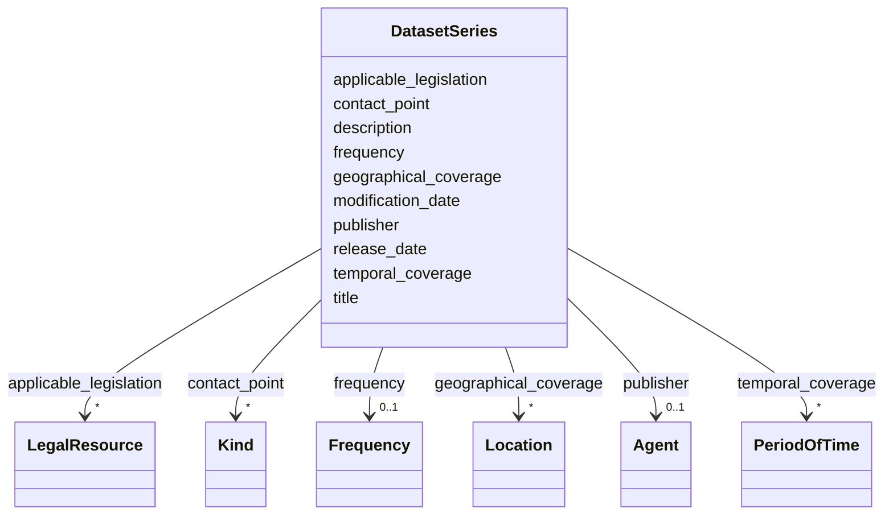

# Class: DatasetSeries


_See [DCAT-AP specs:DatasetSeries](https://semiceu.github.io/DCAT-AP/releases/3.0.0/#DatasetSeries)_


URI: [dcat:DatasetSeries](http://www.w3.org/ns/dcat#DatasetSeries)





<!-- no inheritance hierarchy -->


## Slots

| Name | Cardinality and Range | Description | Inheritance |
| ---  | --- | --- | --- |
| [applicable_legislation](applicable_legislation.md) | * <br/> [LegalResource](LegalResource.md) | The legislation that mandates the creation or management of the Dataset Serie... | direct |
| [contact_point](contact_point.md) | * <br/> [Kind](Kind.md) | Contact information that can be used for sending comments about the Dataset S... | direct |
| [description](description.md) | 1..* <br/> [String](String.md) | A free-text account of the Dataset Series | direct |
| [frequency](frequency.md) | 0..1 <br/> [Frequency](Frequency.md) | The frequency at which the Dataset Series is updated | direct |
| [geographical_coverage](geographical_coverage.md) | * <br/> [Location](Location.md) | A geographic region that is covered by the Dataset Series | direct |
| [modification_date](modification_date.md) | 0..1 <br/> [String](String.md) | The most recent date on which the Dataset Series was changed or modified | direct |
| [publisher](publisher.md) | 0..1 <br/> [Agent](Agent.md) | An entity (organisation) responsible for ensuring the coherency of the Datase... | direct |
| [release_date](release_date.md) | 0..1 <br/> [String](String.md) | The date of formal issuance (e | direct |
| [temporal_coverage](temporal_coverage.md) | * <br/> [PeriodOfTime](PeriodOfTime.md) | A temporal period that the Dataset Series covers | direct |
| [title](title.md) | 1..* <br/> [String](String.md) | A name given to the Dataset Series | direct |


## Usages

| used by | used in | type | used |
| ---  | --- | --- | --- |
| [NMRAnalysisDataset](NMRAnalysisDataset.md) | [in_series](in_series.md) | range | [DatasetSeries](DatasetSeries.md) |
| [Dataset](Dataset.md) | [in_series](in_series.md) | range | [DatasetSeries](DatasetSeries.md) |
| [ResearchDataset](ResearchDataset.md) | [in_series](in_series.md) | range | [DatasetSeries](DatasetSeries.md) |
| [AnalysisDataset](AnalysisDataset.md) | [in_series](in_series.md) | range | [DatasetSeries](DatasetSeries.md) |


## Identifier and Mapping Information


### Schema Source


* from schema: https://stroemphi.github.io/dcat-4C-ap/dcat_4c_ap


## Mappings

| Mapping Type | Mapped Value |
| ---  | ---  |
| self | dcat:DatasetSeries |
| native | nfdi4c:DatasetSeries |


## LinkML Source

<!-- TODO: investigate https://stackoverflow.com/questions/37606292/how-to-create-tabbed-code-blocks-in-mkdocs-or-sphinx -->

### Direct

<details>
```yaml
name: DatasetSeries
description: See [DCAT-AP specs:DatasetSeries](https://semiceu.github.io/DCAT-AP/releases/3.0.0/#DatasetSeries)
from_schema: https://stroemphi.github.io/dcat-4C-ap/dcat_4c_ap
abstract: false
slots:
- applicable_legislation
- contact_point
- description
- frequency
- geographical_coverage
- modification_date
- publisher
- release_date
- temporal_coverage
- title
slot_usage:
  applicable_legislation:
    name: applicable_legislation
    description: The legislation that mandates the creation or management of the Dataset
      Series.
    slot_uri: dcatap:applicableLegislation
    range: LegalResource
    required: false
    multivalued: true
    inlined_as_list: true
  contact_point:
    name: contact_point
    description: Contact information that can be used for sending comments about the
      Dataset Series.
    slot_uri: dcat:contactPoint
    range: Kind
    required: false
    multivalued: true
    inlined_as_list: true
  description:
    name: description
    description: A free-text account of the Dataset Series.
    slot_uri: dcterms:description
    range: string
    required: true
    multivalued: true
    inlined_as_list: true
  frequency:
    name: frequency
    description: The frequency at which the Dataset Series is updated.
    slot_uri: dcterms:accrualPeriodicity
    range: Frequency
    required: false
    multivalued: false
    inlined_as_list: false
  geographical_coverage:
    name: geographical_coverage
    description: A geographic region that is covered by the Dataset Series.
    slot_uri: dcterms:spatial
    range: Location
    required: false
    multivalued: true
    inlined_as_list: true
  modification_date:
    name: modification_date
    description: The most recent date on which the Dataset Series was changed or modified.
    slot_uri: dcterms:modified
    range: string
    required: false
    multivalued: false
    inlined_as_list: false
  publisher:
    name: publisher
    description: 'An entity (organisation) responsible for ensuring the coherency
      of the Dataset Series '
    slot_uri: dcterms:publisher
    range: Agent
    required: false
    multivalued: false
    inlined_as_list: true
  release_date:
    name: release_date
    description: The date of formal issuance (e.g., publication) of the Dataset Series.
    slot_uri: dcterms:issued
    range: string
    required: false
    multivalued: false
    inlined_as_list: false
  temporal_coverage:
    name: temporal_coverage
    description: A temporal period that the Dataset Series covers.
    slot_uri: dcterms:temporal
    range: PeriodOfTime
    required: false
    multivalued: true
    inlined_as_list: true
  title:
    name: title
    description: A name given to the Dataset Series.
    slot_uri: dcterms:title
    range: string
    required: true
    multivalued: true
    inlined_as_list: true
class_uri: dcat:DatasetSeries

```
</details>

### Induced

<details>
```yaml
name: DatasetSeries
description: See [DCAT-AP specs:DatasetSeries](https://semiceu.github.io/DCAT-AP/releases/3.0.0/#DatasetSeries)
from_schema: https://stroemphi.github.io/dcat-4C-ap/dcat_4c_ap
abstract: false
slot_usage:
  applicable_legislation:
    name: applicable_legislation
    description: The legislation that mandates the creation or management of the Dataset
      Series.
    slot_uri: dcatap:applicableLegislation
    range: LegalResource
    required: false
    multivalued: true
    inlined_as_list: true
  contact_point:
    name: contact_point
    description: Contact information that can be used for sending comments about the
      Dataset Series.
    slot_uri: dcat:contactPoint
    range: Kind
    required: false
    multivalued: true
    inlined_as_list: true
  description:
    name: description
    description: A free-text account of the Dataset Series.
    slot_uri: dcterms:description
    range: string
    required: true
    multivalued: true
    inlined_as_list: true
  frequency:
    name: frequency
    description: The frequency at which the Dataset Series is updated.
    slot_uri: dcterms:accrualPeriodicity
    range: Frequency
    required: false
    multivalued: false
    inlined_as_list: false
  geographical_coverage:
    name: geographical_coverage
    description: A geographic region that is covered by the Dataset Series.
    slot_uri: dcterms:spatial
    range: Location
    required: false
    multivalued: true
    inlined_as_list: true
  modification_date:
    name: modification_date
    description: The most recent date on which the Dataset Series was changed or modified.
    slot_uri: dcterms:modified
    range: string
    required: false
    multivalued: false
    inlined_as_list: false
  publisher:
    name: publisher
    description: 'An entity (organisation) responsible for ensuring the coherency
      of the Dataset Series '
    slot_uri: dcterms:publisher
    range: Agent
    required: false
    multivalued: false
    inlined_as_list: true
  release_date:
    name: release_date
    description: The date of formal issuance (e.g., publication) of the Dataset Series.
    slot_uri: dcterms:issued
    range: string
    required: false
    multivalued: false
    inlined_as_list: false
  temporal_coverage:
    name: temporal_coverage
    description: A temporal period that the Dataset Series covers.
    slot_uri: dcterms:temporal
    range: PeriodOfTime
    required: false
    multivalued: true
    inlined_as_list: true
  title:
    name: title
    description: A name given to the Dataset Series.
    slot_uri: dcterms:title
    range: string
    required: true
    multivalued: true
    inlined_as_list: true
attributes:
  applicable_legislation:
    name: applicable_legislation
    description: The legislation that mandates the creation or management of the Dataset
      Series.
    from_schema: https://stroemphi.github.io/dcat-4C-ap/dcat_4c_ap
    rank: 1000
    slot_uri: dcatap:applicableLegislation
    alias: applicable_legislation
    owner: DatasetSeries
    domain_of:
    - Catalogue
    - DataService
    - Dataset
    - DatasetSeries
    - Distribution
    range: LegalResource
    required: false
    multivalued: true
    inlined_as_list: true
  contact_point:
    name: contact_point
    description: Contact information that can be used for sending comments about the
      Dataset Series.
    from_schema: https://stroemphi.github.io/dcat-4C-ap/dcat_4c_ap
    rank: 1000
    slot_uri: dcat:contactPoint
    alias: contact_point
    owner: DatasetSeries
    domain_of:
    - DataService
    - Dataset
    - DatasetSeries
    range: Kind
    required: false
    multivalued: true
    inlined_as_list: true
  description:
    name: description
    description: A free-text account of the Dataset Series.
    from_schema: https://stroemphi.github.io/dcat-4C-ap/dcat_4c_ap
    rank: 1000
    slot_uri: dcterms:description
    alias: description
    owner: DatasetSeries
    domain_of:
    - Catalogue
    - CatalogueRecord
    - DataService
    - Dataset
    - DatasetSeries
    - Distribution
    - DataCreatingActivity
    - EvaluatedEntity
    - EvaluatedActivity
    - Tool
    - Environment
    - Plan
    - QualitativeAttribute
    - QuantitativeAttribute
    range: string
    required: true
    multivalued: true
    inlined_as_list: true
  frequency:
    name: frequency
    description: The frequency at which the Dataset Series is updated.
    from_schema: https://stroemphi.github.io/dcat-4C-ap/dcat_4c_ap
    rank: 1000
    slot_uri: dcterms:accrualPeriodicity
    alias: frequency
    owner: DatasetSeries
    domain_of:
    - Dataset
    - DatasetSeries
    range: Frequency
    required: false
    multivalued: false
    inlined_as_list: false
  geographical_coverage:
    name: geographical_coverage
    description: A geographic region that is covered by the Dataset Series.
    from_schema: https://stroemphi.github.io/dcat-4C-ap/dcat_4c_ap
    rank: 1000
    slot_uri: dcterms:spatial
    alias: geographical_coverage
    owner: DatasetSeries
    domain_of:
    - Catalogue
    - Dataset
    - DatasetSeries
    range: Location
    required: false
    multivalued: true
    inlined_as_list: true
  modification_date:
    name: modification_date
    description: The most recent date on which the Dataset Series was changed or modified.
    from_schema: https://stroemphi.github.io/dcat-4C-ap/dcat_4c_ap
    rank: 1000
    slot_uri: dcterms:modified
    alias: modification_date
    owner: DatasetSeries
    domain_of:
    - Catalogue
    - CatalogueRecord
    - Dataset
    - DatasetSeries
    - Distribution
    range: string
    required: false
    multivalued: false
    inlined_as_list: false
  publisher:
    name: publisher
    description: 'An entity (organisation) responsible for ensuring the coherency
      of the Dataset Series '
    from_schema: https://stroemphi.github.io/dcat-4C-ap/dcat_4c_ap
    rank: 1000
    slot_uri: dcterms:publisher
    alias: publisher
    owner: DatasetSeries
    domain_of:
    - Catalogue
    - DataService
    - Dataset
    - DatasetSeries
    range: Agent
    required: false
    multivalued: false
    inlined_as_list: true
  release_date:
    name: release_date
    description: The date of formal issuance (e.g., publication) of the Dataset Series.
    from_schema: https://stroemphi.github.io/dcat-4C-ap/dcat_4c_ap
    rank: 1000
    slot_uri: dcterms:issued
    alias: release_date
    owner: DatasetSeries
    domain_of:
    - Catalogue
    - Dataset
    - DatasetSeries
    - Distribution
    range: string
    required: false
    multivalued: false
    inlined_as_list: false
  temporal_coverage:
    name: temporal_coverage
    description: A temporal period that the Dataset Series covers.
    from_schema: https://stroemphi.github.io/dcat-4C-ap/dcat_4c_ap
    rank: 1000
    slot_uri: dcterms:temporal
    alias: temporal_coverage
    owner: DatasetSeries
    domain_of:
    - Catalogue
    - Dataset
    - DatasetSeries
    range: PeriodOfTime
    required: false
    multivalued: true
    inlined_as_list: true
  title:
    name: title
    description: A name given to the Dataset Series.
    from_schema: https://stroemphi.github.io/dcat-4C-ap/dcat_4c_ap
    rank: 1000
    slot_uri: dcterms:title
    alias: title
    owner: DatasetSeries
    domain_of:
    - Catalogue
    - CatalogueRecord
    - ConceptScheme
    - DataService
    - Dataset
    - DatasetSeries
    - Distribution
    - DefinedTerm
    - DataCreatingActivity
    - EvaluatedEntity
    - EvaluatedActivity
    - Tool
    - Environment
    - Plan
    - QualitativeAttribute
    - QuantitativeAttribute
    range: string
    required: true
    multivalued: true
    inlined_as_list: true
class_uri: dcat:DatasetSeries

```
</details>