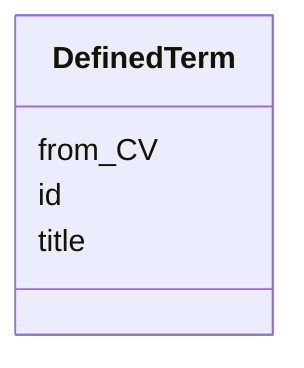

# Class: DefinedTerm


_A word, name, acronym, phrase that is defined in a controlled vocabulary (CV) and that is used to provide the rdf:type of an entity within this schema._


URI: [schema:DefinedTerm](http://schema.org/DefinedTerm)





<!-- no inheritance hierarchy -->


## Slots

| Name | Cardinality and Range | Description | Inheritance |
| ---  | --- | --- | --- |
| [id](id.md) | 1 <br/> [Uriorcurie](Uriorcurie.md) |  | direct |
| [title](title.md) | 0..1 <br/> [String](String.md) | This slot is described in more detail within the class in which it is used | direct |
| [from_CV](from_CV.md) | 0..1 <br/> [Uriorcurie](Uriorcurie.md) | The URL of the controlled vocabulary | direct |


## Usages

| used by | used in | type | used |
| ---  | --- | --- | --- |
| [NMRSpectralAnalysis](NMRSpectralAnalysis.md) | [type](type.md) | range | [DefinedTerm](DefinedTerm.md) |
| [NMRSpectralAnalysis](NMRSpectralAnalysis.md) | [rdf_type](rdf_type.md) | range | [DefinedTerm](DefinedTerm.md) |
| [NMRSpectroscopy](NMRSpectroscopy.md) | [type](type.md) | range | [DefinedTerm](DefinedTerm.md) |
| [NMRSpectroscopy](NMRSpectroscopy.md) | [rdf_type](rdf_type.md) | range | [DefinedTerm](DefinedTerm.md) |
| [ChemicalReaction](ChemicalReaction.md) | [type](type.md) | range | [DefinedTerm](DefinedTerm.md) |
| [ChemicalReaction](ChemicalReaction.md) | [rdf_type](rdf_type.md) | range | [DefinedTerm](DefinedTerm.md) |
| [ChemicalSubstance](ChemicalSubstance.md) | [type](type.md) | range | [DefinedTerm](DefinedTerm.md) |
| [ChemicalSubstance](ChemicalSubstance.md) | [rdf_type](rdf_type.md) | range | [DefinedTerm](DefinedTerm.md) |
| [ChemicalSample](ChemicalSample.md) | [type](type.md) | range | [DefinedTerm](DefinedTerm.md) |
| [ChemicalSample](ChemicalSample.md) | [rdf_type](rdf_type.md) | range | [DefinedTerm](DefinedTerm.md) |
| [NMRSpectrum](NMRSpectrum.md) | [type](type.md) | range | [DefinedTerm](DefinedTerm.md) |
| [NMRSpectrum](NMRSpectrum.md) | [rdf_type](rdf_type.md) | range | [DefinedTerm](DefinedTerm.md) |
| [Laboratory](Laboratory.md) | [type](type.md) | range | [DefinedTerm](DefinedTerm.md) |
| [Laboratory](Laboratory.md) | [rdf_type](rdf_type.md) | range | [DefinedTerm](DefinedTerm.md) |
| [InChIKey](InChIKey.md) | [type](type.md) | range | [DefinedTerm](DefinedTerm.md) |
| [InChIKey](InChIKey.md) | [rdf_type](rdf_type.md) | range | [DefinedTerm](DefinedTerm.md) |
| [InChi](InChi.md) | [type](type.md) | range | [DefinedTerm](DefinedTerm.md) |
| [InChi](InChi.md) | [rdf_type](rdf_type.md) | range | [DefinedTerm](DefinedTerm.md) |
| [IUPACChemicalFormula](IUPACChemicalFormula.md) | [type](type.md) | range | [DefinedTerm](DefinedTerm.md) |
| [IUPACChemicalFormula](IUPACChemicalFormula.md) | [rdf_type](rdf_type.md) | range | [DefinedTerm](DefinedTerm.md) |
| [SMILES](SMILES.md) | [type](type.md) | range | [DefinedTerm](DefinedTerm.md) |
| [SMILES](SMILES.md) | [rdf_type](rdf_type.md) | range | [DefinedTerm](DefinedTerm.md) |
| [ClassifierMixin](ClassifierMixin.md) | [type](type.md) | range | [DefinedTerm](DefinedTerm.md) |
| [ClassifierMixin](ClassifierMixin.md) | [rdf_type](rdf_type.md) | range | [DefinedTerm](DefinedTerm.md) |
| [DataCreatingActivity](DataCreatingActivity.md) | [type](type.md) | range | [DefinedTerm](DefinedTerm.md) |
| [DataCreatingActivity](DataCreatingActivity.md) | [rdf_type](rdf_type.md) | range | [DefinedTerm](DefinedTerm.md) |
| [DataAnalysis](DataAnalysis.md) | [type](type.md) | range | [DefinedTerm](DefinedTerm.md) |
| [DataAnalysis](DataAnalysis.md) | [rdf_type](rdf_type.md) | range | [DefinedTerm](DefinedTerm.md) |
| [EvaluatedEntity](EvaluatedEntity.md) | [type](type.md) | range | [DefinedTerm](DefinedTerm.md) |
| [EvaluatedEntity](EvaluatedEntity.md) | [rdf_type](rdf_type.md) | range | [DefinedTerm](DefinedTerm.md) |
| [AnalysedData](AnalysedData.md) | [type](type.md) | range | [DefinedTerm](DefinedTerm.md) |
| [AnalysedData](AnalysedData.md) | [rdf_type](rdf_type.md) | range | [DefinedTerm](DefinedTerm.md) |
| [EvaluatedActivity](EvaluatedActivity.md) | [type](type.md) | range | [DefinedTerm](DefinedTerm.md) |
| [EvaluatedActivity](EvaluatedActivity.md) | [rdf_type](rdf_type.md) | range | [DefinedTerm](DefinedTerm.md) |
| [Tool](Tool.md) | [type](type.md) | range | [DefinedTerm](DefinedTerm.md) |
| [Tool](Tool.md) | [rdf_type](rdf_type.md) | range | [DefinedTerm](DefinedTerm.md) |
| [HardwareTool](HardwareTool.md) | [type](type.md) | range | [DefinedTerm](DefinedTerm.md) |
| [HardwareTool](HardwareTool.md) | [rdf_type](rdf_type.md) | range | [DefinedTerm](DefinedTerm.md) |
| [SoftwareTool](SoftwareTool.md) | [type](type.md) | range | [DefinedTerm](DefinedTerm.md) |
| [SoftwareTool](SoftwareTool.md) | [rdf_type](rdf_type.md) | range | [DefinedTerm](DefinedTerm.md) |
| [Environment](Environment.md) | [type](type.md) | range | [DefinedTerm](DefinedTerm.md) |
| [Environment](Environment.md) | [rdf_type](rdf_type.md) | range | [DefinedTerm](DefinedTerm.md) |
| [Plan](Plan.md) | [type](type.md) | range | [DefinedTerm](DefinedTerm.md) |
| [Plan](Plan.md) | [rdf_type](rdf_type.md) | range | [DefinedTerm](DefinedTerm.md) |
| [QualitativeAttribute](QualitativeAttribute.md) | [type](type.md) | range | [DefinedTerm](DefinedTerm.md) |
| [QualitativeAttribute](QualitativeAttribute.md) | [rdf_type](rdf_type.md) | range | [DefinedTerm](DefinedTerm.md) |
| [QuantitativeAttribute](QuantitativeAttribute.md) | [has_quantity_type](has_quantity_type.md) | range | [DefinedTerm](DefinedTerm.md) |
| [QuantitativeAttribute](QuantitativeAttribute.md) | [unit](unit.md) | range | [DefinedTerm](DefinedTerm.md) |
| [QuantitativeAttribute](QuantitativeAttribute.md) | [type](type.md) | range | [DefinedTerm](DefinedTerm.md) |
| [QuantitativeAttribute](QuantitativeAttribute.md) | [rdf_type](rdf_type.md) | range | [DefinedTerm](DefinedTerm.md) |


## Identifier and Mapping Information


### Schema Source


* from schema: https://stroemphi.github.io/dcat-4C-ap/dcat_4c_ap


## Mappings

| Mapping Type | Mapped Value |
| ---  | ---  |
| self | schema:DefinedTerm |
| native | nfdi4c:DefinedTerm |


## LinkML Source

<!-- TODO: investigate https://stackoverflow.com/questions/37606292/how-to-create-tabbed-code-blocks-in-mkdocs-or-sphinx -->

### Direct

<details>
```yaml
name: DefinedTerm
description: A word, name, acronym, phrase that is defined in a controlled vocabulary
  (CV) and that is used to provide the rdf:type of an entity within this schema.
from_schema: https://stroemphi.github.io/dcat-4C-ap/dcat_4c_ap
slots:
- id
- title
slot_usage:
  title:
    name: title
    slot_uri: schema:name
attributes:
  from_CV:
    name: from_CV
    description: The URL of the controlled vocabulary.
    from_schema: https://stroemphi.github.io/dcat-4C-ap/dcat_4nfdi_ap/
    rank: 1000
    slot_uri: schema:inDefinedTermSet
    domain_of:
    - DefinedTerm
    range: uriorcurie
class_uri: schema:DefinedTerm

```
</details>

### Induced

<details>
```yaml
name: DefinedTerm
description: A word, name, acronym, phrase that is defined in a controlled vocabulary
  (CV) and that is used to provide the rdf:type of an entity within this schema.
from_schema: https://stroemphi.github.io/dcat-4C-ap/dcat_4c_ap
slot_usage:
  title:
    name: title
    slot_uri: schema:name
attributes:
  from_CV:
    name: from_CV
    description: The URL of the controlled vocabulary.
    from_schema: https://stroemphi.github.io/dcat-4C-ap/dcat_4nfdi_ap/
    rank: 1000
    slot_uri: schema:inDefinedTermSet
    alias: from_CV
    owner: DefinedTerm
    domain_of:
    - DefinedTerm
    range: uriorcurie
  id:
    name: id
    from_schema: https://stroemphi.github.io/dcat-4C-ap/dcat_4c_ap
    rank: 1000
    slot_uri: dcterms:identifier
    identifier: true
    alias: id
    owner: DefinedTerm
    domain_of:
    - DefinedTerm
    - ResearchDataset
    - ResearchCatalog
    - EvaluatedEntity
    - EvaluatedActivity
    range: uriorcurie
    required: true
  title:
    name: title
    description: This slot is described in more detail within the class in which it
      is used.
    from_schema: https://stroemphi.github.io/dcat-4C-ap/dcat_4c_ap
    rank: 1000
    slot_uri: schema:name
    alias: title
    owner: DefinedTerm
    domain_of:
    - Catalogue
    - CatalogueRecord
    - ConceptScheme
    - DataService
    - Dataset
    - DatasetSeries
    - Distribution
    - DefinedTerm
    - DataCreatingActivity
    - EvaluatedEntity
    - EvaluatedActivity
    - Tool
    - Environment
    - Plan
    - QualitativeAttribute
    - QuantitativeAttribute
    range: string
class_uri: schema:DefinedTerm

```
</details>