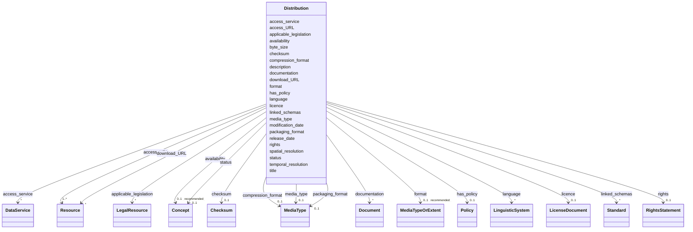

# Class: Distribution


_See [DCAT-AP specs:Distribution](https://semiceu.github.io/DCAT-AP/releases/3.0.0/#Distribution)_


URI: [dcat:Distribution](http://www.w3.org/ns/dcat#Distribution)





<!-- no inheritance hierarchy -->


## Slots

| Name | Cardinality and Range | Description | Inheritance |
| ---  | --- | --- | --- |
| [access_URL](access_URL.md) | 1..* <br/> [Resource](Resource.md) | A URL that gives access to a Distribution of the Dataset | direct |
| [access_service](access_service.md) | * <br/> [DataService](DataService.md) | A data service that gives access to the distribution of the dataset | direct |
| [applicable_legislation](applicable_legislation.md) | * <br/> [LegalResource](LegalResource.md) | The legislation that mandates the creation or management of the Distribution | direct |
| [availability](availability.md) | 0..1 _recommended_ <br/> [Concept](Concept.md) | An indication how long it is planned to keep the Distribution of the Dataset ... | direct |
| [byte_size](byte_size.md) | 0..1 <br/> [NonNegativeInteger](NonNegativeInteger.md) | The size of a Distribution in bytes | direct |
| [checksum](checksum.md) | 0..1 <br/> [Checksum](Checksum.md) | A mechanism that can be used to verify that the contents of a distribution ha... | direct |
| [compression_format](compression_format.md) | 0..1 <br/> [MediaType](MediaType.md) | The format of the file in which the data is contained in a compressed form, e | direct |
| [description](description.md) | * _recommended_ <br/> [String](String.md) | A free-text account of the Distribution | direct |
| [documentation](documentation.md) | * <br/> [Document](Document.md) | A page or document about this Distribution | direct |
| [download_URL](download_URL.md) | * <br/> [Resource](Resource.md) | A URL that is a direct link to a downloadable file in a given format | direct |
| [format](format.md) | 0..1 _recommended_ <br/> [MediaTypeOrExtent](MediaTypeOrExtent.md) | The file format of the Distribution | direct |
| [has_policy](has_policy.md) | 0..1 <br/> [Policy](Policy.md) | The policy expressing the rights associated with the distribution if using th... | direct |
| [language](language.md) | * <br/> [LinguisticSystem](LinguisticSystem.md) | A language used in the Distribution | direct |
| [licence](licence.md) | 0..1 <br/> [LicenseDocument](LicenseDocument.md) | A licence under which the Distribution is made available | direct |
| [linked_schemas](linked_schemas.md) | * <br/> [Standard](Standard.md) | An established schema to which the described Distribution conforms | direct |
| [media_type](media_type.md) | 0..1 <br/> [MediaType](MediaType.md) | The media type of the Distribution as defined in the official register of med... | direct |
| [modification_date](modification_date.md) | 0..1 <br/> [String](String.md) | The most recent date on which the Distribution was changed or modified | direct |
| [packaging_format](packaging_format.md) | 0..1 <br/> [MediaType](MediaType.md) | The format of the file in which one or more data files are grouped together, ... | direct |
| [release_date](release_date.md) | 0..1 <br/> [String](String.md) | The date of formal issuance (e | direct |
| [rights](rights.md) | 0..1 <br/> [RightsStatement](RightsStatement.md) | A statement that specifies rights associated with the Distribution | direct |
| [spatial_resolution](spatial_resolution.md) | 0..1 <br/> [Decimal](Decimal.md) | The minimum spatial separation resolvable in a dataset distribution, measured... | direct |
| [status](status.md) | 0..1 <br/> [Concept](Concept.md) | The status of the distribution in the context of maturity lifecycle | direct |
| [temporal_resolution](temporal_resolution.md) | 0..1 <br/> [Duration](Duration.md) | The minimum time period resolvable in the dataset distribution | direct |
| [title](title.md) | * <br/> [String](String.md) | A name given to the Distribution | direct |


## Usages

| used by | used in | type | used |
| ---  | --- | --- | --- |
| [NMRAnalysisDataset](NMRAnalysisDataset.md) | [dataset_distribution](dataset_distribution.md) | range | [Distribution](Distribution.md) |
| [NMRAnalysisDataset](NMRAnalysisDataset.md) | [sample](sample.md) | range | [Distribution](Distribution.md) |
| [Dataset](Dataset.md) | [dataset_distribution](dataset_distribution.md) | range | [Distribution](Distribution.md) |
| [Dataset](Dataset.md) | [sample](sample.md) | range | [Distribution](Distribution.md) |
| [ResearchDataset](ResearchDataset.md) | [dataset_distribution](dataset_distribution.md) | range | [Distribution](Distribution.md) |
| [ResearchDataset](ResearchDataset.md) | [sample](sample.md) | range | [Distribution](Distribution.md) |
| [AnalysisDataset](AnalysisDataset.md) | [dataset_distribution](dataset_distribution.md) | range | [Distribution](Distribution.md) |
| [AnalysisDataset](AnalysisDataset.md) | [sample](sample.md) | range | [Distribution](Distribution.md) |


## Identifier and Mapping Information


### Schema Source


* from schema: https://stroemphi.github.io/dcat-4C-ap/dcat_4c_ap


## Mappings

| Mapping Type | Mapped Value |
| ---  | ---  |
| self | dcat:Distribution |
| native | nfdi4c:Distribution |


## LinkML Source

<!-- TODO: investigate https://stackoverflow.com/questions/37606292/how-to-create-tabbed-code-blocks-in-mkdocs-or-sphinx -->

### Direct

<details>
```yaml
name: Distribution
description: See [DCAT-AP specs:Distribution](https://semiceu.github.io/DCAT-AP/releases/3.0.0/#Distribution)
from_schema: https://stroemphi.github.io/dcat-4C-ap/dcat_4c_ap
abstract: false
slots:
- access_URL
- access_service
- applicable_legislation
- availability
- byte_size
- checksum
- compression_format
- description
- documentation
- download_URL
- format
- has_policy
- language
- licence
- linked_schemas
- media_type
- modification_date
- packaging_format
- release_date
- rights
- spatial_resolution
- status
- temporal_resolution
- title
slot_usage:
  access_URL:
    name: access_URL
    description: A URL that gives access to a Distribution of the Dataset.
    slot_uri: dcat:accessURL
    range: Resource
    required: true
    multivalued: true
    inlined_as_list: true
  access_service:
    name: access_service
    description: A data service that gives access to the distribution of the dataset.
    slot_uri: dcat:accessService
    range: DataService
    required: false
    multivalued: true
    inlined_as_list: true
  applicable_legislation:
    name: applicable_legislation
    description: The legislation that mandates the creation or management of the Distribution.
    slot_uri: dcatap:applicableLegislation
    range: LegalResource
    required: false
    multivalued: true
    inlined_as_list: true
  availability:
    name: availability
    description: An indication how long it is planned to keep the Distribution of
      the Dataset available.
    slot_uri: dcatap:availability
    range: Concept
    required: false
    recommended: true
    multivalued: false
    inlined_as_list: false
  byte_size:
    name: byte_size
    description: The size of a Distribution in bytes.
    slot_uri: dcat:byteSize
    range: nonNegativeInteger
    required: false
    multivalued: false
    inlined_as_list: false
  checksum:
    name: checksum
    description: A mechanism that can be used to verify that the contents of a distribution
      have not changed.
    slot_uri: spdx:checksum
    range: Checksum
    required: false
    multivalued: false
    inlined_as_list: true
  compression_format:
    name: compression_format
    description: The format of the file in which the data is contained in a compressed
      form, e.g. to reduce the size of the downloadable file.
    slot_uri: dcat:compressFormat
    range: MediaType
    required: false
    multivalued: false
    inlined_as_list: true
  description:
    name: description
    description: A free-text account of the Distribution.
    slot_uri: dcterms:description
    range: string
    required: false
    recommended: true
    multivalued: true
    inlined_as_list: true
  documentation:
    name: documentation
    description: A page or document about this Distribution.
    slot_uri: foaf:page
    range: Document
    required: false
    multivalued: true
    inlined_as_list: true
  download_URL:
    name: download_URL
    description: A URL that is a direct link to a downloadable file in a given format.
    slot_uri: dcat:downloadURL
    range: Resource
    required: false
    multivalued: true
    inlined_as_list: true
  format:
    name: format
    description: The file format of the Distribution.
    slot_uri: dcterms:format
    range: MediaTypeOrExtent
    required: false
    recommended: true
    multivalued: false
    inlined_as_list: true
  has_policy:
    name: has_policy
    description: The policy expressing the rights associated with the distribution
      if using the [[ODRL]] vocabulary.
    slot_uri: odrl:hasPolicy
    range: Policy
    required: false
    multivalued: false
    inlined_as_list: true
  language:
    name: language
    description: A language used in the Distribution.
    slot_uri: dcterms:language
    range: LinguisticSystem
    required: false
    multivalued: true
    inlined_as_list: true
  licence:
    name: licence
    description: A licence under which the Distribution is made available.
    slot_uri: dcterms:license
    range: LicenseDocument
    required: false
    multivalued: false
    inlined_as_list: true
  linked_schemas:
    name: linked_schemas
    description: An established schema to which the described Distribution conforms.
    slot_uri: dcterms:conformsTo
    range: Standard
    required: false
    multivalued: true
    inlined_as_list: true
  media_type:
    name: media_type
    description: The media type of the Distribution as defined in the official register
      of media types managed by IANA.
    slot_uri: dcat:mediaType
    range: MediaType
    required: false
    multivalued: false
    inlined_as_list: false
  modification_date:
    name: modification_date
    description: The most recent date on which the Distribution was changed or modified.
    slot_uri: dcterms:modified
    range: string
    required: false
    multivalued: false
    inlined_as_list: false
  packaging_format:
    name: packaging_format
    description: The format of the file in which one or more data files are grouped
      together, e.g. to enable a set of related files to be downloaded together.
    slot_uri: dcat:packageFormat
    range: MediaType
    required: false
    multivalued: false
    inlined_as_list: true
  release_date:
    name: release_date
    description: The date of formal issuance (e.g., publication) of the Distribution.
    slot_uri: dcterms:issued
    range: string
    required: false
    multivalued: false
    inlined_as_list: false
  rights:
    name: rights
    description: A statement that specifies rights associated with the Distribution.
    slot_uri: dcterms:rights
    range: RightsStatement
    required: false
    multivalued: false
    inlined_as_list: true
  spatial_resolution:
    name: spatial_resolution
    description: The minimum spatial separation resolvable in a dataset distribution,
      measured in meters.
    slot_uri: dcat:spatialResolutionInMeters
    range: decimal
    required: false
    multivalued: false
    inlined_as_list: false
  status:
    name: status
    description: The status of the distribution in the context of maturity lifecycle.
    slot_uri: adms:status
    range: Concept
    required: false
    multivalued: false
    inlined_as_list: true
  temporal_resolution:
    name: temporal_resolution
    description: The minimum time period resolvable in the dataset distribution.
    slot_uri: dcat:temporalResolution
    range: duration
    required: false
    multivalued: false
    inlined_as_list: true
  title:
    name: title
    description: A name given to the Distribution.
    slot_uri: dcterms:title
    range: string
    required: false
    multivalued: true
    inlined_as_list: true
class_uri: dcat:Distribution

```
</details>

### Induced

<details>
```yaml
name: Distribution
description: See [DCAT-AP specs:Distribution](https://semiceu.github.io/DCAT-AP/releases/3.0.0/#Distribution)
from_schema: https://stroemphi.github.io/dcat-4C-ap/dcat_4c_ap
abstract: false
slot_usage:
  access_URL:
    name: access_URL
    description: A URL that gives access to a Distribution of the Dataset.
    slot_uri: dcat:accessURL
    range: Resource
    required: true
    multivalued: true
    inlined_as_list: true
  access_service:
    name: access_service
    description: A data service that gives access to the distribution of the dataset.
    slot_uri: dcat:accessService
    range: DataService
    required: false
    multivalued: true
    inlined_as_list: true
  applicable_legislation:
    name: applicable_legislation
    description: The legislation that mandates the creation or management of the Distribution.
    slot_uri: dcatap:applicableLegislation
    range: LegalResource
    required: false
    multivalued: true
    inlined_as_list: true
  availability:
    name: availability
    description: An indication how long it is planned to keep the Distribution of
      the Dataset available.
    slot_uri: dcatap:availability
    range: Concept
    required: false
    recommended: true
    multivalued: false
    inlined_as_list: false
  byte_size:
    name: byte_size
    description: The size of a Distribution in bytes.
    slot_uri: dcat:byteSize
    range: nonNegativeInteger
    required: false
    multivalued: false
    inlined_as_list: false
  checksum:
    name: checksum
    description: A mechanism that can be used to verify that the contents of a distribution
      have not changed.
    slot_uri: spdx:checksum
    range: Checksum
    required: false
    multivalued: false
    inlined_as_list: true
  compression_format:
    name: compression_format
    description: The format of the file in which the data is contained in a compressed
      form, e.g. to reduce the size of the downloadable file.
    slot_uri: dcat:compressFormat
    range: MediaType
    required: false
    multivalued: false
    inlined_as_list: true
  description:
    name: description
    description: A free-text account of the Distribution.
    slot_uri: dcterms:description
    range: string
    required: false
    recommended: true
    multivalued: true
    inlined_as_list: true
  documentation:
    name: documentation
    description: A page or document about this Distribution.
    slot_uri: foaf:page
    range: Document
    required: false
    multivalued: true
    inlined_as_list: true
  download_URL:
    name: download_URL
    description: A URL that is a direct link to a downloadable file in a given format.
    slot_uri: dcat:downloadURL
    range: Resource
    required: false
    multivalued: true
    inlined_as_list: true
  format:
    name: format
    description: The file format of the Distribution.
    slot_uri: dcterms:format
    range: MediaTypeOrExtent
    required: false
    recommended: true
    multivalued: false
    inlined_as_list: true
  has_policy:
    name: has_policy
    description: The policy expressing the rights associated with the distribution
      if using the [[ODRL]] vocabulary.
    slot_uri: odrl:hasPolicy
    range: Policy
    required: false
    multivalued: false
    inlined_as_list: true
  language:
    name: language
    description: A language used in the Distribution.
    slot_uri: dcterms:language
    range: LinguisticSystem
    required: false
    multivalued: true
    inlined_as_list: true
  licence:
    name: licence
    description: A licence under which the Distribution is made available.
    slot_uri: dcterms:license
    range: LicenseDocument
    required: false
    multivalued: false
    inlined_as_list: true
  linked_schemas:
    name: linked_schemas
    description: An established schema to which the described Distribution conforms.
    slot_uri: dcterms:conformsTo
    range: Standard
    required: false
    multivalued: true
    inlined_as_list: true
  media_type:
    name: media_type
    description: The media type of the Distribution as defined in the official register
      of media types managed by IANA.
    slot_uri: dcat:mediaType
    range: MediaType
    required: false
    multivalued: false
    inlined_as_list: false
  modification_date:
    name: modification_date
    description: The most recent date on which the Distribution was changed or modified.
    slot_uri: dcterms:modified
    range: string
    required: false
    multivalued: false
    inlined_as_list: false
  packaging_format:
    name: packaging_format
    description: The format of the file in which one or more data files are grouped
      together, e.g. to enable a set of related files to be downloaded together.
    slot_uri: dcat:packageFormat
    range: MediaType
    required: false
    multivalued: false
    inlined_as_list: true
  release_date:
    name: release_date
    description: The date of formal issuance (e.g., publication) of the Distribution.
    slot_uri: dcterms:issued
    range: string
    required: false
    multivalued: false
    inlined_as_list: false
  rights:
    name: rights
    description: A statement that specifies rights associated with the Distribution.
    slot_uri: dcterms:rights
    range: RightsStatement
    required: false
    multivalued: false
    inlined_as_list: true
  spatial_resolution:
    name: spatial_resolution
    description: The minimum spatial separation resolvable in a dataset distribution,
      measured in meters.
    slot_uri: dcat:spatialResolutionInMeters
    range: decimal
    required: false
    multivalued: false
    inlined_as_list: false
  status:
    name: status
    description: The status of the distribution in the context of maturity lifecycle.
    slot_uri: adms:status
    range: Concept
    required: false
    multivalued: false
    inlined_as_list: true
  temporal_resolution:
    name: temporal_resolution
    description: The minimum time period resolvable in the dataset distribution.
    slot_uri: dcat:temporalResolution
    range: duration
    required: false
    multivalued: false
    inlined_as_list: true
  title:
    name: title
    description: A name given to the Distribution.
    slot_uri: dcterms:title
    range: string
    required: false
    multivalued: true
    inlined_as_list: true
attributes:
  access_URL:
    name: access_URL
    description: A URL that gives access to a Distribution of the Dataset.
    from_schema: https://stroemphi.github.io/dcat-4C-ap/dcat_4c_ap
    rank: 1000
    slot_uri: dcat:accessURL
    alias: access_URL
    owner: Distribution
    domain_of:
    - Distribution
    range: Resource
    required: true
    multivalued: true
    inlined_as_list: true
  access_service:
    name: access_service
    description: A data service that gives access to the distribution of the dataset.
    from_schema: https://stroemphi.github.io/dcat-4C-ap/dcat_4c_ap
    rank: 1000
    slot_uri: dcat:accessService
    alias: access_service
    owner: Distribution
    domain_of:
    - Distribution
    range: DataService
    required: false
    multivalued: true
    inlined_as_list: true
  applicable_legislation:
    name: applicable_legislation
    description: The legislation that mandates the creation or management of the Distribution.
    from_schema: https://stroemphi.github.io/dcat-4C-ap/dcat_4c_ap
    rank: 1000
    slot_uri: dcatap:applicableLegislation
    alias: applicable_legislation
    owner: Distribution
    domain_of:
    - Catalogue
    - DataService
    - Dataset
    - DatasetSeries
    - Distribution
    range: LegalResource
    required: false
    multivalued: true
    inlined_as_list: true
  availability:
    name: availability
    description: An indication how long it is planned to keep the Distribution of
      the Dataset available.
    from_schema: https://stroemphi.github.io/dcat-4C-ap/dcat_4c_ap
    rank: 1000
    slot_uri: dcatap:availability
    alias: availability
    owner: Distribution
    domain_of:
    - Distribution
    range: Concept
    required: false
    recommended: true
    multivalued: false
    inlined_as_list: false
  byte_size:
    name: byte_size
    description: The size of a Distribution in bytes.
    from_schema: https://stroemphi.github.io/dcat-4C-ap/dcat_4c_ap
    rank: 1000
    slot_uri: dcat:byteSize
    alias: byte_size
    owner: Distribution
    domain_of:
    - Distribution
    range: nonNegativeInteger
    required: false
    multivalued: false
    inlined_as_list: false
  checksum:
    name: checksum
    description: A mechanism that can be used to verify that the contents of a distribution
      have not changed.
    from_schema: https://stroemphi.github.io/dcat-4C-ap/dcat_4c_ap
    rank: 1000
    slot_uri: spdx:checksum
    alias: checksum
    owner: Distribution
    domain_of:
    - Distribution
    range: Checksum
    required: false
    multivalued: false
    inlined_as_list: true
  compression_format:
    name: compression_format
    description: The format of the file in which the data is contained in a compressed
      form, e.g. to reduce the size of the downloadable file.
    from_schema: https://stroemphi.github.io/dcat-4C-ap/dcat_4c_ap
    rank: 1000
    slot_uri: dcat:compressFormat
    alias: compression_format
    owner: Distribution
    domain_of:
    - Distribution
    range: MediaType
    required: false
    multivalued: false
    inlined_as_list: true
  description:
    name: description
    description: A free-text account of the Distribution.
    from_schema: https://stroemphi.github.io/dcat-4C-ap/dcat_4c_ap
    rank: 1000
    slot_uri: dcterms:description
    alias: description
    owner: Distribution
    domain_of:
    - Catalogue
    - CatalogueRecord
    - DataService
    - Dataset
    - DatasetSeries
    - Distribution
    - DataCreatingActivity
    - EvaluatedEntity
    - EvaluatedActivity
    - Tool
    - Environment
    - Plan
    - QualitativeAttribute
    - QuantitativeAttribute
    range: string
    required: false
    recommended: true
    multivalued: true
    inlined_as_list: true
  documentation:
    name: documentation
    description: A page or document about this Distribution.
    from_schema: https://stroemphi.github.io/dcat-4C-ap/dcat_4c_ap
    rank: 1000
    slot_uri: foaf:page
    alias: documentation
    owner: Distribution
    domain_of:
    - DataService
    - Dataset
    - Distribution
    range: Document
    required: false
    multivalued: true
    inlined_as_list: true
  download_URL:
    name: download_URL
    description: A URL that is a direct link to a downloadable file in a given format.
    from_schema: https://stroemphi.github.io/dcat-4C-ap/dcat_4c_ap
    rank: 1000
    slot_uri: dcat:downloadURL
    alias: download_URL
    owner: Distribution
    domain_of:
    - Distribution
    range: Resource
    required: false
    multivalued: true
    inlined_as_list: true
  format:
    name: format
    description: The file format of the Distribution.
    from_schema: https://stroemphi.github.io/dcat-4C-ap/dcat_4c_ap
    rank: 1000
    slot_uri: dcterms:format
    alias: format
    owner: Distribution
    domain_of:
    - DataService
    - Distribution
    range: MediaTypeOrExtent
    required: false
    recommended: true
    multivalued: false
    inlined_as_list: true
  has_policy:
    name: has_policy
    description: The policy expressing the rights associated with the distribution
      if using the [[ODRL]] vocabulary.
    from_schema: https://stroemphi.github.io/dcat-4C-ap/dcat_4c_ap
    rank: 1000
    slot_uri: odrl:hasPolicy
    alias: has_policy
    owner: Distribution
    domain_of:
    - Distribution
    range: Policy
    required: false
    multivalued: false
    inlined_as_list: true
  language:
    name: language
    description: A language used in the Distribution.
    from_schema: https://stroemphi.github.io/dcat-4C-ap/dcat_4c_ap
    rank: 1000
    slot_uri: dcterms:language
    alias: language
    owner: Distribution
    domain_of:
    - Catalogue
    - CatalogueRecord
    - Dataset
    - Distribution
    range: LinguisticSystem
    required: false
    multivalued: true
    inlined_as_list: true
  licence:
    name: licence
    description: A licence under which the Distribution is made available.
    from_schema: https://stroemphi.github.io/dcat-4C-ap/dcat_4c_ap
    rank: 1000
    slot_uri: dcterms:license
    alias: licence
    owner: Distribution
    domain_of:
    - Catalogue
    - DataService
    - Distribution
    range: LicenseDocument
    required: false
    multivalued: false
    inlined_as_list: true
  linked_schemas:
    name: linked_schemas
    description: An established schema to which the described Distribution conforms.
    from_schema: https://stroemphi.github.io/dcat-4C-ap/dcat_4c_ap
    rank: 1000
    slot_uri: dcterms:conformsTo
    alias: linked_schemas
    owner: Distribution
    domain_of:
    - Distribution
    range: Standard
    required: false
    multivalued: true
    inlined_as_list: true
  media_type:
    name: media_type
    description: The media type of the Distribution as defined in the official register
      of media types managed by IANA.
    from_schema: https://stroemphi.github.io/dcat-4C-ap/dcat_4c_ap
    rank: 1000
    slot_uri: dcat:mediaType
    alias: media_type
    owner: Distribution
    domain_of:
    - Distribution
    range: MediaType
    required: false
    multivalued: false
    inlined_as_list: false
  modification_date:
    name: modification_date
    description: The most recent date on which the Distribution was changed or modified.
    from_schema: https://stroemphi.github.io/dcat-4C-ap/dcat_4c_ap
    rank: 1000
    slot_uri: dcterms:modified
    alias: modification_date
    owner: Distribution
    domain_of:
    - Catalogue
    - CatalogueRecord
    - Dataset
    - DatasetSeries
    - Distribution
    range: string
    required: false
    multivalued: false
    inlined_as_list: false
  packaging_format:
    name: packaging_format
    description: The format of the file in which one or more data files are grouped
      together, e.g. to enable a set of related files to be downloaded together.
    from_schema: https://stroemphi.github.io/dcat-4C-ap/dcat_4c_ap
    rank: 1000
    slot_uri: dcat:packageFormat
    alias: packaging_format
    owner: Distribution
    domain_of:
    - Distribution
    range: MediaType
    required: false
    multivalued: false
    inlined_as_list: true
  release_date:
    name: release_date
    description: The date of formal issuance (e.g., publication) of the Distribution.
    from_schema: https://stroemphi.github.io/dcat-4C-ap/dcat_4c_ap
    rank: 1000
    slot_uri: dcterms:issued
    alias: release_date
    owner: Distribution
    domain_of:
    - Catalogue
    - Dataset
    - DatasetSeries
    - Distribution
    range: string
    required: false
    multivalued: false
    inlined_as_list: false
  rights:
    name: rights
    description: A statement that specifies rights associated with the Distribution.
    from_schema: https://stroemphi.github.io/dcat-4C-ap/dcat_4c_ap
    rank: 1000
    slot_uri: dcterms:rights
    alias: rights
    owner: Distribution
    domain_of:
    - Catalogue
    - Distribution
    range: RightsStatement
    required: false
    multivalued: false
    inlined_as_list: true
  spatial_resolution:
    name: spatial_resolution
    description: The minimum spatial separation resolvable in a dataset distribution,
      measured in meters.
    from_schema: https://stroemphi.github.io/dcat-4C-ap/dcat_4c_ap
    rank: 1000
    slot_uri: dcat:spatialResolutionInMeters
    alias: spatial_resolution
    owner: Distribution
    domain_of:
    - Dataset
    - Distribution
    range: decimal
    required: false
    multivalued: false
    inlined_as_list: false
  status:
    name: status
    description: The status of the distribution in the context of maturity lifecycle.
    from_schema: https://stroemphi.github.io/dcat-4C-ap/dcat_4c_ap
    rank: 1000
    slot_uri: adms:status
    alias: status
    owner: Distribution
    domain_of:
    - Distribution
    range: Concept
    required: false
    multivalued: false
    inlined_as_list: true
  temporal_resolution:
    name: temporal_resolution
    description: The minimum time period resolvable in the dataset distribution.
    from_schema: https://stroemphi.github.io/dcat-4C-ap/dcat_4c_ap
    rank: 1000
    slot_uri: dcat:temporalResolution
    alias: temporal_resolution
    owner: Distribution
    domain_of:
    - Dataset
    - Distribution
    range: duration
    required: false
    multivalued: false
    inlined_as_list: true
  title:
    name: title
    description: A name given to the Distribution.
    from_schema: https://stroemphi.github.io/dcat-4C-ap/dcat_4c_ap
    rank: 1000
    slot_uri: dcterms:title
    alias: title
    owner: Distribution
    domain_of:
    - Catalogue
    - CatalogueRecord
    - ConceptScheme
    - DataService
    - Dataset
    - DatasetSeries
    - Distribution
    - DefinedTerm
    - DataCreatingActivity
    - EvaluatedEntity
    - EvaluatedActivity
    - Tool
    - Environment
    - Plan
    - QualitativeAttribute
    - QuantitativeAttribute
    range: string
    required: false
    multivalued: true
    inlined_as_list: true
class_uri: dcat:Distribution

```
</details>