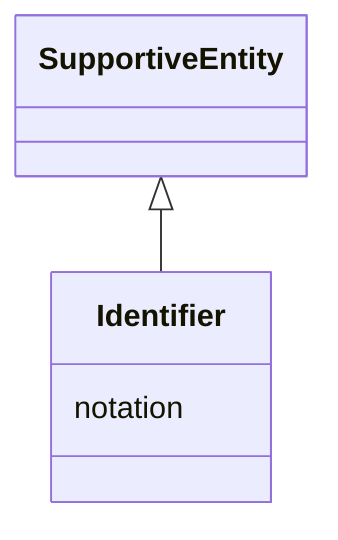

# Class: Identifier


_See [DCAT-AP specs:Identifier](https://semiceu.github.io/DCAT-AP/releases/3.0.0/#Identifier)_


URI: [adms:Identifier](http://www.w3.org/ns/adms#Identifier)





## Inheritance
* [SupportiveEntity](SupportiveEntity.md)
    * **Identifier**


## Slots

| Name | Cardinality and Range | Description | Inheritance |
| ---  | --- | --- | --- |
| [notation](notation.md) | 1 <br/> [Uri](Uri.md) | A string that is an identifier in the context of the identifier scheme refere... | direct |


## Usages

| used by | used in | type | used |
| ---  | --- | --- | --- |
| [NMRAnalysisDataset](NMRAnalysisDataset.md) | [other_identifier](other_identifier.md) | range | [Identifier](Identifier.md) |
| [NMRSpectralAnalysis](NMRSpectralAnalysis.md) | [other_identifier](other_identifier.md) | range | [Identifier](Identifier.md) |
| [NMRSpectroscopy](NMRSpectroscopy.md) | [other_identifier](other_identifier.md) | range | [Identifier](Identifier.md) |
| [ChemicalReaction](ChemicalReaction.md) | [other_identifier](other_identifier.md) | range | [Identifier](Identifier.md) |
| [ChemicalSubstance](ChemicalSubstance.md) | [other_identifier](other_identifier.md) | range | [Identifier](Identifier.md) |
| [ChemicalSample](ChemicalSample.md) | [other_identifier](other_identifier.md) | range | [Identifier](Identifier.md) |
| [NMRSpectrum](NMRSpectrum.md) | [other_identifier](other_identifier.md) | range | [Identifier](Identifier.md) |
| [Laboratory](Laboratory.md) | [other_identifier](other_identifier.md) | range | [Identifier](Identifier.md) |
| [Dataset](Dataset.md) | [other_identifier](other_identifier.md) | range | [Identifier](Identifier.md) |
| [ResearchDataset](ResearchDataset.md) | [other_identifier](other_identifier.md) | range | [Identifier](Identifier.md) |
| [AnalysisDataset](AnalysisDataset.md) | [other_identifier](other_identifier.md) | range | [Identifier](Identifier.md) |
| [DataCreatingActivity](DataCreatingActivity.md) | [other_identifier](other_identifier.md) | range | [Identifier](Identifier.md) |
| [DataAnalysis](DataAnalysis.md) | [other_identifier](other_identifier.md) | range | [Identifier](Identifier.md) |
| [EvaluatedEntity](EvaluatedEntity.md) | [other_identifier](other_identifier.md) | range | [Identifier](Identifier.md) |
| [AnalysedData](AnalysedData.md) | [other_identifier](other_identifier.md) | range | [Identifier](Identifier.md) |
| [EvaluatedActivity](EvaluatedActivity.md) | [other_identifier](other_identifier.md) | range | [Identifier](Identifier.md) |
| [Tool](Tool.md) | [other_identifier](other_identifier.md) | range | [Identifier](Identifier.md) |
| [HardwareTool](HardwareTool.md) | [other_identifier](other_identifier.md) | range | [Identifier](Identifier.md) |
| [SoftwareTool](SoftwareTool.md) | [other_identifier](other_identifier.md) | range | [Identifier](Identifier.md) |
| [Environment](Environment.md) | [other_identifier](other_identifier.md) | range | [Identifier](Identifier.md) |


## Identifier and Mapping Information


### Schema Source


* from schema: https://stroemphi.github.io/dcat-4C-ap/dcat_4c_ap


## Mappings

| Mapping Type | Mapped Value |
| ---  | ---  |
| self | adms:Identifier |
| native | nfdi4c:Identifier |


## LinkML Source

<!-- TODO: investigate https://stackoverflow.com/questions/37606292/how-to-create-tabbed-code-blocks-in-mkdocs-or-sphinx -->

### Direct

<details>
```yaml
name: Identifier
description: See [DCAT-AP specs:Identifier](https://semiceu.github.io/DCAT-AP/releases/3.0.0/#Identifier)
from_schema: https://stroemphi.github.io/dcat-4C-ap/dcat_4c_ap
is_a: SupportiveEntity
abstract: false
slots:
- notation
slot_usage:
  notation:
    name: notation
    description: A string that is an identifier in the context of the identifier scheme
      referenced by its datatype.
    slot_uri: skos:notation
    range: uri
    required: true
    multivalued: false
    inlined_as_list: false
class_uri: adms:Identifier

```
</details>

### Induced

<details>
```yaml
name: Identifier
description: See [DCAT-AP specs:Identifier](https://semiceu.github.io/DCAT-AP/releases/3.0.0/#Identifier)
from_schema: https://stroemphi.github.io/dcat-4C-ap/dcat_4c_ap
is_a: SupportiveEntity
abstract: false
slot_usage:
  notation:
    name: notation
    description: A string that is an identifier in the context of the identifier scheme
      referenced by its datatype.
    slot_uri: skos:notation
    range: uri
    required: true
    multivalued: false
    inlined_as_list: false
attributes:
  notation:
    name: notation
    description: A string that is an identifier in the context of the identifier scheme
      referenced by its datatype.
    from_schema: https://stroemphi.github.io/dcat-4C-ap/dcat_4c_ap
    rank: 1000
    slot_uri: skos:notation
    alias: notation
    owner: Identifier
    domain_of:
    - Identifier
    range: uri
    required: true
    multivalued: false
    inlined_as_list: false
class_uri: adms:Identifier

```
</details>