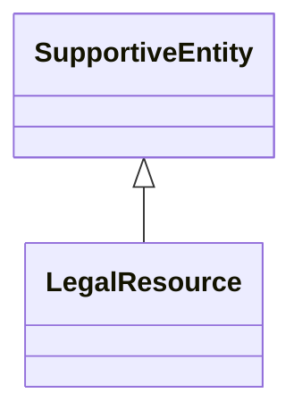

# Class: LegalResource


_See [DCAT-AP specs:LegalResource](https://semiceu.github.io/DCAT-AP/releases/3.0.0/#LegalResource)_


URI: [eli:LegalResource](http://data.europa.eu/eli/ontology#LegalResource)





## Inheritance
* [SupportiveEntity](SupportiveEntity.md)
    * **LegalResource**


## Slots

| Name | Cardinality and Range | Description | Inheritance |
| ---  | --- | --- | --- |


## Usages

| used by | used in | type | used |
| ---  | --- | --- | --- |
| [NMRAnalysisDataset](NMRAnalysisDataset.md) | [applicable_legislation](applicable_legislation.md) | range | [LegalResource](LegalResource.md) |
| [Catalogue](Catalogue.md) | [applicable_legislation](applicable_legislation.md) | range | [LegalResource](LegalResource.md) |
| [DataService](DataService.md) | [applicable_legislation](applicable_legislation.md) | range | [LegalResource](LegalResource.md) |
| [Dataset](Dataset.md) | [applicable_legislation](applicable_legislation.md) | range | [LegalResource](LegalResource.md) |
| [DatasetSeries](DatasetSeries.md) | [applicable_legislation](applicable_legislation.md) | range | [LegalResource](LegalResource.md) |
| [Distribution](Distribution.md) | [applicable_legislation](applicable_legislation.md) | range | [LegalResource](LegalResource.md) |
| [ResearchDataset](ResearchDataset.md) | [applicable_legislation](applicable_legislation.md) | range | [LegalResource](LegalResource.md) |
| [AnalysisDataset](AnalysisDataset.md) | [applicable_legislation](applicable_legislation.md) | range | [LegalResource](LegalResource.md) |
| [ResearchCatalog](ResearchCatalog.md) | [applicable_legislation](applicable_legislation.md) | range | [LegalResource](LegalResource.md) |


## Identifier and Mapping Information


### Schema Source


* from schema: https://stroemphi.github.io/dcat-4C-ap/dcat_4c_ap


## Mappings

| Mapping Type | Mapped Value |
| ---  | ---  |
| self | eli:LegalResource |
| native | nfdi4c:LegalResource |


## LinkML Source

<!-- TODO: investigate https://stackoverflow.com/questions/37606292/how-to-create-tabbed-code-blocks-in-mkdocs-or-sphinx -->

### Direct

<details>
```yaml
name: LegalResource
description: See [DCAT-AP specs:LegalResource](https://semiceu.github.io/DCAT-AP/releases/3.0.0/#LegalResource)
from_schema: https://stroemphi.github.io/dcat-4C-ap/dcat_4c_ap
is_a: SupportiveEntity
abstract: false
class_uri: eli:LegalResource

```
</details>

### Induced

<details>
```yaml
name: LegalResource
description: See [DCAT-AP specs:LegalResource](https://semiceu.github.io/DCAT-AP/releases/3.0.0/#LegalResource)
from_schema: https://stroemphi.github.io/dcat-4C-ap/dcat_4c_ap
is_a: SupportiveEntity
abstract: false
class_uri: eli:LegalResource

```
</details>