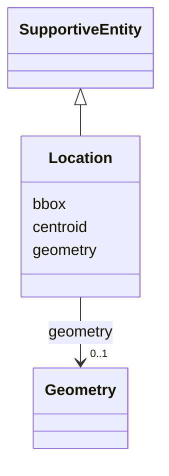

# Class: Location


_See [DCAT-AP specs:Location](https://semiceu.github.io/DCAT-AP/releases/3.0.0/#Location)_


URI: [dcterms:Location](http://purl.org/dc/terms/Location)





## Inheritance
* [SupportiveEntity](SupportiveEntity.md)
    * **Location**


## Slots

| Name | Cardinality and Range | Description | Inheritance |
| ---  | --- | --- | --- |
| [bbox](bbox.md) | 0..1 _recommended_ <br/> [String](String.md) | The geographic bounding box of a resource | direct |
| [centroid](centroid.md) | 0..1 _recommended_ <br/> [String](String.md) | The geographic center (centroid) of a resource | direct |
| [geometry](geometry.md) | 0..1 <br/> [Geometry](Geometry.md) | The corresponding geometry for a resource | direct |


## Usages

| used by | used in | type | used |
| ---  | --- | --- | --- |
| [NMRAnalysisDataset](NMRAnalysisDataset.md) | [geographical_coverage](geographical_coverage.md) | range | [Location](Location.md) |
| [Catalogue](Catalogue.md) | [geographical_coverage](geographical_coverage.md) | range | [Location](Location.md) |
| [Dataset](Dataset.md) | [geographical_coverage](geographical_coverage.md) | range | [Location](Location.md) |
| [DatasetSeries](DatasetSeries.md) | [geographical_coverage](geographical_coverage.md) | range | [Location](Location.md) |
| [ResearchDataset](ResearchDataset.md) | [geographical_coverage](geographical_coverage.md) | range | [Location](Location.md) |
| [AnalysisDataset](AnalysisDataset.md) | [geographical_coverage](geographical_coverage.md) | range | [Location](Location.md) |
| [ResearchCatalog](ResearchCatalog.md) | [geographical_coverage](geographical_coverage.md) | range | [Location](Location.md) |


## Identifier and Mapping Information


### Schema Source


* from schema: https://stroemphi.github.io/dcat-4C-ap/dcat_4c_ap


## Mappings

| Mapping Type | Mapped Value |
| ---  | ---  |
| self | dcterms:Location |
| native | nfdi4c:Location |


## LinkML Source

<!-- TODO: investigate https://stackoverflow.com/questions/37606292/how-to-create-tabbed-code-blocks-in-mkdocs-or-sphinx -->

### Direct

<details>
```yaml
name: Location
description: See [DCAT-AP specs:Location](https://semiceu.github.io/DCAT-AP/releases/3.0.0/#Location)
from_schema: https://stroemphi.github.io/dcat-4C-ap/dcat_4c_ap
is_a: SupportiveEntity
abstract: false
slots:
- bbox
- centroid
- geometry
slot_usage:
  bbox:
    name: bbox
    description: The geographic bounding box of a resource.
    slot_uri: dcat:bbox
    range: string
    required: false
    recommended: true
    multivalued: false
    inlined_as_list: false
  centroid:
    name: centroid
    description: The geographic center (centroid) of a resource.
    slot_uri: dcat:centroid
    range: string
    required: false
    recommended: true
    multivalued: false
    inlined_as_list: false
  geometry:
    name: geometry
    description: The corresponding geometry for a resource.
    slot_uri: locn:geometry
    range: Geometry
    required: false
    multivalued: false
    inlined_as_list: false
class_uri: dcterms:Location

```
</details>

### Induced

<details>
```yaml
name: Location
description: See [DCAT-AP specs:Location](https://semiceu.github.io/DCAT-AP/releases/3.0.0/#Location)
from_schema: https://stroemphi.github.io/dcat-4C-ap/dcat_4c_ap
is_a: SupportiveEntity
abstract: false
slot_usage:
  bbox:
    name: bbox
    description: The geographic bounding box of a resource.
    slot_uri: dcat:bbox
    range: string
    required: false
    recommended: true
    multivalued: false
    inlined_as_list: false
  centroid:
    name: centroid
    description: The geographic center (centroid) of a resource.
    slot_uri: dcat:centroid
    range: string
    required: false
    recommended: true
    multivalued: false
    inlined_as_list: false
  geometry:
    name: geometry
    description: The corresponding geometry for a resource.
    slot_uri: locn:geometry
    range: Geometry
    required: false
    multivalued: false
    inlined_as_list: false
attributes:
  bbox:
    name: bbox
    description: The geographic bounding box of a resource.
    from_schema: https://stroemphi.github.io/dcat-4C-ap/dcat_4c_ap
    rank: 1000
    slot_uri: dcat:bbox
    alias: bbox
    owner: Location
    domain_of:
    - Location
    range: string
    required: false
    recommended: true
    multivalued: false
    inlined_as_list: false
  centroid:
    name: centroid
    description: The geographic center (centroid) of a resource.
    from_schema: https://stroemphi.github.io/dcat-4C-ap/dcat_4c_ap
    rank: 1000
    slot_uri: dcat:centroid
    alias: centroid
    owner: Location
    domain_of:
    - Location
    range: string
    required: false
    recommended: true
    multivalued: false
    inlined_as_list: false
  geometry:
    name: geometry
    description: The corresponding geometry for a resource.
    from_schema: https://stroemphi.github.io/dcat-4C-ap/dcat_4c_ap
    rank: 1000
    slot_uri: locn:geometry
    alias: geometry
    owner: Location
    domain_of:
    - Location
    range: Geometry
    required: false
    multivalued: false
    inlined_as_list: false
class_uri: dcterms:Location

```
</details>