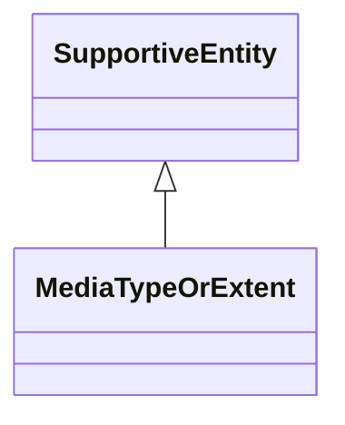

# Class: MediaTypeOrExtent


_See [DCAT-AP specs:MediaTypeOrExtent](https://semiceu.github.io/DCAT-AP/releases/3.0.0/#MediaTypeOrExtent)_


URI: [dcterms:MediaTypeOrExtent](http://purl.org/dc/terms/MediaTypeOrExtent)





## Inheritance
* [SupportiveEntity](SupportiveEntity.md)
    * **MediaTypeOrExtent**


## Slots

| Name | Cardinality and Range | Description | Inheritance |
| ---  | --- | --- | --- |


## Usages

| used by | used in | type | used |
| ---  | --- | --- | --- |
| [DataService](DataService.md) | [format](format.md) | range | [MediaTypeOrExtent](MediaTypeOrExtent.md) |
| [Distribution](Distribution.md) | [format](format.md) | range | [MediaTypeOrExtent](MediaTypeOrExtent.md) |


## Identifier and Mapping Information


### Schema Source


* from schema: https://stroemphi.github.io/dcat-4C-ap/dcat_4c_ap


## Mappings

| Mapping Type | Mapped Value |
| ---  | ---  |
| self | dcterms:MediaTypeOrExtent |
| native | nfdi4c:MediaTypeOrExtent |


## LinkML Source

<!-- TODO: investigate https://stackoverflow.com/questions/37606292/how-to-create-tabbed-code-blocks-in-mkdocs-or-sphinx -->

### Direct

<details>
```yaml
name: MediaTypeOrExtent
description: See [DCAT-AP specs:MediaTypeOrExtent](https://semiceu.github.io/DCAT-AP/releases/3.0.0/#MediaTypeOrExtent)
from_schema: https://stroemphi.github.io/dcat-4C-ap/dcat_4c_ap
is_a: SupportiveEntity
abstract: false
class_uri: dcterms:MediaTypeOrExtent

```
</details>

### Induced

<details>
```yaml
name: MediaTypeOrExtent
description: See [DCAT-AP specs:MediaTypeOrExtent](https://semiceu.github.io/DCAT-AP/releases/3.0.0/#MediaTypeOrExtent)
from_schema: https://stroemphi.github.io/dcat-4C-ap/dcat_4c_ap
is_a: SupportiveEntity
abstract: false
class_uri: dcterms:MediaTypeOrExtent

```
</details>