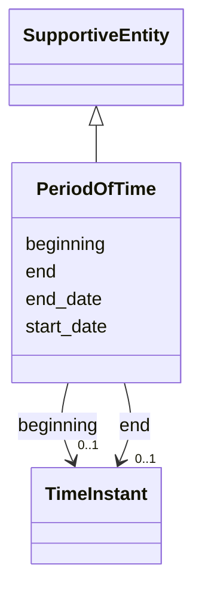

# Class: PeriodOfTime


_See [DCAT-AP specs:PeriodOfTime](https://semiceu.github.io/DCAT-AP/releases/3.0.0/#PeriodOfTime)_


URI: [dcterms:PeriodOfTime](http://purl.org/dc/terms/PeriodOfTime)





## Inheritance
* [SupportiveEntity](SupportiveEntity.md)
    * **PeriodOfTime**


## Slots

| Name | Cardinality and Range | Description | Inheritance |
| ---  | --- | --- | --- |
| [beginning](beginning.md) | 0..1 <br/> [TimeInstant](TimeInstant.md) | The beginning of a period or interval | direct |
| [end](end.md) | 0..1 <br/> [TimeInstant](TimeInstant.md) | The end of a period or interval | direct |
| [end_date](end_date.md) | 0..1 _recommended_ <br/> [String](String.md) | The end of the period | direct |
| [start_date](start_date.md) | 0..1 _recommended_ <br/> [String](String.md) | The start of the period | direct |


## Usages

| used by | used in | type | used |
| ---  | --- | --- | --- |
| [NMRAnalysisDataset](NMRAnalysisDataset.md) | [temporal_coverage](temporal_coverage.md) | range | [PeriodOfTime](PeriodOfTime.md) |
| [Catalogue](Catalogue.md) | [temporal_coverage](temporal_coverage.md) | range | [PeriodOfTime](PeriodOfTime.md) |
| [Dataset](Dataset.md) | [temporal_coverage](temporal_coverage.md) | range | [PeriodOfTime](PeriodOfTime.md) |
| [DatasetSeries](DatasetSeries.md) | [temporal_coverage](temporal_coverage.md) | range | [PeriodOfTime](PeriodOfTime.md) |
| [ResearchDataset](ResearchDataset.md) | [temporal_coverage](temporal_coverage.md) | range | [PeriodOfTime](PeriodOfTime.md) |
| [AnalysisDataset](AnalysisDataset.md) | [temporal_coverage](temporal_coverage.md) | range | [PeriodOfTime](PeriodOfTime.md) |
| [ResearchCatalog](ResearchCatalog.md) | [temporal_coverage](temporal_coverage.md) | range | [PeriodOfTime](PeriodOfTime.md) |


## Identifier and Mapping Information


### Schema Source


* from schema: https://stroemphi.github.io/dcat-4C-ap/dcat_4c_ap


## Mappings

| Mapping Type | Mapped Value |
| ---  | ---  |
| self | dcterms:PeriodOfTime |
| native | nfdi4c:PeriodOfTime |


## LinkML Source

<!-- TODO: investigate https://stackoverflow.com/questions/37606292/how-to-create-tabbed-code-blocks-in-mkdocs-or-sphinx -->

### Direct

<details>
```yaml
name: PeriodOfTime
description: See [DCAT-AP specs:PeriodOfTime](https://semiceu.github.io/DCAT-AP/releases/3.0.0/#PeriodOfTime)
from_schema: https://stroemphi.github.io/dcat-4C-ap/dcat_4c_ap
is_a: SupportiveEntity
abstract: false
slots:
- beginning
- end
- end_date
- start_date
slot_usage:
  beginning:
    name: beginning
    description: The beginning of a period or interval.
    slot_uri: time:hasBeginning
    range: TimeInstant
    required: false
    multivalued: false
    inlined_as_list: true
  end:
    name: end
    description: The end of a period or interval.
    slot_uri: time:hasEnd
    range: TimeInstant
    required: false
    multivalued: false
    inlined_as_list: true
  end_date:
    name: end_date
    description: The end of the period.
    slot_uri: dcat:endDate
    range: string
    required: false
    recommended: true
    multivalued: false
    inlined_as_list: true
  start_date:
    name: start_date
    description: The start of the period.
    slot_uri: dcat:startDate
    range: string
    required: false
    recommended: true
    multivalued: false
    inlined_as_list: false
class_uri: dcterms:PeriodOfTime

```
</details>

### Induced

<details>
```yaml
name: PeriodOfTime
description: See [DCAT-AP specs:PeriodOfTime](https://semiceu.github.io/DCAT-AP/releases/3.0.0/#PeriodOfTime)
from_schema: https://stroemphi.github.io/dcat-4C-ap/dcat_4c_ap
is_a: SupportiveEntity
abstract: false
slot_usage:
  beginning:
    name: beginning
    description: The beginning of a period or interval.
    slot_uri: time:hasBeginning
    range: TimeInstant
    required: false
    multivalued: false
    inlined_as_list: true
  end:
    name: end
    description: The end of a period or interval.
    slot_uri: time:hasEnd
    range: TimeInstant
    required: false
    multivalued: false
    inlined_as_list: true
  end_date:
    name: end_date
    description: The end of the period.
    slot_uri: dcat:endDate
    range: string
    required: false
    recommended: true
    multivalued: false
    inlined_as_list: true
  start_date:
    name: start_date
    description: The start of the period.
    slot_uri: dcat:startDate
    range: string
    required: false
    recommended: true
    multivalued: false
    inlined_as_list: false
attributes:
  beginning:
    name: beginning
    description: The beginning of a period or interval.
    from_schema: https://stroemphi.github.io/dcat-4C-ap/dcat_4c_ap
    rank: 1000
    slot_uri: time:hasBeginning
    alias: beginning
    owner: PeriodOfTime
    domain_of:
    - PeriodOfTime
    range: TimeInstant
    required: false
    multivalued: false
    inlined_as_list: true
  end:
    name: end
    description: The end of a period or interval.
    from_schema: https://stroemphi.github.io/dcat-4C-ap/dcat_4c_ap
    rank: 1000
    slot_uri: time:hasEnd
    alias: end
    owner: PeriodOfTime
    domain_of:
    - PeriodOfTime
    range: TimeInstant
    required: false
    multivalued: false
    inlined_as_list: true
  end_date:
    name: end_date
    description: The end of the period.
    from_schema: https://stroemphi.github.io/dcat-4C-ap/dcat_4c_ap
    rank: 1000
    slot_uri: dcat:endDate
    alias: end_date
    owner: PeriodOfTime
    domain_of:
    - PeriodOfTime
    range: string
    required: false
    recommended: true
    multivalued: false
    inlined_as_list: true
  start_date:
    name: start_date
    description: The start of the period.
    from_schema: https://stroemphi.github.io/dcat-4C-ap/dcat_4c_ap
    rank: 1000
    slot_uri: dcat:startDate
    alias: start_date
    owner: PeriodOfTime
    domain_of:
    - PeriodOfTime
    range: string
    required: false
    recommended: true
    multivalued: false
    inlined_as_list: false
class_uri: dcterms:PeriodOfTime

```
</details>