# Class: ResearchCatalog


_A curated collection of metadata about data resources._


URI: [dcat:Catalog](http://www.w3.org/ns/dcat#Catalog)

```mermaid
 classDiagram
    class ResearchCatalog
    click ResearchCatalog href "../ResearchCatalog"
      Catalogue <|-- ResearchCatalog
        click Catalogue href "../Catalogue"
      
      ResearchCatalog : applicable_legislation
        
          
    
    
    ResearchCatalog --> "*" LegalResource : applicable_legislation
    click LegalResource href "../LegalResource"

        
      ResearchCatalog : catalogue
        
          
    
    
    ResearchCatalog --> "*" Catalogue : catalogue
    click Catalogue href "../Catalogue"

        
      ResearchCatalog : creator
        
          
    
    
    ResearchCatalog --> "0..1" Agent : creator
    click Agent href "../Agent"

        
      ResearchCatalog : description
        
      ResearchCatalog : geographical_coverage
        
          
    
    
    ResearchCatalog --> "*" Location : geographical_coverage
    click Location href "../Location"

        
      ResearchCatalog : has_dataset
        
          
    
    
    ResearchCatalog --> "*" ResearchDataset : has_dataset
    click ResearchDataset href "../ResearchDataset"

        
      ResearchCatalog : has_part
        
          
    
    
    ResearchCatalog --> "*" Catalogue : has_part
    click Catalogue href "../Catalogue"

        
      ResearchCatalog : homepage
        
          
    
    
    ResearchCatalog --> "0..1 _recommended_" Document : homepage
    click Document href "../Document"

        
      ResearchCatalog : id
        
      ResearchCatalog : language
        
          
    
    
    ResearchCatalog --> "* _recommended_" LinguisticSystem : language
    click LinguisticSystem href "../LinguisticSystem"

        
      ResearchCatalog : licence
        
          
    
    
    ResearchCatalog --> "0..1" LicenseDocument : licence
    click LicenseDocument href "../LicenseDocument"

        
      ResearchCatalog : modification_date
        
      ResearchCatalog : publisher
        
          
    
    
    ResearchCatalog --> "1" Agent : publisher
    click Agent href "../Agent"

        
      ResearchCatalog : record
        
          
    
    
    ResearchCatalog --> "*" CatalogueRecord : record
    click CatalogueRecord href "../CatalogueRecord"

        
      ResearchCatalog : release_date
        
      ResearchCatalog : rights
        
          
    
    
    ResearchCatalog --> "0..1" RightsStatement : rights
    click RightsStatement href "../RightsStatement"

        
      ResearchCatalog : service
        
          
    
    
    ResearchCatalog --> "*" DataService : service
    click DataService href "../DataService"

        
      ResearchCatalog : temporal_coverage
        
          
    
    
    ResearchCatalog --> "*" PeriodOfTime : temporal_coverage
    click PeriodOfTime href "../PeriodOfTime"

        
      ResearchCatalog : themes
        
          
    
    
    ResearchCatalog --> "* _recommended_" ConceptScheme : themes
    click ConceptScheme href "../ConceptScheme"

        
      ResearchCatalog : title
        
      
```





## Inheritance
* [Catalogue](Catalogue.md)
    * **ResearchCatalog**


## Slots

| Name | Cardinality and Range | Description | Inheritance |
| ---  | --- | --- | --- |
| [id](id.md) | 1 <br/> [Uriorcurie](Uriorcurie.md) |  | direct |
| [applicable_legislation](applicable_legislation.md) | * <br/> [LegalResource](LegalResource.md) | The legislation that mandates the creation or management of the Catalog | [Catalogue](Catalogue.md) |
| [catalogue](catalogue.md) | * <br/> [Catalogue](Catalogue.md) | A catalogue whose contents are of interest in the context of this catalogue | [Catalogue](Catalogue.md) |
| [creator](creator.md) | 0..1 <br/> [Agent](Agent.md) | An entity responsible for the creation of the catalogue | [Catalogue](Catalogue.md) |
| [description](description.md) | 1..* <br/> [String](String.md) | A free-text account of the Catalogue | [Catalogue](Catalogue.md) |
| [geographical_coverage](geographical_coverage.md) | * <br/> [Location](Location.md) | A geographical area covered by the Catalogue | [Catalogue](Catalogue.md) |
| [has_dataset](has_dataset.md) | * <br/> [ResearchDataset](ResearchDataset.md) | A Dataset that is part of the Catalogue | [Catalogue](Catalogue.md) |
| [has_part](has_part.md) | * <br/> [Catalogue](Catalogue.md) | A related Catalogue that is part of the described Catalogue | [Catalogue](Catalogue.md) |
| [homepage](homepage.md) | 0..1 _recommended_ <br/> [Document](Document.md) | A web page that acts as the main page for the Catalogue | [Catalogue](Catalogue.md) |
| [language](language.md) | * _recommended_ <br/> [LinguisticSystem](LinguisticSystem.md) | A language used in the textual metadata describing titles, descriptions, etc | [Catalogue](Catalogue.md) |
| [licence](licence.md) | 0..1 <br/> [LicenseDocument](LicenseDocument.md) | A licence under which the Catalogue can be used or reused | [Catalogue](Catalogue.md) |
| [modification_date](modification_date.md) | 0..1 _recommended_ <br/> [String](String.md) | The most recent date on which the Catalogue was modified | [Catalogue](Catalogue.md) |
| [publisher](publisher.md) | 1 <br/> [Agent](Agent.md) | An entity (organisation) responsible for making the Catalogue available | [Catalogue](Catalogue.md) |
| [record](record.md) | * <br/> [CatalogueRecord](CatalogueRecord.md) | A Catalogue Record that is part of the Catalogue | [Catalogue](Catalogue.md) |
| [release_date](release_date.md) | 0..1 _recommended_ <br/> [String](String.md) | The date of formal issuance (e | [Catalogue](Catalogue.md) |
| [rights](rights.md) | 0..1 <br/> [RightsStatement](RightsStatement.md) | A statement that specifies rights associated with the Catalogue | [Catalogue](Catalogue.md) |
| [service](service.md) | * <br/> [DataService](DataService.md) | A site or end-point (Data Service) that is listed in the Catalogue | [Catalogue](Catalogue.md) |
| [temporal_coverage](temporal_coverage.md) | * <br/> [PeriodOfTime](PeriodOfTime.md) | A temporal period that the Catalogue covers | [Catalogue](Catalogue.md) |
| [themes](themes.md) | * _recommended_ <br/> [ConceptScheme](ConceptScheme.md) | A knowledge organization system used to classify the Resources that are in th... | [Catalogue](Catalogue.md) |
| [title](title.md) | 1..* <br/> [String](String.md) | A name given to the Catalogue | [Catalogue](Catalogue.md) |


## Comments

* The name of this class is only deviating from its parent as this is needed according to the sublcassing strategy chosen here in this LinkML model to further constrain the slots of existing (imported) classes.

## Identifier and Mapping Information


### Schema Source


* from schema: https://stroemphi.github.io/dcat-4C-ap/dcat_4c_ap


## Mappings

| Mapping Type | Mapped Value |
| ---  | ---  |
| self | dcat:Catalog |
| native | nfdi4c:ResearchCatalog |


## LinkML Source

<!-- TODO: investigate https://stackoverflow.com/questions/37606292/how-to-create-tabbed-code-blocks-in-mkdocs-or-sphinx -->

### Direct

<details>
```yaml
name: ResearchCatalog
description: A curated collection of metadata about data resources.
comments:
- The name of this class is only deviating from its parent as this is needed according
  to the sublcassing strategy chosen here in this LinkML model to further constrain
  the slots of existing (imported) classes.
from_schema: https://stroemphi.github.io/dcat-4C-ap/dcat_4c_ap
is_a: Catalogue
slots:
- id
slot_usage:
  has_dataset:
    name: has_dataset
    range: ResearchDataset
class_uri: dcat:Catalog

```
</details>

### Induced

<details>
```yaml
name: ResearchCatalog
description: A curated collection of metadata about data resources.
comments:
- The name of this class is only deviating from its parent as this is needed according
  to the sublcassing strategy chosen here in this LinkML model to further constrain
  the slots of existing (imported) classes.
from_schema: https://stroemphi.github.io/dcat-4C-ap/dcat_4c_ap
is_a: Catalogue
slot_usage:
  has_dataset:
    name: has_dataset
    range: ResearchDataset
attributes:
  id:
    name: id
    from_schema: https://stroemphi.github.io/dcat-4C-ap/dcat_4c_ap
    rank: 1000
    slot_uri: dcterms:identifier
    identifier: true
    alias: id
    owner: ResearchCatalog
    domain_of:
    - DefinedTerm
    - ResearchDataset
    - ResearchCatalog
    - EvaluatedEntity
    - EvaluatedActivity
    range: uriorcurie
    required: true
  applicable_legislation:
    name: applicable_legislation
    description: The legislation that mandates the creation or management of the Catalog.
    from_schema: https://stroemphi.github.io/dcat-4C-ap/dcat_4c_ap
    rank: 1000
    slot_uri: dcatap:applicableLegislation
    alias: applicable_legislation
    owner: ResearchCatalog
    domain_of:
    - Catalogue
    - DataService
    - Dataset
    - DatasetSeries
    - Distribution
    range: LegalResource
    required: false
    multivalued: true
    inlined_as_list: true
  catalogue:
    name: catalogue
    description: A catalogue whose contents are of interest in the context of this
      catalogue.
    from_schema: https://stroemphi.github.io/dcat-4C-ap/dcat_4c_ap
    rank: 1000
    slot_uri: dcat:catalog
    alias: catalogue
    owner: ResearchCatalog
    domain_of:
    - Catalogue
    range: Catalogue
    required: false
    multivalued: true
    inlined_as_list: true
  creator:
    name: creator
    description: An entity responsible for the creation of the catalogue.
    from_schema: https://stroemphi.github.io/dcat-4C-ap/dcat_4c_ap
    rank: 1000
    slot_uri: dcterms:creator
    alias: creator
    owner: ResearchCatalog
    domain_of:
    - Catalogue
    - Dataset
    range: Agent
    required: false
    multivalued: false
    inlined_as_list: true
  description:
    name: description
    description: A free-text account of the Catalogue.
    from_schema: https://stroemphi.github.io/dcat-4C-ap/dcat_4c_ap
    rank: 1000
    slot_uri: dcterms:description
    alias: description
    owner: ResearchCatalog
    domain_of:
    - Catalogue
    - CatalogueRecord
    - DataService
    - Dataset
    - DatasetSeries
    - Distribution
    - DataCreatingActivity
    - EvaluatedEntity
    - EvaluatedActivity
    - Tool
    - Environment
    - Plan
    - QualitativeAttribute
    - QuantitativeAttribute
    range: string
    required: true
    multivalued: true
    inlined_as_list: true
  geographical_coverage:
    name: geographical_coverage
    description: A geographical area covered by the Catalogue.
    from_schema: https://stroemphi.github.io/dcat-4C-ap/dcat_4c_ap
    rank: 1000
    slot_uri: dcterms:spatial
    alias: geographical_coverage
    owner: ResearchCatalog
    domain_of:
    - Catalogue
    - Dataset
    - DatasetSeries
    range: Location
    required: false
    multivalued: true
    inlined_as_list: true
  has_dataset:
    name: has_dataset
    description: A Dataset that is part of the Catalogue.
    from_schema: https://stroemphi.github.io/dcat-4C-ap/dcat_4c_ap
    rank: 1000
    slot_uri: dcat:dataset
    alias: has_dataset
    owner: ResearchCatalog
    domain_of:
    - Catalogue
    range: ResearchDataset
    required: false
    multivalued: true
    inlined_as_list: true
  has_part:
    name: has_part
    description: A related Catalogue that is part of the described Catalogue.
    from_schema: https://stroemphi.github.io/dcat-4C-ap/dcat_4c_ap
    rank: 1000
    slot_uri: dcterms:hasPart
    alias: has_part
    owner: ResearchCatalog
    domain_of:
    - Catalogue
    - DataCreatingActivity
    - EvaluatedEntity
    - EvaluatedActivity
    - Tool
    range: Catalogue
    required: false
    multivalued: true
    inlined_as_list: true
  homepage:
    name: homepage
    description: A web page that acts as the main page for the Catalogue.
    from_schema: https://stroemphi.github.io/dcat-4C-ap/dcat_4c_ap
    rank: 1000
    slot_uri: foaf:homepage
    alias: homepage
    owner: ResearchCatalog
    domain_of:
    - Catalogue
    range: Document
    required: false
    recommended: true
    multivalued: false
    inlined_as_list: true
  language:
    name: language
    description: A language used in the textual metadata describing titles, descriptions,
      etc. of the Datasets in the Catalogue.
    from_schema: https://stroemphi.github.io/dcat-4C-ap/dcat_4c_ap
    rank: 1000
    slot_uri: dcterms:language
    alias: language
    owner: ResearchCatalog
    domain_of:
    - Catalogue
    - CatalogueRecord
    - Dataset
    - Distribution
    range: LinguisticSystem
    required: false
    recommended: true
    multivalued: true
    inlined_as_list: true
  licence:
    name: licence
    description: A licence under which the Catalogue can be used or reused.
    from_schema: https://stroemphi.github.io/dcat-4C-ap/dcat_4c_ap
    rank: 1000
    slot_uri: dcterms:license
    alias: licence
    owner: ResearchCatalog
    domain_of:
    - Catalogue
    - DataService
    - Distribution
    range: LicenseDocument
    required: false
    multivalued: false
    inlined_as_list: true
  modification_date:
    name: modification_date
    description: The most recent date on which the Catalogue was modified.
    from_schema: https://stroemphi.github.io/dcat-4C-ap/dcat_4c_ap
    rank: 1000
    slot_uri: dcterms:modified
    alias: modification_date
    owner: ResearchCatalog
    domain_of:
    - Catalogue
    - CatalogueRecord
    - Dataset
    - DatasetSeries
    - Distribution
    range: string
    required: false
    recommended: true
    multivalued: false
    inlined_as_list: false
  publisher:
    name: publisher
    description: An entity (organisation) responsible for making the Catalogue available.
    from_schema: https://stroemphi.github.io/dcat-4C-ap/dcat_4c_ap
    rank: 1000
    slot_uri: dcterms:publisher
    alias: publisher
    owner: ResearchCatalog
    domain_of:
    - Catalogue
    - DataService
    - Dataset
    - DatasetSeries
    range: Agent
    required: true
    multivalued: false
    inlined_as_list: true
  record:
    name: record
    description: A Catalogue Record that is part of the Catalogue.
    from_schema: https://stroemphi.github.io/dcat-4C-ap/dcat_4c_ap
    rank: 1000
    slot_uri: dcat:record
    alias: record
    owner: ResearchCatalog
    domain_of:
    - Catalogue
    range: CatalogueRecord
    required: false
    multivalued: true
    inlined_as_list: true
  release_date:
    name: release_date
    description: The date of formal issuance (e.g., publication) of the Catalogue.
    from_schema: https://stroemphi.github.io/dcat-4C-ap/dcat_4c_ap
    rank: 1000
    slot_uri: dcterms:issued
    alias: release_date
    owner: ResearchCatalog
    domain_of:
    - Catalogue
    - Dataset
    - DatasetSeries
    - Distribution
    range: string
    required: false
    recommended: true
    multivalued: false
    inlined_as_list: false
  rights:
    name: rights
    description: A statement that specifies rights associated with the Catalogue.
    from_schema: https://stroemphi.github.io/dcat-4C-ap/dcat_4c_ap
    rank: 1000
    slot_uri: dcterms:rights
    alias: rights
    owner: ResearchCatalog
    domain_of:
    - Catalogue
    - Distribution
    range: RightsStatement
    required: false
    multivalued: false
    inlined_as_list: true
  service:
    name: service
    description: A site or end-point (Data Service) that is listed in the Catalogue.
    from_schema: https://stroemphi.github.io/dcat-4C-ap/dcat_4c_ap
    rank: 1000
    slot_uri: dcat:service
    alias: service
    owner: ResearchCatalog
    domain_of:
    - Catalogue
    range: DataService
    required: false
    multivalued: true
    inlined_as_list: true
  temporal_coverage:
    name: temporal_coverage
    description: A temporal period that the Catalogue covers.
    from_schema: https://stroemphi.github.io/dcat-4C-ap/dcat_4c_ap
    rank: 1000
    slot_uri: dcterms:temporal
    alias: temporal_coverage
    owner: ResearchCatalog
    domain_of:
    - Catalogue
    - Dataset
    - DatasetSeries
    range: PeriodOfTime
    required: false
    multivalued: true
    inlined_as_list: true
  themes:
    name: themes
    description: A knowledge organization system used to classify the Resources that
      are in the Catalogue.
    from_schema: https://stroemphi.github.io/dcat-4C-ap/dcat_4c_ap
    rank: 1000
    slot_uri: dcat:themeTaxonomy
    alias: themes
    owner: ResearchCatalog
    domain_of:
    - Catalogue
    range: ConceptScheme
    required: false
    recommended: true
    multivalued: true
    inlined_as_list: true
  title:
    name: title
    description: A name given to the Catalogue.
    from_schema: https://stroemphi.github.io/dcat-4C-ap/dcat_4c_ap
    rank: 1000
    slot_uri: dcterms:title
    alias: title
    owner: ResearchCatalog
    domain_of:
    - Catalogue
    - CatalogueRecord
    - ConceptScheme
    - DataService
    - Dataset
    - DatasetSeries
    - Distribution
    - DefinedTerm
    - DataCreatingActivity
    - EvaluatedEntity
    - EvaluatedActivity
    - Tool
    - Environment
    - Plan
    - QualitativeAttribute
    - QuantitativeAttribute
    range: string
    required: true
    multivalued: true
    inlined_as_list: true
class_uri: dcat:Catalog

```
</details>