# Class: SupportiveEntity


_The supportive entities are supporting the main entities in the Application Profile. They are included in the Application Profile because they form the range of properties._


URI: [nfdi4c:SupportiveEntity](https://stroemphi.github.io/dcat-4C-ap/dcat_4c_ap/SupportiveEntity)

```mermaid
 classDiagram
    class SupportiveEntity
    click SupportiveEntity href "../SupportiveEntity"
      SupportiveEntity <|-- Agent
        click Agent href "../Agent"
      SupportiveEntity <|-- Attribution
        click Attribution href "../Attribution"
      SupportiveEntity <|-- Checksum
        click Checksum href "../Checksum"
      SupportiveEntity <|-- ChecksumAlgorithm
        click ChecksumAlgorithm href "../ChecksumAlgorithm"
      SupportiveEntity <|-- Concept
        click Concept href "../Concept"
      SupportiveEntity <|-- ConceptScheme
        click ConceptScheme href "../ConceptScheme"
      SupportiveEntity <|-- Document
        click Document href "../Document"
      SupportiveEntity <|-- Frequency
        click Frequency href "../Frequency"
      SupportiveEntity <|-- Geometry
        click Geometry href "../Geometry"
      SupportiveEntity <|-- Identifier
        click Identifier href "../Identifier"
      SupportiveEntity <|-- Kind
        click Kind href "../Kind"
      SupportiveEntity <|-- LegalResource
        click LegalResource href "../LegalResource"
      SupportiveEntity <|-- LicenseDocument
        click LicenseDocument href "../LicenseDocument"
      SupportiveEntity <|-- LinguisticSystem
        click LinguisticSystem href "../LinguisticSystem"
      SupportiveEntity <|-- Location
        click Location href "../Location"
      SupportiveEntity <|-- MediaType
        click MediaType href "../MediaType"
      SupportiveEntity <|-- MediaTypeOrExtent
        click MediaTypeOrExtent href "../MediaTypeOrExtent"
      SupportiveEntity <|-- PeriodOfTime
        click PeriodOfTime href "../PeriodOfTime"
      SupportiveEntity <|-- Policy
        click Policy href "../Policy"
      SupportiveEntity <|-- ProvenanceStatement
        click ProvenanceStatement href "../ProvenanceStatement"
      SupportiveEntity <|-- Relationship
        click Relationship href "../Relationship"
      SupportiveEntity <|-- Resource
        click Resource href "../Resource"
      SupportiveEntity <|-- RightsStatement
        click RightsStatement href "../RightsStatement"
      SupportiveEntity <|-- Role
        click Role href "../Role"
      SupportiveEntity <|-- Standard
        click Standard href "../Standard"
      SupportiveEntity <|-- TimeInstant
        click TimeInstant href "../TimeInstant"
      
      
```





## Inheritance
* **SupportiveEntity**
    * [Agent](Agent.md)
    * [Attribution](Attribution.md)
    * [Checksum](Checksum.md)
    * [ChecksumAlgorithm](ChecksumAlgorithm.md)
    * [Concept](Concept.md)
    * [ConceptScheme](ConceptScheme.md)
    * [Document](Document.md)
    * [Frequency](Frequency.md)
    * [Geometry](Geometry.md)
    * [Identifier](Identifier.md)
    * [Kind](Kind.md)
    * [LegalResource](LegalResource.md)
    * [LicenseDocument](LicenseDocument.md)
    * [LinguisticSystem](LinguisticSystem.md)
    * [Location](Location.md)
    * [MediaType](MediaType.md)
    * [MediaTypeOrExtent](MediaTypeOrExtent.md)
    * [PeriodOfTime](PeriodOfTime.md)
    * [Policy](Policy.md)
    * [ProvenanceStatement](ProvenanceStatement.md)
    * [Relationship](Relationship.md)
    * [Resource](Resource.md)
    * [RightsStatement](RightsStatement.md)
    * [Role](Role.md)
    * [Standard](Standard.md)
    * [TimeInstant](TimeInstant.md)


## Slots

| Name | Cardinality and Range | Description | Inheritance |
| ---  | --- | --- | --- |


## Identifier and Mapping Information


### Schema Source


* from schema: https://stroemphi.github.io/dcat-4C-ap/dcat_4c_ap


## Mappings

| Mapping Type | Mapped Value |
| ---  | ---  |
| self | nfdi4c:SupportiveEntity |
| native | nfdi4c:SupportiveEntity |


## LinkML Source

<!-- TODO: investigate https://stackoverflow.com/questions/37606292/how-to-create-tabbed-code-blocks-in-mkdocs-or-sphinx -->

### Direct

<details>
```yaml
name: SupportiveEntity
description: The supportive entities are supporting the main entities in the Application
  Profile. They are included in the Application Profile because they form the range
  of properties.
from_schema: https://stroemphi.github.io/dcat-4C-ap/dcat_4c_ap

```
</details>

### Induced

<details>
```yaml
name: SupportiveEntity
description: The supportive entities are supporting the main entities in the Application
  Profile. They are included in the Application Profile because they form the range
  of properties.
from_schema: https://stroemphi.github.io/dcat-4C-ap/dcat_4c_ap

```
</details>